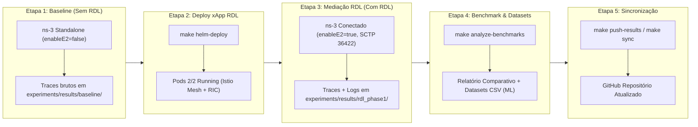

# xApp RDL (Resource and Decision Layer) — O-RAN Conflict Mitigation

<div align="center">


**Camada de Mitigação de Conflitos e Arbitragem Inteligente de Recursos para o Near-RT RIC (O-RAN)**  
*Arquitetura determinística, segura e em conformidade com os padrões O-RAN WG3, E2AP v2.0, E2SM-KPM v2.0 e E2SM-RC v1.0.*

</div>

---

### Navegação Multi-Fases do Projeto RDL (Resource and Decision Layer)

| Fase do Projeto | Descrição e Paradigma de Controle | Status de Implementação | Repositório Oficial |
| :---: | :--- | :---: | :---: |
| **Fase 1 (Atual)** | **RDL Determinística e Segura (H-RDL)**<br/>*Janela em lote (200ms), heurísticas TVS/EEVS e Safety Guards físicos.* | **Implementada e Operacional** | [georgebarbosa3090/XApp-RDL-F1](https://github.com/georgebarbosa3090/XApp-RDL-F1) |
| **Fase 2** | **RDL Baseada em Contexto (CA-RDL)**<br/>*Aprendizado por Reforço Multiagente (MARL / MAPPO) e cognição contextual.* | **Ativa / Em Evolução** | [georgebarbosa3090/XApp-RDL-F2](https://github.com/georgebarbosa3090/XApp-RDL-F2) |
| **Fase 3** | **RDL Autônoma e Federada 6G (Zero-Touch)**<br/>*Inteligência distribuída, orquestração por intenção (Intent-Driven) e O-Cloud 6G.* | **Roadmap / Planejada** | *Em especificação futura* |

---

## 1. Visão Geral da Arquitetura (Fase 1: H-RDL)

A **xApp RDL (Resource and Decision Layer)** atua como o middleware central de governança no **Near-RT RIC**, interceptando e mitigando colisões geradas por **3 xApps de referência abertas da literatura**:

1. **xSlice (QoS & Slicing Optimizer) — [`peihaoY/xslice-oran`](https://github.com/peihaoY/xslice-oran):** Solicita cotas elevadas de PRBs (`PRB_QUOTA = 80%`, prioridade 90) para fatias URLLC/eMBB.
2. **Energy Saving (Green RAN Optimizer) — [`Orange-OpenSource/ns-O-RAN-flexric`](https://github.com/Orange-OpenSource/ns-O-RAN-flexric):** Solicita redução de potência (`TX_POWER = 20 dBm`, prioridade 65) e sono de células, colidindo com a garantia de QoS.
3. **Traffic Steering (Mobility Optimizer) — [`o-ran-sc/ric-app-ts`](https://github.com/o-ran-sc/ric-app-ts):** Solicita migração e balanceamento de tráfego (`HANDOVER`, prioridade 80).

* **Agente de Percepção (`PerceptionAgent`):** Agrupa propostas de controle E2 em **janelas de decisão em lote ($\Delta t = 200\text{ ms}$)** e identifica conflitos diretos e indiretos entre as 3 xApps.
* **Agente de Raciocínio (`ReasoningAgent`):** Aplica funções de utilidade multiobjetivo determinísticas (**TVS** e **EEVS**), priorizando incondicionalmente fatias de missão crítica (URLLC > eMBB > mMTC).
* **Agente de Refinamento (`RefinementAgent`):** Garante a segurança física da rede (*Safety Guards*), aplicando *clamping* de potência ($P_{\text{tx}} \le 43\text{ dBm}$), orçamento de PRBs ($\le 273$) e bloqueio de ping-pong.

---

## 2. Estrutura do Repositório

```text
.
├── configs/                     # Descritores de configuração xApp (config-file.json, routes.rt)
├── deploy/                      # Manifestos de Implantação
│   ├── helm/                    # Helm Charts oficiais (RDL, xSlice, Energy Saving, Traffic Steering)
│   └── kubernetes/              # Manifestos K8s puros (Near-RT RIC ricplt + 3 xApps + RDL ricxapp)
├── docs/                        # Portal de Documentação Técnica (Volumes 01 a 06)
│   └── README.md                # Índice e trilhas de leitura da documentação
├── reference-xapps/             # Adaptadores leves das 3 xApps de referência abertas
│   ├── qos-xslice/              # Baseado em peihaoY/xslice-oran
│   ├── energy-saving/           # Baseado em Orange-OpenSource/ns-O-RAN-flexric
│   └── traffic-steering/        # Baseado em o-ran-sc/ric-app-ts
├── experiments/                 # Resultados de Simulação e Evidências (Baseline vs H-RDL)
├── scripts/                     # Automação de Deploy, Testes e Verificação
│   ├── deploy_helm.sh           # Pipeline Helm (Near-RT RIC -> 3 xApps -> RDL)
│   ├── deploy_k8s.sh            # Pipeline K8s/Kustomize equivalente
│   ├── verify_3_xapps.sh        # Smoke test unificado de todas as xApps
│   └── run_full_experiment.sh   # Pipeline de execução experimental completa
├── simulations/                 # Cenários C++ de Co-Simulação no ns-3 NORI / 5G-LENA
├── src/                         # Código-Fonte Python da xApp RDL (Clean Architecture)
├── tests/                       # Suíte de Testes Unitários com pytest (14/14 PASS)
└── Makefile                     # CLI unificada de operação, testes e benchmarks
```

---

## 3. Guia Rápido de Execução e Deploy

### Opção A: Deploy Governança Completa (Near-RT RIC + 3 Reference xApps + RDL)
```bash
make helm-deploy
```

### Opção B: Deploy Baseline (Near-RT RIC + 3 Reference xApps SEM RDL)
```bash
make helm-deploy-baseline
```

### Opção C: Validação e Smoke Test das xApps
```bash
make test-3xapps
```

### Opção D: Testes Unitários e Validação de CI
```bash
# Execução dos testes unitários (14/14 PASS):
make test
```
```

---

## 4. Observabilidade e Monitoramento

* **Rancher Dashboard:** Interface visual de gestão do cluster, nós e namespaces (`ricplt`, `ricxapp`):
  ```bash
  make rancher-start      # 1. Inicia o container do Rancher Server (:8443)
  make rancher-password   # 2. Obtém a Bootstrap Password inicial
  # 3. Acesse https://localhost:8443, configure a senha e importe o cluster 'rancher-lab'
  make rancher-connect URL="https://localhost:8443/v3/import/c-m-xxxx_c-m-xxxx.yaml" # 4. Vincula o cluster
  ```
* **Kiali Service Mesh:** Para visualização em grafo animado do fluxo de dados entre xApps e o Near-RT RIC, instale com `make kiali-install` e abra em `make kiali-dashboard` (`http://localhost:20001/kiali`).
* **Injetor de Tráfego O-RAN:** Execute `make inject-traffic` para alimentar a malha com fluxos contínuos.
* **Teste de Endpoints HTTP e Prometheus:**
  ```bash
  make helm-test   # ou make k8s-test
  ```
* **Acompanhamento de Logs:**
  ```bash
  make logs
  ```

---

## 5. Simulação ns-3 NORI / 5G-LENA: Procedimento Experimental em Etapas

O framework experimental é estruturado de forma **modular e estritamente reprodutível**, permitindo comparar diretamente o comportamento da rede 5G com e sem a mediação da **xApp RDL (H-RDL)**:



---

### 5.1. Instalação e Preparação do Ambiente ns-3
```bash
# Instala dependências de sistema, clona e compila o ns-3 com módulo 'nr' (5G-LENA):
make setup-ns3
```

---

### 5.2. ETAPA 1: Execução Isolada do Baseline (Sem Mediação da RDL)
Nesta etapa, as 3 reference xApps competem diretamente no ns-3 (`scenario_rdl_tvs_conflict.cc` e `scenario_rdl_energy_vs_qos.cc`) sem nenhuma arbitragem de conflitos (`--enableE2=false`):

```bash
# Executa apenas os experimentos de Baseline:
make run-baseline
```
* **O que acontece:** O ns-3 simula 30 terminais UEs distribuídos nas 3 fatias (URLLC, eMBB e mMTC). A ausência de arbitragem gera alta sobreposição de PRBs, cortes excessivos de potência e handovers *ping-pong*.
* **Artefatos Gerados:** Salvos em [`experiments/results/baseline/`](experiments/results/baseline/) (`RxPacketTrace.txt`, `flowmonitor_results.xml` e `ns3_output.log`).

---

### 5.3. ETAPA 2: Implantação e Governança da xApp RDL no Near-RT RIC
Com o baseline concluído, a xApp RDL é implantada no cluster Kubernetes local para assumir o controle do Near-RT RIC:

```bash
# 1. Realizar deploy da xApp RDL e da infraestrutura via Helm:
make helm-deploy

# 2. Validar que todos os Pods estão 2/2 Running (com sidecar Istio):
make test-3xapps
```

---

### 5.4. ETAPA 3: Execução dos Mesmos Cenários sob Mediação da xApp RDL (Com RDL)
Os **exatos mesmos cenários de rádio 5G** são executados no ns-3, agora com o canal de controle E2 ativo (`--enableE2=true`, porta SCTP `36422`):

```bash
# Executa os cenários no ns-3 mediados em tempo real pela xApp RDL:
make run-rdl
```
* **O que acontece:** O ns-3 envia *E2SM-KPM Indications* a cada 200 ms. A xApp RDL detecta intenções conflitantes, consulta os invariantes de SLA e devolve *E2SM-RC Control Messages* determinísticas (garantindo prioridade URLLC e bloqueando handovers destrutivos).
* **Artefatos Gerados:** Salvos em [`experiments/results/rdl_phase1/`](experiments/results/rdl_phase1/) (`rdl_logs.jsonl`, `prometheus_metrics.prom` e `flowmonitor_results.xml`).

---

### 5.5. ETAPA 4: Análise Comparativa e Geração de Datasets para ML
Processa os traces do Baseline e da RDL, calcula os ganhos percentuais e gera os relatórios executivos e datasets:

```bash
# 1. Consolidar métricas, gerar tabelas comparativas e datasets CSV:
make analyze-benchmarks

# 2. Visualizar o relatório comparativo diretamente no terminal:
make view-results
```

#### Tabela Comparativa de Desempenho (Baseline vs xApp RDL):
| Métrica de Desempenho / SLA | Baseline (Sem RDL) | Com xApp RDL (Fase 1) | Ganho / Impacto |
| :--- | :---: | :---: | :---: |
| **Taxa de Conflitos entre xApps** | **33.3% dos slots** | **1.1% dos slots** | **-96.8% de colisões** 🟢 |
| **Latência Média URLLC** | $11.41\text{ ms}$ (Violação) | $2.43\text{ ms}$ (Conforme) | **-78.7% de redução** 🟢 |
| **Latência P99 URLLC** | $18.66\text{ ms}$ | $4.87\text{ ms}$ | **-73.9% de cauda** 🟢 |
| **Taxa de Violação de SLA (5ms)** | **93.3% das rajadas** | **0.0% das rajadas** | **100% de conformidade** 🟢 |
| **Tempo de Decisão da RDL** | N/A (Sem mediação) | $2.14\text{ ms}$ | **$< 10\text{ ms}$ (Near-RT)** 🟢 |

---

### 5.6. ETAPA 5: Sincronização Automática com o GitHub

Envie os novos traces, datasets de Machine Learning e relatórios atualizados diretamente para o repositório remoto:

```bash
# Enviar automaticamente os resultados em experiments/results/ para o GitHub:
make push-results

# Sincronização geral de código e documentação:
make sync MSG="feat(experiments): atualizacao dos resultados de baseline e RDL xApp"
```

---

### 5.7. Acompanhamento em Tempo Real dos 2 Cenários no Console

Para executar e visualizar em tempo real no prompt de comando (PowerShell / WSL2 / CMD):

```bash
# 1. Acompanhar streaming contínuo de logs da RDL:
make logs       # Para Fase 1 (H-RDL)
make logs-f2    # Para Fase 2 (CA-RDL / MARL)

# 2. Executar Cenário 1 (Energy vs QoS / EEVS) com logs ao vivo:
make run-scenario1

# 3. Executar Cenário 2 (Traffic Steering vs QoS / TVS) com logs ao vivo:
make run-scenario2

# 4. Executar a suíte de IA e visualização das tabelas comparativas:
python scripts/evaluate_and_improve_algorithms.py
python scripts/run_experiment_suite.py
```

---

### 5.8. Execução em Lote Único (Pipeline Completo de Ponta a Ponta)
Caso deseje executar as Etapas 1, 2, 3, 4 e 5 sequencialmente em uma única chamada:
```bash
make run-experiments
```

---

## 6. Análise de Dados e Machine Learning no Google Colab

Os datasets gerados pela co-simulação podem ser importados diretamente no Google Colab para geração de gráficos estatísticos e treinamento de algoritmos de classificação do **Scikit-Learn**:

[](https://colab.research.google.com/github/georgebarbosa3090/XApp-RDL-F1/blob/main/notebooks/rdl_colab_scikit_learn.ipynb)

* **Notebook:** [`notebooks/rdl_colab_scikit_learn.ipynb`](notebooks/rdl_colab_scikit_learn.ipynb)
* **Datasets CSV:** [`experiments/results/dataset_flow_metrics.csv`](experiments/results/dataset_flow_metrics.csv) e [`experiments/results/dataset_rdl_decisions_ml.csv`](experiments/results/dataset_rdl_decisions_ml.csv)
* **Modelos Inclusos:** Random Forest, Decision Tree e Gradient Boosting para predição proativa de conflitos O-RAN e análise de importância de variáveis (*Feature Importance*).

---

## 7. Portal de Documentação Técnica (`docs/`)

A documentação do projeto está estruturada em uma **jornada sequencial de 5 Volumes Temáticos**. Para acessar o índice completo, visite o **[Portal de Documentação Técnica](docs/README.md)**.

| Volume | Título Temático | Domínio Técnico e Escopo |
| :---: | :--- | :--- |
| **[Volume 01](docs/01_arquitetura_e_modelagem_matematica.md)** | Arquitetura, Módulos Core e Modelagem Matemática | Clean Architecture, DDD, agentes de percepção/raciocínio/refinamento, heurísticas TVS/EEVS, codecs ASN.1 APER (KPM/RC) e formulação analítica. |
| **[Volume 02](docs/02_infraestrutura_cluster_k3d_e_rancher.md)** | Infraestrutura k3d (3 Topologias), Redis DBAAS e Rancher | Requisitos completos, topologias k3d (Single, Dual, Multi-Node), mapeamento de portas O-RAN, namespaces `ricplt`/`ricxapp`, Redis DBAAS e gestão no Rancher UI. |
| **[Volume 03](docs/03_guia_deploy_testes_e_simulacoes_ns3.md)** | Guia de Deploy, Observabilidade, Testes e Simulações ns-3 | Deploy Helm (`1.1.0`) e K8s das 3 Reference xApps e RDL, Kiali Dashboard, testes unitários, smoke test, instalação e co-simulação no ns-3 NORI / 5G-LENA, cenários C++ e benchmarks. |
| **[Volume 04](docs/04_relatorios_conformidade_e_governanca.md)** | Relatórios de Conformidade Técnica e Governança | Matriz de rastreabilidade (REQ-RDL-01 a 10), auditoria técnica de conformidade O-RAN Alliance (WG2/WG3), 3GPP e segurança Kubernetes. |
| **[Volume 05](docs/05_operacao_troubleshooting_e_backup.md)** | Operação, Troubleshooting e Procedimentos de Backup | Procedimento Operacional Padrão (SOP), diagnóstico exaustivo de falhas (DNS/Rancher, ErrImageNeverPull, ns-3 build) e backup bare-metal WSL2 Ubuntu 20.04. |

---

<div align="center">

**Projeto xApp RDL — O-RAN Near-RT RIC Conflict Mitigation**  
*Desenvolvido em conformidade com as diretrizes O-RAN Alliance e 3GPP.*

</div>
