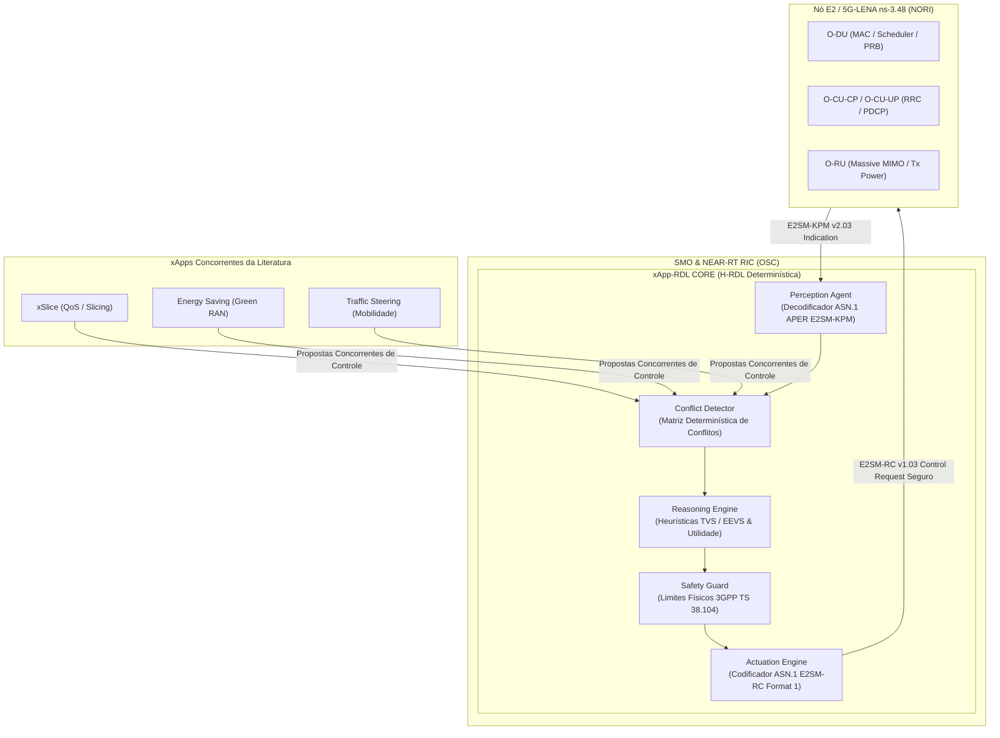
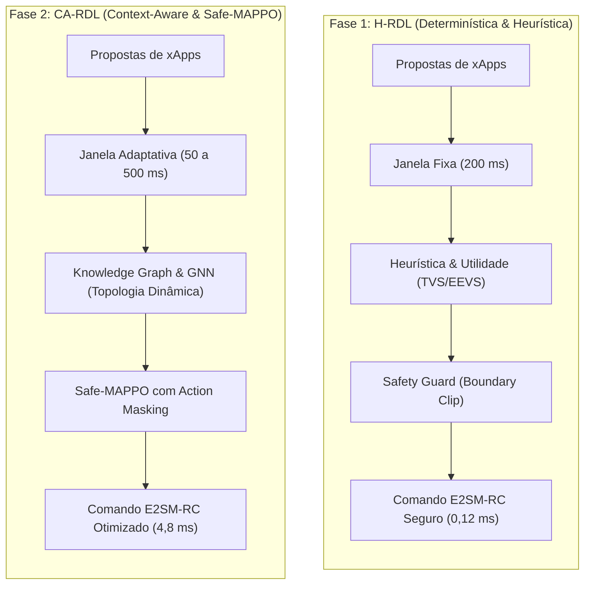

# xApp RDL (Resource and Decision Layer) — O-RAN Multi-xApp Conflict Governance

<div align="center">

**Arquitetura Unificada de Governança Cognitiva, Arbitragem Determinística e Mitigação de Conflitos Multi-xApp para Near-RT RIC**  
*Homologado para O-RAN ALLIANCE WG2/WG3, O-RAN SC (Release J), NORI (5G-LENA v5.1 / ns-3.48) e OpenRAN@Brasil Blueprint v3.*

[](https://o-ran.org)
[](https://cttc.es)
[](https://python.org)
[-brightgreen.svg)](tests/)
[](LICENSE)
[](https://drive.google.com/drive/folders/14ZHofqW5rT3UIXe248wb6JHiNX0WiGiM?usp=sharing)

</div>

---

### 🗺️ Navegação Multi-Fases do Projeto RDL (Resource and Decision Layer)

| Fase do Projeto | Descrição e Paradigma de Controle | Status de Implementação | Repositório Oficial |
| :---: | :--- | :---: | :---: |
| **Fase 1** | **RDL Determinística e Segura (H-RDL)**<br/>*Janela em lote nominal ($\Delta t_{win} = 200	ext{ ms}$), heurísticas de prioridade TVS/EEVS, Safety Guards físicos e mapeamento formal E2AP/E2SM.* | **100% Validada & Operacional** | [georgebarbosa3090/XApp-RDL-F1](https://github.com/georgebarbosa3090/XApp-RDL-F1) |
| **Fase 2** | **RDL Baseada em Contexto e Safe-RL (CA-RDL)**<br/>*Aprendizado por Reforço Multiagente (Safe-MAPPO sob CMDP Lagrangian), Grafos de Conhecimento (GraphSAGE / GNN) e Sensibilidade Contextual.* | **100% Validada & Operacional** | [georgebarbosa3090/XApp-RDL-F2](https://github.com/georgebarbosa3090/XApp-RDL-F2) |
| **Fase 3** | **RDL Autônoma e Federada 6G (Zero-Touch)**<br/>*Inteligência distribuída, orquestração por intenção (A1 Intent-Driven), Federação Multi-RIC e SAGIN.* | **Roadmap Ativo (2026–2028)** | *Em especificação e testbed* |

---

## 1. Visão Geral da Arquitetura e Principais Inovações

A **xApp RDL (Resource and Decision Layer)** atua como o middleware central de governança no **Near-RT RIC**, interceptando e mitigando colisões de recursos geradas por **xApps concorrentes da literatura O-RAN**:

1. **xSlice (QoS & Slicing Optimizer) — [`peihaoY/xslice-oran`](https://github.com/peihaoY/xslice-oran):** Solicita cotas elevadas de PRBs (`PRB_QUOTA = 80%`, prioridade 90) para fatias críticas URLLC e eMBB.
2. **Energy Saving (Green RAN Optimizer) — [`Orange-OpenSource/ns-O-RAN-flexric`](https://github.com/Orange-OpenSource/ns-O-RAN-flexric):** Solicita redução de potência de transmissão (`TX_POWER = 20 dBm`, prioridade 65) e modo sleep de células, colidindo com as garantias de QoS.
3. **Traffic Steering (Mobility Optimizer) — [`o-ran-sc/ric-app-ts`](https://github.com/o-ran-sc/ric-app-ts):** Solicita migração e balanceamento de tráfego (`HANDOVER`, prioridade 80), podendo induzir instabilidade e tempestades de Ping-Pong.



---

## 2. Paradigmas de Controle e Governança: H-RDL (Fase 1) × CA-RDL (Fase 2)

A governança multi-xApp evolui através de dois paradigmas complementares e interoperáveis:



### 2.1 Comparativo Didático dos Paradigmas

| Dimensão de Análise | Fase 1: H-RDL (Heuristic RDL) | Fase 2: CA-RDL (Context-Aware RDL) |
| :--- | :--- | :--- |
| **Filosofia de Controle** | **Determinística e Reativa:** Aplica regras matemáticas estritas e funções de utilidade convexas sobre estados instantâneos. | **Cognitiva e Adaptativa:** Aprende padrões temporais complexos, antecipa tendências e adapta a decisão ao contexto operacional. |
| **Janela de Decisão ($\Delta t_{win}$)** | **Fixa ($200	ext{ ms}$):** Agrupa propostas que chegam no intervalo regular para arbitragem em lote. | **Dinâmica e Adaptativa ($50	ext{ a }500	ext{ ms}$):** Ajusta o intervalo com base na velocidade de variação do tráfego e churn de rádio. |
| **Mecanismo de Detecção** | **Tabela de Conflitos e Regras Estáticas:** Verifica sobreposição de parâmetros físicos ($P_{tx}$, PRBs, Handover) na matriz de conflito. | **Knowledge Graph & GraphSAGE (GNN):** Mapeia a topologia como grafo dinâmico e detecta conflitos diretos, indiretos e implícitos. |
| **Motor de Decisão (Reasoning)** | **Heurísticas TVS / EEVS:** Otimização combinatória convexa baseada em pesos estáticos de QoS e penalidades lineares. | **Safe-MAPPO (MARL):** Agentes neurais cooperativos treinados sob CMDP (*Constrained Markov Decision Process*) via Multiplicadores de Lagrange. |
| **Garantia de Segurança** | **Safety Guard Rígido (Hard Bound):** *Clipping* e truncamento imediato de comandos fora dos limites do 3GPP TS 38.104. | **Action Masking + Lagrange Guard:** Invalidação prévia de ações inseguras no espaço de probabilidade da política neural. |
| **Latência de Decisão** | **Ultra-baixa ($0,12	ext{ ms}$):** Execução vetorial imediata em C++/Python sem inferência neural. | **Determinada ($4,8	ext{ ms}$):** Inferência neural via PyTorch/ONNX Runtime dentro do orçamento Near-RT (< 10 ms). |
| **Cenário Ideal de Operação** | Redes estáveis, tráfego homogêneo e requisitos determinísticos estritos de sub-milissegundo. | Redes densas heterogêneas, fatiamento dinâmico (URLLC/eMBB/mMTC), ISAC 6G e mobilidade NTN/V2X. |

---

## 3. Topologia e Cenários de Simulação Homologados (O-RAN / ns-3)

A plataforma valida cenários de simulação científica, com foco em H-RDL:

| ID | Cenário | Topologia / Nós | xApps Concorrentes | Desafio de Conflito | Métrica Chave |
| :---: | :--- | :--- | :--- | :--- | :--- |
| **C1** | **EEVS (Energy vs QoS)** | 1 gNB Macro + 3 Small Cells, 30 UEs | xSlice vs Energy Saving | Conflito Direto de $P_{tx}$ e PRBs | Consumo (J/Mbit) vs SLA Violation |
| **C2** | **TVS (Traffic Steering vs Slicing)** | 3 gNBs Interconectadas (Xn), 45 UEs | xSlice vs Traffic Steering | Conflito Indireto de Handover e Cota | Vazão Agregada (Mbps) e Ping-Pong |
| **C3** | **5G-Adv Multi-Carrier MIMO** | Dual Carrier (n78 + n258), 60 UEs | xSlice + ES + TS + MIMO Alloc | Acoplamento Cruzado de Banda e Potência | Eficiência Espectral (bps/Hz) |

---

## 4. Galeria de Figuras Científicas e Topologias de Rede

Todas as figuras do ecossistema estão catalogadas na pasta [`docs/figures/`](docs/figures/README.md).

---

## 5. Catálogo Formal de Tabelas Científicas e Normativas

O arcabouço científico consolida as matrizes de rastreabilidade normativa, orçamentos de latência e evidências experimentais documentadas em [`docs/`](docs/README.md).

---

## 6. Pipeline de Execução e Reproducibilidade

### 6.1 Execução dos Testes Automatizados
```bash
# Execução da suíte de testes em ambiente WSL / Linux
pytest tests/ -v
```

### 6.2 Execução do Módulo de Arbitragem Heurística
```bash
# Execução da arbitragem H-RDL
python -m src.rdl_engine --scenario cenario_1_eevs
```

---

## 7. Informações Acadêmicas e Governança

- **Autor do Projeto:** George Alexandro Ferreira Barbosa
- **Orientador:** Prof. Dr. André Riker
- **Instituição:** Universidade Federal do Pará (UFPA) — Instituto de Tecnologia (ITEC)
- **Programa:** Programa de Pós-Graduação em Ciência da Computação (PPGCOMP)
- **Área de Concentração:** Sistemas de Computação e Redes de Comunicação
- **Linha de Pesquisa:** Redes Sem Fio Inteligentes, Open RAN e Arquiteturas Cognitivas 6G
- **Release Homologada:** `1.2.0-certified` (18 de setembro de 2026)

---

## 8. Licença e Direitos

Este projeto é disponibilizado sob a licença **Apache License 2.0**. Consulte o arquivo [`LICENSE`](LICENSE) para obter os termos e condições na íntegra.
