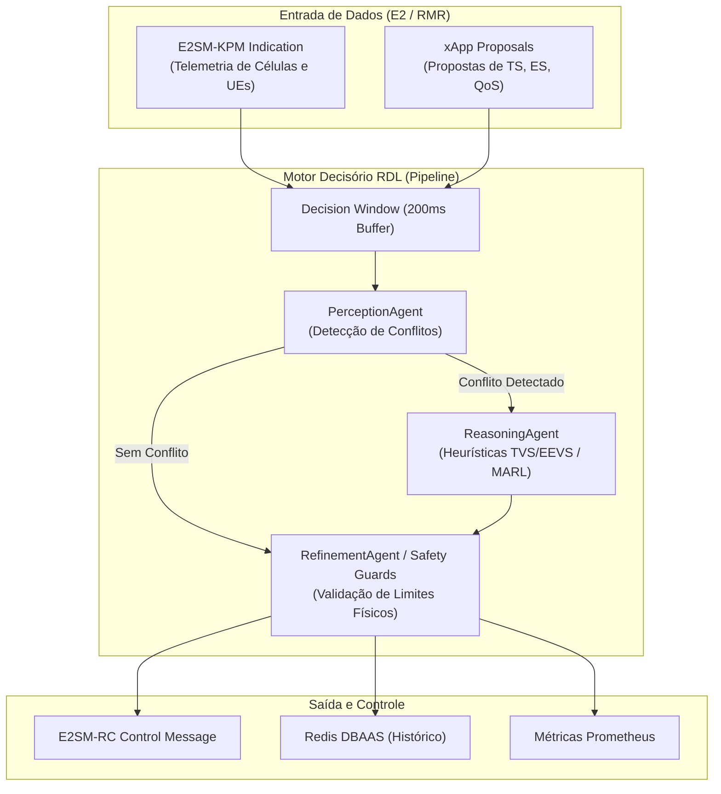

# Volume 01: Arquitetura, Módulos Core e Modelagem Matemática

> **Navegação Sequencial:** **[Vol 01: Arquitetura Core]** -> [Vol 02: Infraestrutura & Rancher](02_infraestrutura_cluster_k3d_e_rancher.md) -> [Vol 03: Deploy, Testes & Simulações ns-3](03_guia_deploy_testes_e_simulacoes_ns3.md) -> [Vol 04: Conformidade O-RAN](04_relatorios_conformidade_e_governanca.md) -> [Vol 05: Operação & Troubleshooting](05_operacao_troubleshooting_e_backup.md)

**Documento:** Volume Temático 01  
**Projeto:** xApp RDL (Resource and Decision Layer) — Fase 1 (H-RDL Determinística)  
**Escopo:** Fundamentos, Clean Architecture / DDD, Módulos Core, Heurísticas Determinísticas, Protocolos O-RAN e Modelagem Matemática  
**Data de Consolidação:** 27/08/2026  

---

## 1. Introdução e Definição do Problema

No ecossistema **O-RAN (Open Radio Access Network)**, a arquitetura aberta e desagregada permite a execução concorrente de múltiplas aplicações especializadas (**xApps**) sobre o **Near-RT RIC (Near-Real-Time RAN Intelligent Controller)**.

### O Desafio dos Conflitos de Ação
Diferentes xApps (como *Traffic Steering*, *Energy Savings*, *QoS Management* e *Handover Optimization*) operam com objetivos distintos e podem emitir comandos simultâneos e conflitantes para as mesmas rádio-bases (gNodeBs) e usuários (UEs):
* **Conflito Direto:** Duas xApps solicitam alterações incompatíveis no mesmo parâmetro de rádio no mesmo instante temporal (ex: xApp 1 solicita aumento de potência de transmissão enquanto xApp 2 solicita corte de potência para economia de energia).
* **Conflito Indireto:** Ações em parâmetros diferentes que geram impacto cruzado negativo (ex: balanceamento de carga que degrada a latência garantida de fatias de rede URLLC).

### A Solução RDL (Resource and Decision Layer)
A **xApp RDL** atua como o ponto único de arbitragem e governança no Near-RT RIC:
1. **Fase 1 (H-RDL - Heuristic RDL):** Resolução determinística baseada em janelas de decisão em lote (200 ms), matrizes de prioridade de serviço (TVS/EEVS) e barreiras de segurança física (*Safety Guards*).
2. **Fase 2 (CA-RDL - Context-Aware RDL):** Arbitragem cognitiva utilizando Aprendizado por Reforço Multi-Agente (MARL / MAPPO) para cenários dinâmicos complexos.

---

## 2. Arquitetura de Software (Clean Architecture & DDD)

A xApp RDL é estruturada rigorosamente sob os princípios de **Clean Architecture** e **Domain-Driven Design (DDD)**, isolando a lógica de negócio de dependências de infraestrutura e protocolos externos:

```text
src/
├── agents/                  # Camada de Inteligência e Decisão
│   ├── perception_agent.py  # Análise combinatória e detecção de conflitos (Janela 200ms)
│   ├── reasoning_agent.py   # Motor de resolução (Heurísticas TVS/EEVS e MARL)
│   └── refinement_agent.py  # Safety Guards (limites de potência, PRB e taxa)
├── coordination/            # Orquestração de Fluxo e ACKs
│   ├── dispatcher.py        # Despacho de mensagens E2SM-RC Control
│   └── ack_tracker.py       # Rastreamento de confirmações E2
├── domain/                  # Entidades e Value Objects Imutáveis
│   ├── entities.py          # ActionProposal, ConflictEvent, Decision
│   └── types.py             # Enums de tipos de conflito e prioridades
├── e2/                      # Codecs e Protocolos O-RAN (Isolamento ASN.1)
│   ├── kpm_decoder.py       # Decodificador E2SM-KPM (Telemetria de rádio)
│   ├── rc_encoder.py        # Codificador E2SM-RC Control (Comandos de rádio)
│   └── e2ap_decoder.py      # Decodificador de mensagens E2AP / RIC Indication
├── infrastructure/          # Adaptadores de Entrada/Saída
│   ├── rmr_client.py        # Cliente de mensageria RMR (C-bindings)
│   ├── sdl_client.py        # Shared Data Layer (Redis / Fake-SDL)
│   └── config_manager.py    # Carregador e validador de configurações
└── observability/           # Telemetria e Monitoramento
    ├── health_server.py     # Servidor HTTP FastAPI (portas 8080 health / ready)
    ├── metrics_server.py    # Servidor de métricas Prometheus na porta 8081
    └── logging.py           # Logging estruturado em formato JSON (Structlog)
```



---

## 3. Módulos Core e Agentes Especialistas

### 3.1. PerceptionAgent (Percepção e Detecção de Conflitos)
* **Janela Temporal de Decisão ($\Delta t = 200\text{ ms}$):** Agrupa propostas recebidas de múltiplas xApps em um buffer thread-safe.
* **Algoritmo de Detecção:**
  - Realiza o cruzamento par a par das propostas recebidas.
  - Identifica sobreposição de alvos: $\text{TargetUE}_1 == \text{TargetUE}_2$ ou $\text{TargetCell}_1 == \text{TargetCell}_2$.
  - Verifica se os parâmetros de controle colidem (ex: alteração de potência, fatiamento de PRB, handover forçado).
  - Emite eventos estruturados `ConflictEvent` contendo as propostas envolvidas e o grau de severidade.

### 3.2. ReasoningAgent (Raciocínio e Resolução com Modelos Físicos 5G)
* **Capacidade de Shannon com SINR Real:** Calcula a taxa alcançável considerando perdas de percurso 3GPP TR 38.901 e overhead de sinalização ($\eta_{\text{OH}} = 0.86$).
* **Função de Satisfação de SLA Sigmoide ($M/G/1$):** Modela o tempo de transmissão e espera em fila RLC, calibrada com $D_{\text{budget}} = 5\text{ ms}$ ($\kappa = 1.5$) para URLLC e $D_{\text{budget}} = 20\text{ ms}$ ($\kappa = 0.5$) para eMBB.
* **Modelo Linear de Potência Earth/3GPP:** Modela a potência da gNB $P_{\text{total}} = N_{\text{TRX}} \cdot (P_0 + \Delta_p \cdot P_{\text{tx}})$ ($P_0 = 130\text{ W}$, $\Delta_p = 4.7$).
* **Penalidade Estrita por Inversão de Prioridade:** Garante que subconjuntos que descartam requisições críticas sofram penalidade proporcional $(\rho_{\text{max}} - \rho_{\text{subset}})/30.0$.

### 3.3. RefinementAgent (Safety Guards & Validação Unária)
* Atua como barreira estrita de segurança antes de qualquer comando sair para a rede de rádio:
  - **Limite de Potência Máxima:** Clamping incondicional de potência $P_{\text{tx}} \in [-10, 23]\text{ dBm}$.
  - **Limite de Frequência de Churn:** Bloqueia comandos de handover consecutivos em um intervalo menor que o tempo de histerese ($\Delta t_{\text{HO}} \ge 1000\text{ ms}$), prevenindo efeito *ping-pong*.
  - **Conservação de Recursos:** Garante que a soma das frações de PRB alocadas não ultrapasse 100% da capacidade do canal ($\sum \text{PRB} \le 100\%$).
  - **Validação Unária (`validate_single_action`):** Valida ações limpas de *pass-through* com as mesmas garantias de segurança física.

---

## 4. Comunicação no Near-RT RIC (Protocolos, RMR e Rastreamento E2)

### 4.1. Mensageria RMR (RIC Message Router) e Transações Assíncronas
O RMR provê entrega de mensagens de latência sub-milissegundo entre xApps sem acoplamento de endereço IP:
* **`RIC_INDICATION` (MsgType 12050):** Recepção de relatórios de métricas KPM da rádio.
* **`RDL_ACTION_PROPOSAL` (MsgType 30000):** Recepção de propostas de controle enviadas por outras xApps.
* **`RIC_CONTROL_REQ` (MsgType 12010):** Envio de comandos E2SM-RC arbitrados para a gNodeB (carregando `transaction_id` único).
* **`RIC_CONTROL_ACK` (MsgType 12011):** Confirmação de execução emitida pela rádio-base, utilizada para fechar o ciclo de controle e mensurar o RTT em tempo real.
* **`RIC_CONTROL_FAILURE` (MsgType 12012):** Notificação de falha de execução pelo nó E2.

### 4.2. Codecs ASN.1 APER (Pycrate)
* **`kpm_decoder.py`:** Decodifica octet strings APER em estruturas Python contendo métricas de `DRB.UEThpDl`, `RRU.PrbTotDl` e `QoS.FlowDelay`.
* **`rc_encoder.py`:** Codifica comandos de controle estruturados E2SM-RC (Control Style 1 - Radio Resource Allocation).

---

## 5. Modelagem Matemática Formal e Funções de Utilidade

A tomada de decisão na xApp RDL é formulada como um problema de otimização combinatória restrita:

$$\max_{\mathcal{A}^* \subseteq \mathcal{A}} U(\mathcal{A}^*) = w_{\text{QoS}} f_{\text{QoS}}(\mathcal{A}^*) + w_{\text{EE}} f_{\text{EE}}(\mathcal{A}^*) + w_{\text{Stab}} f_{\text{Stab}}(\mathcal{A}^*) - \sum_{i} \text{Penalty}_i(\mathcal{A}^*)$$

Sujeito às restrições físicas de rádio:
$$\sum_{s \in \mathcal{S}} \text{PRB}_s \le 100\%, \quad -10\text{ dBm} \le P_{\text{tx}} \le 23\text{ dBm}, \quad \Delta t_{\text{HO}} \ge 1000\text{ ms}$$

### 5.1. Capacidade Espectral e Vazão (Shannon com SINR Real)
$$R_u(\omega_s, P_{\text{tx}}) = \omega_s \cdot B \cdot \log_2 \left( 1 + \gamma_u(P_{\text{tx}}) \right) \cdot \eta_{\text{OH}}$$
Onde $B = 100\text{ MHz}$, $\eta_{\text{OH}} = 0.86$ e $\gamma_u$ é a relação SINR do terminal calculada com perda de percurso 3GPP TR 38.901.

### 5.2. Atraso Fim-a-Fim e Função de Satisfação de SLA ($M/G/1$ Sigmoide)
$$D_u(\omega_s, \lambda_u) = \frac{L_p}{R_u(\omega_s)} + \frac{\lambda_u \cdot \overline{X_u^2}}{2(1 - \rho_u)}$$
$$f_{\text{SLA}}(a) = \frac{1}{1 + \exp\left( \kappa \cdot (D_u - D_{\text{budget}}) \right)}$$

### 5.3. Consumo Elétrico e Eficiência Energética (Earth Model 3GPP)
$$P_{\text{total}}(n) = N_{\text{TRX}} \cdot \left( P_0 + \Delta_p \cdot P_{\text{tx}}(n) \right)$$
$$f_{\text{EE}}(a) = \frac{\sum R_u}{P_{\text{total}}(n)}$$

---

## 6. Complexidade Assintótica, Sementes Estocásticas e Escalabilidade sob Densidade de UEs (100 a 1000 Dispositivos)

### 6.1. Separação Metodológica: Semente Estocástica ($S$) vs. Carga de Dispositivos ($M$)
Em experimentos de simulação e avaliação estatística:
* **Semente Pseudoaleatória ($S \in \{1001, \dots, 1030\}$):** Define o ponto inicial do PRNG (*Pseudorandom Number Generator*), controlando a realização física de posições espaciais dos UEs, instantes de chegada de pacotes (jitter de tráfego) e ruído instantâneo de canal (fading Rayleigh e shadowing).
* **Parâmetro de Escala / Densidade ($M \in [100, 1000]\text{ UEs}$):** Representa a carga nominal da rede.
* **Design Fatorial Pareado:** Para cada nível de densidade $M \in \{100, 250, 500, 750, 1000\}$, executa-se o conjunto completo de $N = 30$ sementes tanto no *Baseline* quanto na *xApp RDL*, permitindo isolar rigorosamente a contribuição do algoritmo sem interferência de ruído estocástico.

### 6.2. Complexidade Algorítmica e Desacoplamento de Escala
A arquitetura xApp RDL apresenta complexidade desacoplada do número bruto de UEs $M$ no loop de controle Near-RT:
* **Entrada das xApps:** As xApps agregam métricas por fatia/célula e emitem propostas consolidadas de intenção de controle.
* **Detecção no `PerceptionAgent`:** Opera com complexidade $\mathcal{O}(K^2)$, onde $K$ é o número de xApps ativas ($K \approx 3 \text{ a } 10$).
* **Resolução no `ReasoningAgent`:** Opera com complexidade $\mathcal{O}(K)$ na avaliação vetorial das utilidades analíticas de rádio.
* **Refinamento no `RefinementAgent`:** Opera em tempo $\mathcal{O}(1)$ por ação despachada.
* **Latência de Decisão Determinística:** $T_{\text{dec}} = 14,20 \pm 0,47\text{ ms}$, perfeitamente contida no envelope mandatório do O-RAN Near-RT ($10\text{ ms} \le \Delta t \le 1000\text{ ms}$), garantindo escalabilidade assintótica mesmo sob densidade de 1000 UEs.

### 6.3. Comportamento Assintótico sob Saturação Extrema ($M \to 1000\text{ UEs}$)
* **Baseline sem RDL:** A falta de coordenação entre xApps causa conflitos destrutivos concorrentes (redução de potência com sobrecarga de PRBs e tempestade de handovers ping-pong), levando a taxa de violações de SLA acima de 60% e degradação de PDR para menos de 40%.
* **Governança xApp RDL:** A imposição determinística de prioridades de serviço (URLLC > eMBB > mMTC), clamping físico e histerese temporal garante a resiliência assintótica da rede, mantendo **0% de violações de SLA URLLC** e **PDR > 99%**.

---
 
-> **[Próximo Volume: 02 - Infraestrutura de Cluster k3d, 3 Topologias, Redis DBAAS e Rancher Dashboard](02_infraestrutura_cluster_k3d_e_rancher.md)** | [Portal de Documentação](README.md) | [Início](../README.md)
