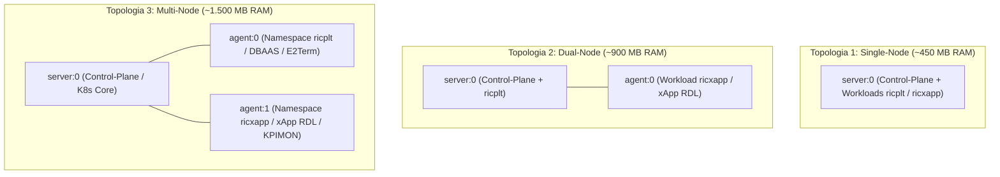
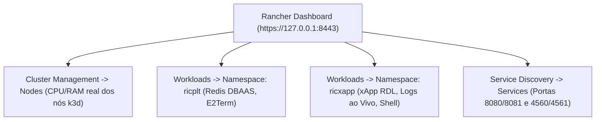

# Volume 02: Infraestrutura de Cluster (k3d / K8s Puro), 3 Topologias de Cluster, Redis DBAAS e Rancher Dashboard

> **Navegação Sequencial:** [Vol 01: Arquitetura Core](01_arquitetura_e_modelagem_matematica.md) -> **[Vol 02: Infraestrutura & Rancher]** -> [Vol 03: Deploy, Testes & Simulações ns-3](03_guia_deploy_testes_e_simulacoes_ns3.md) -> [Vol 04: Conformidade O-RAN](04_relatorios_conformidade_e_governanca.md) -> [Vol 05: Operação & Troubleshooting](05_operacao_troubleshooting_e_backup.md)

**Documento:** Volume Temático 02  
**Projeto:** xApp RDL (Resource and Decision Layer) — Fase 1 (H-RDL Determinística)  
**Escopo:** Requisitos do Sistema, Topologias de Cluster k3d no WSL2, Mapeamento de Portas O-RAN, Levantamento do Near-RT RIC com Redis DBAAS e Gestão via Rancher Dashboard  
**Data de Consolidação:** 27/08/2026  

---

## 1. Requisitos de Sistema e Pré-requisitos

Para implantar a infraestrutura completa do Near-RT RIC, xApps e simulador ns-3 no ambiente WSL2 ou Linux bare-metal, certifique-se de que os seguintes componentes estão instalados:

| Componente | Versão Mínima | Finalidade no Projeto | Comando de Validação |
| :--- | :---: | :--- | :--- |
| **Sistema Operacional** | WSL2 (Ubuntu 20.04 ou 22.04 LTS) | Ambiente de execução Linux nativo | `uname -a` |
| **Docker Engine** | 20.10+ / containerd | Container runtime e isolamento de nós | `docker --version` |
| **k3d CLI** | v5.x | Orquestrador de clusters Kubernetes leves em Docker | `k3d version` |
| **kubectl CLI** | v1.24+ | Interface de linha de comando oficial do Kubernetes | `kubectl version --client` |
| **Helm CLI** | v3.8+ | Gerenciador de pacotes e templates de deploy O-RAN | `helm version --short` |
| **Python** | 3.8+ (com módulo `venv`) | Ambiente de execução e testes da xApp RDL | `python3 --version` |
| **Rancher Server** | v2.8+ / v2.14 | Dashboard visual de gestão de clusters e telemetria | `docker ps \| grep rancher` |

---

## 2. As 3 Topologias de Cluster k3d para O-RAN

Executar a stack completa do Near-RT RIC e xApps no WSL2 exige uma gestão precisa de memória RAM para evitar que o *OOM Killer* do kernel Linux derrube os nós ou o simulador `ns-3`. O projeto disponibiliza **3 topologias de cluster padronizadas**:



### 2.1. Comparativo Técnico entre as Topologias

| Critério | Topologia 1: Single-Node (1 Server) | Topologia 2: Dual-Node (1 Server + 1 Agent) | Topologia 3: Multi-Node (1 Server + 2 Agents) |
| :--- | :---: | :---: | :---: |
| **Composição de Nós** | 1 nó (`server-0`) | 2 nós (`server-0`, `agent-0`) | 3 nós (`server-0`, `agent-0`, `agent-1`) |
| **Overhead de Memória RAM** | **~450 MB (Ultraleve)** | **~900 MB (Balanceada)** | **~1.500 MB (Alta Disponibilidade)** |
| **Isolamento de Cargas** | Lógico (por Namespaces) | Físico (Control-Plane vs Workloads) | Físico Completo (`ricplt` vs `ricxapp`) |
| **Importação de Imagens** | Importação direta no nó único | Requer importar no `agent-0` | Requer replicar nos nós de execução |
| **Caso de Uso Recomendado** | **Desenvolvimento ágil e WSL2 com RAM limitada (< 16 GB)** | **Ambientes de homologação e testes de tolerância a falhas** | **Simulação de produção e clusters dedicados bare-metal** |

---

### 2.2. Comandos de Criação das 3 Topologias

#### Opção A: Topologia 1 — Single-Node (Recomendada / Padrão do Repositório)
Cria um cluster ultraleve de 1 nó com todas as portas O-RAN mapeadas:
```bash
# Deletar cluster antigo (se existir)
k3d cluster delete rancher-lab 2>/dev/null || true

# Criar cluster Single-Node
k3d cluster create rancher-lab \
  --servers 1 \
  --agents 0 \
  --port "36422:36422/SCTP@server:0" \
  --port "8080:8080@server:0" \
  --port "8081:8081@server:0" \
  --port "4560:4560@server:0" \
  --port "4561:4561@server:0"

# Configurar kubeconfig local
mkdir -p ~/.kube && k3d kubeconfig get rancher-lab > ~/.kube/config && chmod 600 ~/.kube/config
```

#### Opção B: Topologia 2 — Dual-Node (1 Server + 1 Agent)
Separa o plano de controle dos nós de execução de xApps:
```bash
k3d cluster delete rancher-lab 2>/dev/null || true

k3d cluster create rancher-lab \
  --servers 1 \
  --agents 1 \
  --port "36422:36422/SCTP@server:0" \
  --port "8080:8080@agent:0" \
  --port "8081:8081@agent:0" \
  --port "4560:4560@agent:0" \
  --port "4561:4561@agent:0"

mkdir -p ~/.kube && k3d kubeconfig get rancher-lab > ~/.kube/config && chmod 600 ~/.kube/config
```

#### Opção C: Topologia 3 — Multi-Node (1 Server + 2 Agents)
Isola o plano da plataforma Near-RT RIC (`ricplt`) no `agent-0` e as xApps (`ricxapp`) no `agent-1`:
```bash
k3d cluster delete rancher-lab 2>/dev/null || true

k3d cluster create rancher-lab \
  --servers 1 \
  --agents 2 \
  --port "36422:36422/SCTP@server:0" \
  --port "8080:8080@agent:0" \
  --port "8081:8081@agent:0" \
  --port "4560:4560@agent:0" \
  --port "4561:4561@agent:0"

mkdir -p ~/.kube && k3d kubeconfig get rancher-lab > ~/.kube/config && chmod 600 ~/.kube/config
```

---

## 3. Mapeamento de Portas O-RAN e Conectividade de Rede

O cluster k3d expõe as portas fundamentais para a arquitetura O-RAN:

| Porta | Protocolo | Camada / Módulo | Função Técnica |
| :---: | :---: | :--- | :--- |
| **`36422`** | **SCTP** | E2 Termination (`E2Term`) | Canal de transporte de mensagens E2AP / E2SM-KPM / E2SM-RC com gNodeBs ou simulador ns-3 |
| **`8080`** | **HTTP** | xApp RDL Core | Probes de Liveness (`/health`) e Readiness (`/ready`) para o Kubernetes |
| **`8081`** | **HTTP** | xApp Observability | Endpoint `/metrics` para raspagem do Prometheus |
| **`4560`** | **TCP** | RMR Data Channel | Transporte interno de payloads de decisão entre xApps |
| **`4561`** | **TCP** | RMR Route Manager | Distribuição dinâmica de tabelas de rotas (`routes.rt`) |
| **`6379`** | **TCP** | Redis DBAAS (SDL) | Shared Data Layer para persistência de topologia e histórico de decisões |

---

## 4. Levantamento da Infraestrutura Near-RT RIC (Namespaces & Redis DBAAS)

A arquitetura O-RAN exige o isolamento em dois namespaces centrais:
* **`ricplt`:** Plataforma Near-RT RIC (DBAAS Redis, E2Term, RouteMgr, AppMgr).
* **`ricxapp`:** Execução das aplicações inteligentes (xApp RDL, KPIMON, Traffic Steering).

### 4.1. Criação dos Namespaces
```bash
kubectl create namespace ricplt --dry-run=client -o yaml | kubectl apply -f -
kubectl create namespace ricxapp --dry-run=client -o yaml | kubectl apply -f -
```

### 4.2. Deploy Declarativo do Redis DBAAS (Shared Data Layer) no `ricplt`
```bash
kubectl apply -n ricplt -f - <<EOF
apiVersion: apps/v1
kind: Deployment
metadata:
  name: deployment-ricplt-dbaas-redis
  namespace: ricplt
  labels:
    app: ricplt-dbaas
spec:
  replicas: 1
  selector:
    matchLabels:
      app: ricplt-dbaas
  template:
    metadata:
      labels:
        app: ricplt-dbaas
    spec:
      containers:
      - name: redis
        image: redis:6.2-alpine
        imagePullPolicy: IfNotPresent
        ports:
        - containerPort: 6379
        resources:
          requests:
            cpu: 50m
            memory: 64Mi
          limits:
            cpu: 200m
            memory: 128Mi
---
apiVersion: v1
kind: Service
metadata:
  name: service-ricplt-dbaas-tcp
  namespace: ricplt
  labels:
    app: ricplt-dbaas
spec:
  selector:
    app: ricplt-dbaas
  ports:
  - port: 6379
    targetPort: 6379
EOF
```

### 4.3. Validação do Status do Redis DBAAS
```bash
kubectl get pods -n ricplt -o wide
# Saída esperada: deployment-ricplt-dbaas-redis-xxx   1/1   Running
```

---

## 5. Integração e Gestão no Rancher Dashboard

O **Rancher Dashboard** (`https://127.0.0.1:8443`) centraliza o gerenciamento visual do cluster, monitoramento de nós, inspeção de logs em tempo real e abertura de terminais nos pods.



### 5.1. Passo 1: Inicialização do Contêiner do Rancher Server

O Rancher Server precisa ser iniciado como contêiner Docker antes de tentar acessar a interface web:

```bash
# Opção A: Via Makefile (Recomendado)
make rancher-start

# Opção B: Comando Docker Direto
docker run -d --restart=unless-stopped \
  -p 8088:80 -p 8443:443 \
  --privileged \
  --name rancher-server \
  rancher/rancher:v2.8.5
```

> [!NOTE]
> **Mapeamento de Portas:** Utilizamos a porta `8088:80` para a interface HTTP do Rancher para evitar conflito com a porta `8080`, que é dedicada às sondas de liveness `/health` das xApps no cluster k3d. O acesso seguro principal é feito via HTTPS na porta `8443`.

---

### 5.2. Passo 2: Acompanhar Prontidão e Obter Senha Inicial (Bootstrap Password)

Na primeira execução, o Rancher leva cerca de **60 a 90 segundos** para inicializar seu plano de controle interno e certificados:

```bash
# 1. Acompanhar logs até a inicialização completa (Pressione Ctrl+C quando pronto):
make rancher-logs
# ou: docker logs -f rancher-server

# 2. Obter a senha de primeiro acesso (Bootstrap Password):
make rancher-password
# ou: docker logs rancher-server 2>&1 | grep "Bootstrap Password:"
```

---

### 5.3. Passo 3: Acesso ao Dashboard e Configuração Inicial

1. Abra no navegador: **`https://localhost:8443`** (ou `https://127.0.0.1:8443`).
2. **Aviso de Certificado TLS:** Como o Rancher gera certificados autoassinados para o ambiente de laboratório, o navegador exibirá o aviso *"Sua conexão não é particular"*:
   - Clique em **"Avançado"** -> **"Continuar para localhost (não seguro)"** (no Google Chrome, se o botão não aparecer, basta digitar `thisisunsafe` na janela).
3. Cole a **Bootstrap Password** obtida no Passo 2, defina sua nova senha definitiva de administrador e confirme a URL de acesso (`https://localhost:8443`).

---

### 5.4. Passo 4: Importação e Vinculação Automatizada do Cluster k3d

Para importar o cluster `rancher-lab` no Rancher sem sofrer com problemas de resolução DNS do WSL2 ou conflitos de porta (`8443` no host vs `443` no Docker):

```bash
# 1. No painel do Rancher, acesse: Cluster Management -> Clusters -> Import Existing -> Selecione 'Generic' -> Nomeie como 'rancher-lab'
# 2. Copie o comando de registro gerado na UI do Rancher (ele conterá a URL com o token gerado, ex: https://localhost:8443/v3/import/c-m-abcdef_c-m-abcdef.yaml)
# 3. Execute o helper automatizado do repositório passando a URL ou o nome do arquivo com token:
make rancher-connect URL="https://localhost:8443/v3/import/c-m-abcdef_c-m-abcdef.yaml"

# Ou simplesmente execute o script (ele tentará autodescobrir o token se não informado):
bash scripts/register_rancher.sh
```

> [!IMPORTANT]
> **Atenção ao Placeholder `<token>`:**
> Não digite literalmente `<token>` no terminal Bash, pois os caracteres `<` e `>` são interpretados como redirecionamento de arquivo (`-bash: token: No such file or directory`), impedindo o download do manifesto e a criação do namespace `cattle-system`. Sempre substitua pelo token real (ex: `c-m-abcdef123_c-m-abcdef123.yaml`).

#### Procedimento Manual Equivalente (Passo a Passo Interno):
```bash
# A. Conectar o container do Rancher à rede Docker do cluster k3d
docker network connect k3d-rancher-lab rancher-server 2>/dev/null || true

# B. Baixar e aplicar o manifesto usando o TOKEN REAL gerado pela UI do Rancher
# (Substitua TOKEN_REAL.yaml pelo nome do arquivo gerado pelo Rancher, ex: c-m-xxxx_c-m-xxxx.yaml)
docker exec rancher-server curl --insecure -sfL https://localhost:443/v3/import/TOKEN_REAL.yaml | kubectl apply -f -

# C. Configurar o agente para comunicação direta com bypass de SSL interno
kubectl wait --for=condition=available --timeout=60s deployment/cattle-cluster-agent -n cattle-system 2>/dev/null || true
kubectl set env deployment/cattle-cluster-agent -n cattle-system \
  CATTLE_SERVER="https://rancher-server:443" \
  CATTLE_SSL_NO_VERIFY="true"

# D. Reiniciar e validar o Pod do Agente
kubectl rollout restart deployment/cattle-cluster-agent -n cattle-system
kubectl get pods -n cattle-system -w
```

---

## 6. Próximo Passo Sequencial

Com a infraestrutura de cluster k3d provisionada, Redis DBAAS ativo no namespace `ricplt` e o cluster registrado com sucesso no Rancher Dashboard, avance para o deploy da xApp RDL e ativação imediata da observabilidade com Kiali:

-> **[Volume 03: Guia de Deploy, Observabilidade, Testes e Simulações no ns-3 NORI / 5G-LENA](03_guia_deploy_testes_e_simulacoes_ns3.md)**
