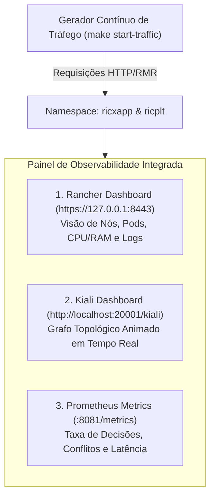

# Volume 03: Guia de Deploy da xApp RDL (Helm & Kubernetes Puro) e Observabilidade Imediata com Kiali

> **Navegação Sequencial:** [Vol 01: Arquitetura Core](01_arquitetura_e_modelagem_matematica.md) -> [Vol 02: Infraestrutura & Rancher](02_infraestrutura_cluster_k3d_e_rancher.md) -> **[Vol 03: Deploy & Observabilidade Kiali]** -> [Vol 04: Testes, ns-3 & Benchmarks](04_testes_simulacao_ns3_e_benchmarks.md) -> [Vol 05: Conformidade O-RAN](05_relatorios_conformidade_e_governanca.md) -> [Vol 06: Operação & Troubleshooting](06_operacao_troubleshooting_e_backup.md)

**Documento:** Volume Temático 03  
**Projeto:** xApp RDL (Resource and Decision Layer) — Fase 1 (H-RDL Determinística)  
**Escopo:** Empacotamento Helm, Deploy Declarativo Kustomize, Onboarding DMS, Integração de Service Mesh Istio, Kiali Dashboard e Injeção Contínua de Tráfego  
**Data de Consolidação:** 27/08/2026  

---

## 1. Visão Geral das Estratégias de Deploy

A xApp RDL suporta duas modalidades oficiais de implantação no Kubernetes Near-RT RIC:

1. **Modalidade Helm Chart (Padrão O-RAN / Produção):** Utiliza a estrutura declarativa `deploy/helm/iqos-xapp-rdl` gerenciada via Helm CLI v3 ou AppMgr DMS.
2. **Modalidade Kubernetes Puro / Kustomize (Desenvolvimento / K8s Nativo):** Utiliza os manifestos puros em `deploy/kubernetes/` aplicados diretamente com `kubectl apply -k`.

---

## 2. Deploy via Helm Chart Oficial (`deploy/helm/iqos-xapp-rdl/`)

```text
deploy/helm/iqos-xapp-rdl/
├── Chart.yaml                  # Metadados do Chart (versão 1.1.0)
├── values.yaml                 # Parâmetros configuráveis (portas, recursos, sondas)
└── templates/
    ├── _helpers.tpl            # Nomes e labels padronizados
    ├── deployment.yaml         # Pod da xApp com healthcheck e security context
    ├── service-http.yaml       # Serviços HTTP (porta 8080 health / 8081 metrics)
    └── service-rmr.yaml        # Serviços RMR (portas 4560 data / 4561 route)
```

### 2.1. Deploy Helm Automatizado em 1 Comando
O comando compila a imagem Docker local, importa nos nós containerd do k3d, valida a sintaxe com `helm lint`, empacota o chart e realiza o deploy no namespace `ricxapp`:

```bash
cd ~/XApp-RDL-F1
make helm-deploy
```

### 2.2. Execução Manual Passo a Passo
```bash
# 1. Build da imagem Docker
docker build -f docker/Dockerfile -t iqos-xapp-rdl:1.1.0 .

# 2. Importação no containerd do k3d
for node in $(docker ps --format '{{.Names}}' | grep -E "k3d-.*-(server|agent)"); do
    docker save iqos-xapp-rdl:1.1.0 | docker exec -i $node ctr images import -
done

# 3. Validar e empacotar
helm lint deploy/helm/iqos-xapp-rdl
helm package deploy/helm/iqos-xapp-rdl

# 4. Deploy no namespace ricxapp
helm upgrade --install ricxapp-iqos-xapp-rdl ./iqos-xapp-rdl-1.1.0.tgz \
  --namespace ricxapp \
  --create-namespace \
  --set image.pullPolicy=Never \
  --set env.useFakeSdl="true" \
  --set env.rmrWaitForReady="false"

# 5. Aguardar Rollout
kubectl rollout status deployment/ricxapp-iqos-xapp-rdl -n ricxapp --timeout=60s
```

---

## 3. Deploy Kubernetes Puro / Kustomize (`deploy/kubernetes/`)

Para operadores que preferem K8s nativo sem a dependência do Helm:

```bash
# Deploy automatizado:
make k8s-deploy

# Ou aplicação direta via Kustomize:
kubectl apply -k deploy/kubernetes/
kubectl rollout status deployment/ricxapp-iqos-xapp-rdl -n ricxapp --timeout=60s
```

---

## 4. Observabilidade Imediata com Kiali Service Mesh e Rancher UI

Assim que o deploy da xApp e da plataforma Near-RT RIC for concluído, ative imediatamente a stack de **Observabilidade em Tempo Real** para validar a saúde dos componentes, a topologia de rede e o fluxo de dados.



### 4.1. Instalação e Inicialização do Kiali
O script instala o **Istio Service Mesh**, injeta os sidecars de telemetria e disponibiliza o **Kiali UI**:

```bash
# 1. Instalar Istio e Kiali no cluster
make kiali-install

# 2. Abrir o Kiali Dashboard no navegador
make kiali-dashboard
# URL: http://localhost:20001/kiali
```

### 4.2. Injeção Contínua de Tráfego O-RAN
Para visualizar os fluxos de mensagens trafegando entre os namespaces `ricplt` e `ricxapp` no Kiali, inicie o gerador contínuo de tráfego sintético:

```bash
# Iniciar tráfego contínuo em segundo plano no cluster:
make start-traffic

# Ou executar o injetor interativo via terminal:
make inject-traffic
```

### 4.3. Como Navegar e Interpretar os Painéis:

1. **No Kiali Dashboard (`http://localhost:20001/kiali`):**
   - Acesse a aba **Graph** no menu lateral esquerdo.
   - Selecione os namespaces **`ricxapp`** e **`ricplt`**.
   - No menu superior **Display**, marque:
     - ✅ **Traffic Animation** (setas e partículas animadas indicando o fluxo).
     - ✅ **Response Time** (latência em milissegundos).
     - ✅ **Request Rate** (taxa de requisições por segundo - RPS).

2. **No Rancher Dashboard (`https://127.0.0.1:8443`):**
   - Vá em **Workloads -> Deployments -> `ricxapp-iqos-xapp-rdl`**.
   - Acompanhe o consumo de CPU e RAM em tempo real.
   - Clique em `⋮` -> **Ver Registros (View Logs)** para ver as decisões da RDL sendo tomadas em tempo real.

3. **Smoke Test de Endpoints HTTP e Métricas Prometheus:**
   ```bash
   make helm-test
   # Ou manualmente:
   curl -s http://localhost:8080/health
   curl -s http://localhost:8081/metrics | grep -E "rdl_|dl_"
   ```

---

## 5. Tabela de Comandos de Deploy e Observabilidade

| Ação Desejada | Comando Make | Ação Executada |
| :--- | :--- | :--- |
| **Deploy Helm Completo** | `make helm-deploy` | Build, importação containerd, lint e deploy Helm |
| **Deploy K8s Nativo** | `make k8s-deploy` | Aplicação dos manifestos Kustomize |
| **Instalar Kiali / Istio** | `make kiali-install` | Provisiona Istio e Kiali no cluster |
| **Abrir Dashboard Kiali** | `make kiali-dashboard` | Port-forward na porta `20001` |
| **Iniciar Tráfego Contínuo** | `make start-traffic` | Deploy do pod gerador de carga |
| **Parar Tráfego** | `make stop-traffic` | Remove o pod gerador de carga |
| **Injetar Tráfego CLI** | `make inject-traffic` | Dispara rajadas de teste interativas |
| **Testar Endpoints** | `make helm-test` | Valida `/health`, `/ready` e `/metrics` |
| **Ver Logs da xApp** | `make logs` | Streaming de logs em tempo real |
| **Desinstalar xApp** | `make helm-uninstall` | Remove a release Helm do namespace `ricxapp` |

---

## 6. Próximo Passo Sequencial

Com a xApp RDL implantada e a observabilidade ativa no Kiali e no Rancher, avance para a suíte de testes unitários, simulação no ns-3 NORI e execução do pipeline experimental:

➡️ **[Volume 04: Testes, Simulação no ns-3 NORI, Procedimento Experimental e Benchmarks](04_testes_simulacao_ns3_e_benchmarks.md)**
