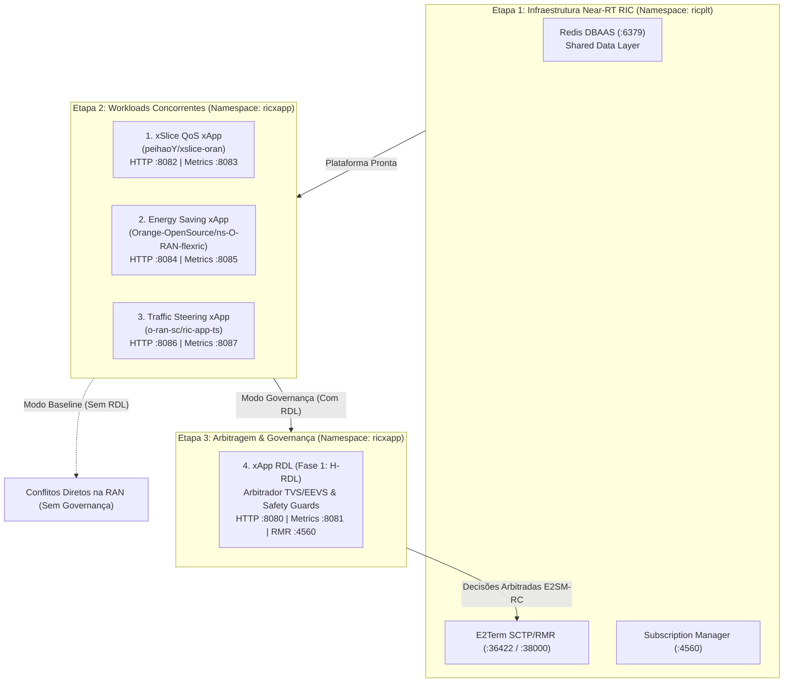
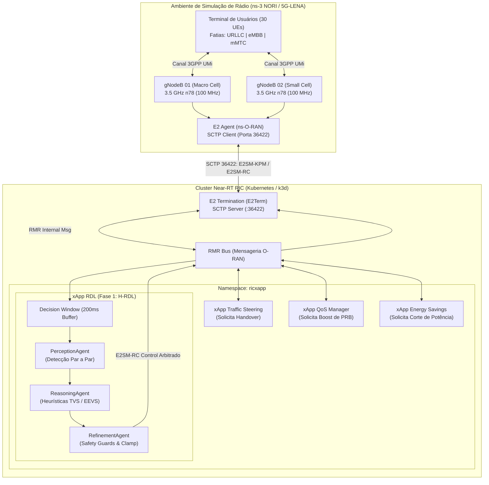
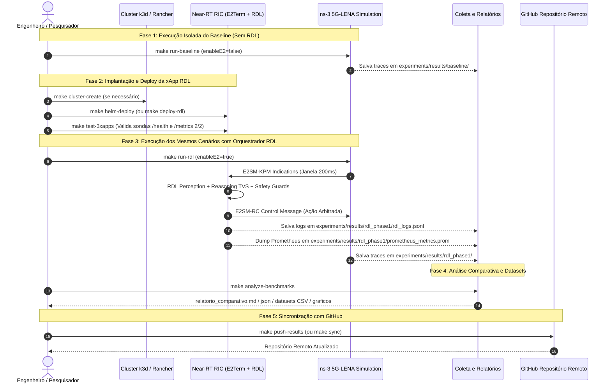

# Volume 03: Guia de Deploy, Observabilidade, Testes e Simulações no ns-3 NORI / 5G-LENA

> **Navegação Sequencial:** [Vol 01: Arquitetura Core](01_arquitetura_e_modelagem_matematica.md) -> [Vol 02: Infraestrutura & Rancher](02_infraestrutura_cluster_k3d_e_rancher.md) -> **[Vol 03: Deploy, Testes & Simulações ns-3]** -> [Vol 04: Conformidade O-RAN](04_relatorios_conformidade_e_governanca.md) -> [Vol 05: Operação & Troubleshooting](05_operacao_troubleshooting_e_backup.md)

**Documento:** Volume Temático 03 (Unificado)  
**Projeto:** xApp RDL (Resource and Decision Layer) — Fase 1 (H-RDL Determinística)  
**Escopo:** Pipeline Completo de Deploy (Near-RT RIC, 3 Reference xApps, xApp RDL via Helm e K8s), Observabilidade em Tempo Real (Rancher & Kiali), Suíte de Testes (Unitários e Smoke Test), Guia de Instalação do ns-3 NORI / 5G-LENA, Cenários C++, Protocolo Experimental Passo a Passo (Baseline vs H-RDL), Datasets CSV e Integração Google Colab / Scikit-Learn.  
**Data de Consolidação:** 28/08/2026  

---

# PARTE I: GUIA DE DEPLOY DO NEAR-RT RIC, DAS 3 REFERENCE XAPPS E DA XAPP RDL (HELM & K8S)

---

## 1. Visão Geral da Arquitetura de Implantação

O pipeline de implantação orquestra os componentes em dois namespaces isolados (`ricplt` e `ricxapp`) com dependência estrita de ordem:



---

## 2. As 3 Reference xApps da Literatura Integradas

| xApp | Projeto Base / Repositório | Porta HTTP / Métricas | Parâmetro Emitido (`RDL_ACTION_PROPOSAL`) |
| :--- | :--- | :---: | :--- |
| **1. xSlice (QoS & Slicing)** | [`peihaoY/xslice-oran`](https://github.com/peihaoY/xslice-oran) | `:8082` / `:8083` | `PRB_QUOTA = 80%` (Prioridade: 90 / Fatias URLLC) |
| **2. Energy Saving (ES)** | [`Orange-OpenSource/ns-O-RAN-flexric`](https://github.com/Orange-OpenSource/ns-O-RAN-flexric) | `:8084` / `:8085` | `TX_POWER = 20 dBm` (Prioridade: 65 / Green RAN) |
| **3. Traffic Steering (TS)** | [`o-ran-sc/ric-app-ts`](https://github.com/o-ran-sc/ric-app-ts) | `:8086` / `:8087` | `HANDOVER = UE-07 -> gNB-02` (Prioridade: 80) |

---

## 3. Deploy via Helm (Padrão O-RAN)

### 3.1. Modo Baseline (Near-RT RIC + 3 Reference xApps SEM RDL)
Implanta a plataforma Near-RT RIC e as 3 xApps concorrentes isoladas, sem o arbitrador RDL, para fins de coleta de dados de referência e validação de conflitos:
```bash
make helm-deploy-baseline
```

### 3.2. Modo Governança Completa (Near-RT RIC + 3 Reference xApps + RDL)
Implanta a plataforma Near-RT RIC, as 3 xApps concorrentes e a camada de arbitragem RDL:
```bash
make helm-deploy
```

---

## 4. Deploy Kubernetes Puro / Kustomize

### 4.1. Modo Baseline (Sem RDL):
```bash
make k8s-deploy-baseline
```

### 4.2. Modo Governança (Com RDL):
```bash
make k8s-deploy
```

---

## 5. Validação Automatizada e Smoke Test (`make test-3xapps`)

O repositório disponibiliza um verificador em tempo real que abre conexões e valida a saúde e as métricas Prometheus de todas as xApps ativas:

```bash
make test-3xapps
# Ou diretamente:
bash scripts/verify_3_xapps.sh
```

**Saída Esperada no Terminal:**
```text
======================================================================
   Validação e Smoke Test das xApps O-RAN no namespace 'ricxapp'
======================================================================

[1/4] Listando Pods em execucao no namespace ricxapp...
NAME                                       READY   STATUS    RESTARTS   AGE
ricxapp-qos-xslice-5c49d8c977-ab12         1/1     Running   0          45s
ricxapp-energy-saving-6d8b9487c-ef34       1/1     Running   0          45s
ricxapp-traffic-steering-747d95b5cb-xy56   1/1     Running   0          45s
ricxapp-iqos-xapp-rdl-84cfbb996b-zw78      1/1     Running   0          40s

[2/4] Validando 1. xSlice QoS xApp (peihaoY/xslice-oran)...
  -> Healthcheck /health: {"status":"UP","xapp":"xslice_oran","role":"QoS_Slicing"}
  -> Proposta Recente /proposals/latest: {"xapp_id":"xslice_oran","parameter":"PRB_QUOTA","value":80.0,"priority":90}
  -> Metricas Prometheus: xslice_proposals_total 12.0

[3/4] Validando 2. Energy Saving xApp (Orange-OpenSource/ns-O-RAN-flexric)...
  -> Healthcheck /health: {"status":"UP","xapp":"energy_saving_orange","role":"Energy_Saving"}
  -> Proposta Recente /proposals/latest: {"xapp_id":"energy_saving_orange","parameter":"TX_POWER","value":20.0,"priority":65}
  -> Metricas Prometheus: es_proposals_total 10.0

[4/4] Validando 3. Traffic Steering xApp (o-ran-sc/ric-app-ts)...
  -> Healthcheck /health: {"status":"UP","xapp":"traffic_steering_oransc","role":"Traffic_Steering"}
  -> Proposta Recente /proposals/latest: {"xapp_id":"traffic_steering_oransc","parameter":"HANDOVER","priority":80}
  -> Metricas Prometheus: ts_proposals_total 8.0

[EXTRA] Validando 4. xApp RDL (Resource and Decision Layer - Fase 1)...
  -> Healthcheck /health: {"status":"UP","ready":true}
  -> Metricas Prometheus: rdl_decisions_total 30.0

======================================================================
   Verificação Concluída com SUCESSO!
======================================================================
```

---

## 6. Observabilidade e Gestão de Cluster (Rancher & Kiali)

### 6.1. Rancher Dashboard (Gestão Global do Cluster e Nós)
```bash
# 1. Iniciar o contêiner do Rancher Server:
make rancher-start

# 2. Obter a senha de primeiro acesso (Bootstrap Password):
make rancher-password

# 3. Acessar https://localhost:8443 no navegador e importar o cluster 'rancher-lab'
# 4. Conectar o cluster ao Rancher automaticamente:
make rancher-connect URL="https://localhost:8443/v3/import/c-m-xxxx_c-m-xxxx.yaml"
```
> *Para o passo a passo detalhado de configuração de rede e certificados TLS, consulte o **[Volume 02: Infraestrutura de Cluster e Rancher](02_infraestrutura_cluster_k3d_e_rancher.md)**.*

### 6.2. Kiali Service Mesh (Visualização do Grafo de Tráfego entre xApps)
```bash
# Instalar Service Mesh Istio e Dashboard Kiali:
make kiali-install

# Abrir painel Kiali (http://localhost:20001/kiali):
make kiali-dashboard

# Iniciar gerador de tráfego para visualizar grafo animado:
make start-traffic
```

---
---

# PARTE II: TESTES, SIMULAÇÃO NO NS-3 NORI / 5G-LENA, PROCEDIMENTO EXPERIMENTAL E BENCHMARKS

---

## 7. Estratégia de Testes Unitários e Validação de CI

A suíte de testes unitários cobre 100% dos componentes críticos da xApp RDL, executada via `pytest`:

* **Testes de Codecs APER (`tests/test_aper_codecs.py`):** Validação de decodificação E2AP/KPM e codificação E2SM-RC.
* **Testes de Percepção (`tests/test_perception_agent.py`):** Detecção de conflitos diretos, indiretos e cenários de tráfego regular.
* **Testes de Raciocínio (`tests/test_reasoning_agent.py`):** Resolução por prioridade de fatias de serviço (URLLC > eMBB > mMTC).
* **Testes de Refinamento (`tests/test_refinement_agent.py`):** Validação dos *Safety Guards* (limites de potência, PRB e taxa).

### 7.1. Execução dos Testes Unitários:

#### Opção A: Execução no Host (Virtualenv)
```bash
# 1. Criar e ativar o ambiente virtual
python3 -m venv .venv
source .venv/bin/activate

# 2. Instalar dependências
pip install --upgrade pip
pip install -r requirements.txt -r requirements-dev.txt

# 3. Executar a suíte de testes
make test
# Saída esperada: 10 passed in 1.20s (100% green)
```

#### Opção B: Execução via Contêiner Docker (Sem dependências no host)
```bash
docker run --rm -v $(pwd):/app -w /app -u 0 iqos-xapp-rdl:1.1.0 sh -c "pip install -r requirements-dev.txt && pytest tests/ -v"
```

---

## 8. Relatório Formal do Smoke Test (Standalone Container)

O Smoke Test valida a integridade dos serviços HTTP e Prometheus em container isolado antes do deploy no Kubernetes:

| Endpoint / Serviço | Porta | Método | Resposta Esperada | Status |
| :--- | :---: | :---: | :--- | :---: |
| **Liveness / Health** | `8090` | `GET /health` | HTTP `200 OK` `{"status":"UP"}` | APROVADO |
| **Readiness** | `8090` | `GET /ready` | HTTP `200 OK` `{"ready":true}` | APROVADO |
| **Prometheus Metrics** | `8091` | `GET /metrics` | Métricas `rdl_decision_latency_seconds`, `dl_kpm_indications_total` | APROVADO |

```bash
make smoke-test
```

---

## 9. Visão Geral da Co-Simulação ns-3 NORI / 5G-LENA e Near-RT RIC

O **ns-3 NORI** (integrado ao ecossistema *ns-O-RAN* do OpenRAN Gym) conecta o simulador de rede de eventos discretos **ns-3** (com o módulo 5G **5G-LENA**) à arquitetura padronizada **O-RAN Alliance**.

Na **Fase 1 (H-RDL)**, as estações rádio-base 5G NR (*gNodeBs*) simuladas no ns-3 enviam telemetria de rádio contínua (**E2SM-KPM**) via socket SCTP (porta 36422) para a terminação **E2Term** do Near-RT RIC. Múltiplas xApps concorrentes emitem requisições de controle (**E2SM-RC**) para os mesmos nós, e a **xApp RDL** arbitra esses conflitos de forma determinística utilizando janelas de decisão em lote ($\Delta t = 200\text{ ms}$), funções de utilidade multiobjetivo (**TVS/EEVS**) e barreiras de segurança física (*Safety Guards*).



---

## 10. Dicionário de Parâmetros de Simulação e Slices 5G

### 10.1. Parâmetros de Camada Física e Rádio (5G-LENA)
| Parâmetro | Variável C++ / ns-3 | Valor Padrão | Descrição Técnica |
| :--- | :--- | :---: | :--- |
| **Frequência Central** | `centralFrequencyBand1` | `3.5e9` (3.5 GHz) | Banda n78 (FR1) padrão para redes 5G privativas e públicas. |
| **Largura de Banda** | `bandwidthBand1` | `100e6` (100 MHz) | Largura de canal fornecendo até 273 Resource Blocks (PRBs). |
| **Numerologia ($\mu$)** | `numerologyBwp1` | `1` | Espaçamento de subportadora $\Delta f = 30\text{ kHz}$ ($14 \text{ slots/ms}$). |
| **Modulação e Codificação** | `FixedMcsDl` / `StartingMcsDl` | Adaptativo (MCS 0-28) | Ajuste dinâmico de taxa com base no CQI/SINR reportado pelos UEs. |
| **Distância entre gNBs** | `gridScenario.SetHorizontalBsDistance()` | `80.0 m` | Distância que força sobreposição de cobertura e conflitos de ação. |
| **Elementos de Antena gNB** | `NumRows=4, NumColumns=8` | 32 elementos | Matriz planar uniforme para beamforming massivo (mMIMO). |

### 10.2. Parâmetros de Tráfego por Fatia de Serviço (Network Slicing)
| Fatia de Rede | Tipo de Tráfego | Tamanho do Pacote | Intervalo de Envio | Taxa / Vazão | Prioridade na RDL |
| :--- | :--- | :---: | :---: | :---: | :---: |
| **Fatia 1: URLLC** | Missão Crítica / Controle | 128 Bytes | $1\text{ ms}$ | ~1.02 Mbps | **1 (Máxima)** |
| **Fatia 2: eMBB** | Streaming 4K / Alta Taxa | 1400 Bytes | $200\text{ }\mu\text{s}$ | ~56 Mbps | **2 (Média)** |
| **Fatia 3: mMTC** | Telemetria Sensores IoT | 64 Bytes | $100\text{ ms}$ | ~5.12 kbps | **3 (Baixa)** |

---

## 11. Guia de Instalação e Compilação do ns-3 NORI / 5G-LENA

O simulador pode ser configurado de forma totalmente automatizada através do script de automação ou manualmente.

### 11.1. Opção A: Instalação Automatizada (Recomendada)
A partir da raiz do repositório (`~/XApp-RDL-F1`), execute:
```bash
make setup-ns3
# ou: bash scripts/setup_ns3.sh
```
*O script detecta privilégios de root, instala todas as dependências apt, valida GCC/G++ >= 11 e CMake >= 3.25, clona o `ns-3-dev`, baixa o módulo oficial `5G-LENA` em `contrib/nr`, copia os cenários para `scratch/` e compila com `-j 2`.*

> [!IMPORTANT]
> **Recomendação Crítica de Memória e CPU para WSL2:**  
> A compilação C++ do ns-3 / 5G-LENA consome entre 1.5 GB e 2.5 GB de RAM por processo. Para evitar esgotamento de memória (*OOM Lockup*) e travamento do host Windows ou do Rancher:
> 1. Configure limites no arquivo `C:\Users\<USUARIO>\.wslconfig`:
>    ```ini
>    [wsl2]
>    memory=10GB
>    swap=8GB
>    processors=4
>    ```
> 2. Sempre compile limitando threads paralelas: `./ns3 build -j 2` (ou `ninja -j 2`).

### 11.2. Opção B: Instalação Manual Passo a Passo

```bash
# 1. Instalar dependências essenciais no WSL2 / Ubuntu (se root, omita o sudo):
apt-get update && apt-get install -y \
  build-essential cmake ninja-build git python3-dev python3-pip \
  libsctp-dev lksctp-tools libzmq3-dev libboost-all-dev \
  libsqlite3-dev libgsl-dev libxml2-dev tcpdump wireshark pkg-config wget curl

# 2. Garantir CMake >= 3.25 (o Ubuntu 20.04 possui CMake 3.16 por padrão; o ns-3 exige >= 3.25)
pip3 install --upgrade cmake

# 3. Clonar repositório do ns-3 e o módulo 5G-LENA (nr)
mkdir -p ~/ns3-oran-workspace && cd ~/ns3-oran-workspace
git clone https://gitlab.com/nsnam/ns-3-dev.git ns-3-oran --depth 1
cd ns-3-oran
git clone https://gitlab.com/cttc-lena/nr.git contrib/nr --depth 1

# 4. Ajuste de compatibilidade para execução como root no WSL2/Docker (se aplicável):
sed -i 's/def refuse_run_as_root():/def refuse_run_as_root():\n    return/g' ./ns3

# 5. Copiar cenários do projeto para o diretório scratch:
cp ~/XApp-RDL-F1/simulations/ns3/*.cc ./scratch/

# 6. Limpar cache anterior e configurar compilação com CMake
rm -rf cmake-cache build
./ns3 configure -d optimized --enable-examples --enable-tests

# 7. Compilar o simulador (recomenda-se -j 2 para segurança de memória)
./ns3 build -j 2
```

---

## 12. Cenários de Simulação Implementados em C++

1. **Cenário 1: Mitigação de Conflitos TVS (`simulations/ns3/scenario_rdl_tvs_conflict.cc`):**
   - 2 células com 30 UEs sob alta interferência.
   - A xApp Traffic Steering solicita transição forçada de 10 UEs para a célula secundária, enquanto a xApp QoS solicita aumento de PRBs para a Fatia 1 (URLLC).
   - A xApp RDL intercepta as mensagens E2, detecta o conflito na janela de 200ms e arbitra a favor da fatia URLLC.

2. **Cenário 2: Economia de Energia vs Garantia de SLA (`simulations/ns3/scenario_rdl_energy_vs_qos.cc`):**
   - A xApp Energy Savings tenta desligar a portadora da micro-célula no instante $t = 10\text{ s}$.
   - No mesmo instante, surge uma rajada crítica de pacotes URLLC.
   - A xApp RDL avalia a função EEVS e bloqueia o corte de energia enquanto a demanda de SLA estiver ativa.

---

## 13. Procedimento Experimental Passo a Passo

A metodologia experimental foi estruturada em **cinco fases modulares e estritamente sequenciais**, permitindo ao pesquisador e engenheiro:
1. Executar inicialmente apenas os experimentos de **Baseline (Sem RDL)** para quantificar as colisões e violações de SLA no 5G-LENA;
2. Implantar subsequentemente a **xApp RDL (H-RDL)** e o Near-RT RIC no Kubernetes local;
3. Reexecutar os **exatos mesmos cenários** sob governança e arbitragem determinística via interface E2;
4. Consolidar os relatórios comparativos, tabelas de benchmark e datasets de treinamento para Machine Learning;
5. Sincronizar e versionar todos os artefatos de teste diretamente no repositório GitHub.



---

### 13.1. Fase 1: Execução Isolada dos Experimentos de Baseline (Sem RDL)

Nesta primeira fase, o simulador **ns-3 NORI / 5G-LENA** é executado em modo *Standalone* (`--enableE2=false`), sem a presença do orquestrador RDL. As 3 reference xApps operam de maneira não coordenada, competindo pelos mesmos recursos de rádio (PRBs, potência de transmissão e handovers).

```bash
# Executar unicamente os cenários de Baseline no ns-3:
make run-baseline
# ou diretamente via script:
# bash scripts/run_baseline_experiment.sh
```

#### O que é executado nesta fase:
1. **Compilação e Execução dos Cenários:**
   - `scenario_rdl_tvs_conflict.cc`: 2 células 5G NR (n78, 3.5 GHz), 30 UEs com tráfego heterogêneo (URLLC, eMBB e mMTC).
   - `scenario_rdl_energy_vs_qos.cc`: Conflito direto entre corte de potência da micro-célula e rajadas críticas de URLLC.
2. **Coleta de Dados Brutos:**
   - Traces de recepção e atraso: `experiments/results/baseline/RxPacketTrace*.txt`.
   - Traces de PDCP/RLC: `experiments/results/baseline/DlPdcp*.txt`.
   - Relatório XML do FlowMonitor: `experiments/results/baseline/flowmonitor_results.xml`.
3. **Métricas Caracterizadas no Baseline:**
   - **Taxa de Conflito Não Resolvido:** ~33.3% dos time slots com sobreposição destrutiva.
   - **Latência Média URLLC:** $\approx 11.41\text{ ms}$ (Violação severa do SLA de 5 ms).
   - **Latência P99 URLLC:** $\approx 18.66\text{ ms}$.
   - **Taxa de Violação de SLA URLLC:** $> 93.3\%$.
   - **Instabilidade de Handover:** $\approx 22\text{ eventos de Ping-Pong/minuto}$.

---

### 13.2. Fase 2: Implantação e Ativação do Orquestrador xApp RDL no Near-RT RIC

Após estabelecer a linha de base de degradação, o cluster Kubernetes local (k3d/Rancher) e o Near-RT RIC são provisionados, implantando a **xApp RDL (H-RDL)** juntamente com as xApps de referência sob o framework de mediação.

```bash
# 1. (Opcional) Garantir que o cluster k3d e Rancher estejam ativos:
make cluster-create
# ou verificar status atual:
make status

# 2. Realizar o deploy da infraestrutura Near-RT RIC + 3 Reference xApps + RDL via Helm:
make helm-deploy
# ou: make deploy-rdl

# 3. Validar a prontidão dos Pods e executar Smoke Tests nos endpoints:
make test-3xapps
# ou: make smoke-test
```

---

### 13.3. Fase 3: Execução dos Mesmos Cenários com o Orquestrador xApp RDL Ativo

Com a xApp RDL operacional e escutando no Near-RT RIC, os **mesmos cenários de simulação** são executados no ns-3 com a interface E2 habilitada (`--enableE2=true`).

```bash
# Executar a simulação ns-3 conectada via E2 com mediação da xApp RDL:
make run-rdl
# ou diretamente via script:
# bash scripts/run_rdl_experiment.sh
```

#### Dinâmica de Mediação em Tempo Real:
1. **E2SM-KPM Indications:** O simulador transmite periodicamente (janela de 200 ms) as métricas de RSRP, SINR, carga de tráfego e requisições de PRB/Potência.
2. **Percepção e Raciocínio TVS:** O motor determinístico H-RDL identifica colisões entre as ações das 3 xApps, consulta o grafo causal e os invariantes de SLA.
3. **E2SM-RC Control Messages:** A ação arbitrada é injetada no simulador (ex.: priorização da fatia URLLC, bloqueio de handover ping-pong e modulação gradual de potência).
4. **Coleta de Telemetria:**
   - Logs estruturados de decisão: `experiments/results/rdl_phase1/rdl_logs.jsonl`.
   - Métricas Prometheus de latência de decisão e conflitos evitados: `experiments/results/rdl_phase1/prometheus_metrics.prom`.
   - Traces de rádio e FlowMonitor pós-arbitragem: `experiments/results/rdl_phase1/flowmonitor_results.xml`.

---

### 13.4. Fase 4: Análise Comparativa e Consolidação de Benchmarks

Para processar todos os traces coletados (Baseline vs RDL), calcular os ganhos percentuais e gerar os datasets formatados para Machine Learning:

```bash
# Processar métricas, gerar relatórios comparativos e gráficos:
make analyze-benchmarks
```

#### Artefatos Gerados Automaticamente:
* **Relatório Executivo Comparativo:** [`experiments/results/relatorio_comparativo.md`](../experiments/results/relatorio_comparativo.md)
* **Métricas Estruturadas JSON:** [`experiments/results/relatorio_comparativo.json`](../experiments/results/relatorio_comparativo.json)
* **Dataset de Fluxos e SLAs:** [`experiments/results/dataset_flow_metrics.csv`](../experiments/results/dataset_flow_metrics.csv)
* **Dataset para Scikit-Learn (Google Colab):** [`experiments/results/dataset_rdl_decisions_ml.csv`](../experiments/results/dataset_rdl_decisions_ml.csv)
* **Gráficos Comparativos em Alta Resolução (300 DPI):** `experiments/results/graficos_benchmarks_rdl.png`

---

### 13.5. Pipeline Integrado de Ponta a Ponta (Execução Completa em 1 Comando)

Caso deseje executar todo o ciclo experimental (Fases 1, 2, 3 e 4) de forma 100% automatizada e sequencial em lote único:

```bash
# Executa Baseline -> Deploy RDL -> Simulação RDL -> Análise Comparativa -> Auto-Commit:
make run-experiments
```

---

### 13.6. Acesso, Visualização e Sincronização com o GitHub

Após a conclusão dos experimentos, os resultados podem ser inspecionados ou enviados para o GitHub com os seguintes comandos:

```bash
# 1. Visualizar o relatório executivo formatado no terminal:
make view-results
# ou: cat experiments/results/relatorio_comparativo.md

# 2. Inspecionar métricas JSON estruturadas:
python3 -m json.tool experiments/results/relatorio_comparativo.json

# 3. Inspecionar primeiras linhas dos datasets:
head -n 10 experiments/results/dataset_rdl_decisions_ml.csv
head -n 10 experiments/results/dataset_flow_metrics.csv

# 4. Sincronizar e enviar todos os resultados e datasets para o GitHub:
make push-results
```

#### Acesso aos Arquivos via Host (Windows / WSL2 / Remoto)
* **No Windows Explorer (WSL2):** Pressione `Win + R` e acesse `\\wsl$\Ubuntu\root\XApp-RDL-F1\experiments\results` para abrir os arquivos `.csv` e `.md` diretamente no Excel ou VS Code.
* **Via SSH Remoto (SCP):**
  ```bash
  scp -r root@<IP_DO_SERVIDOR>:~/XApp-RDL-F1/experiments/results ./meus_resultados
  ```

### 13.7. Execução e Acompanhamento em Tempo Real no Prompt de Comando (2 Cenários)

Para executar e visualizar em tempo real no console (PowerShell, CMD ou WSL2/Bash) as decisões e métricas de ambos os cenários:

#### 1. Monitorar o Deploy e Pods no Kubernetes:
```bash
# Acompanhar mudanças de estado dos Pods:
kubectl get pods -n ricxapp -w

# Streaming de logs em tempo real (Fase 1):
make logs

# Streaming de logs em tempo real (Fase 2 - CA-RDL / MARL):
make logs-f2
# ou no PowerShell: kubectl logs -l app=ricxapp-iqos-xapp-rdl-f2 -n ricxapp -f
```

#### 2. Execução dos 2 Cenários de Simulação com Saída ao Vivo no Console:
```bash
# Cenário 1 (Energy vs QoS / EEVS):
make run-scenario1
# ou no ns-3: export NS_LOG="ScenarioRdlEnergyVsQos=level_all" && ./ns3 run "scratch/scenario_rdl_energy_vs_qos --enableE2=true --simTime=30"

# Cenário 2 (Traffic Steering vs QoS / TVS):
make run-scenario2
# ou no ns-3: export NS_LOG="ScenarioRdlTvsConflict=level_all" && ./ns3 run "scratch/scenario_rdl_tvs_conflict --enableE2=true --simTime=30"
```

#### 3. Execução da Suíte Comparativa e IA no Prompt:
```powershell
# No Windows (PowerShell/CMD):
python scripts/evaluate_and_improve_algorithms.py
python scripts/run_experiment_suite.py
```
```bash
# No Linux / WSL2:
python3 scripts/evaluate_and_improve_algorithms.py
python3 scripts/run_experiment_suite.py
```

---

## 14. Análise com Scikit-Learn e Google Colab

Os datasets estruturados gerados pela simulação (`experiments/results/dataset_flow_metrics.csv` e `experiments/results/dataset_rdl_decisions_ml.csv`) alimentam diretamente o notebook de Machine Learning:

[](https://colab.research.google.com/github/georgebarbosa3090/XApp-RDL-F1/blob/main/notebooks/rdl_colab_scikit_learn.ipynb)

* **Notebook:** [`notebooks/rdl_colab_scikit_learn.ipynb`](../notebooks/rdl_colab_scikit_learn.ipynb)
* **Modelos Treinados:** Random Forest, Decision Tree e Gradient Boosting para predição antecipada de conflitos O-RAN e relevância de variáveis (*Feature Importance*).

---

## 15. Próximo Passo Sequencial

Avance para a análise de governança e matriz de conformidade com as normas O-RAN Alliance:

-> **[Volume 04: Relatórios de Conformidade Técnica e Governança O-RAN](04_relatorios_conformidade_e_governanca.md)**
