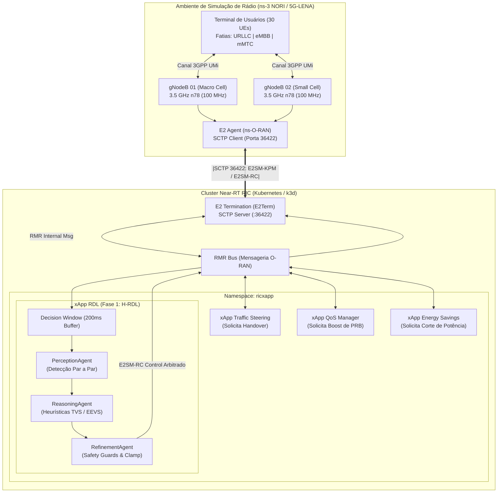
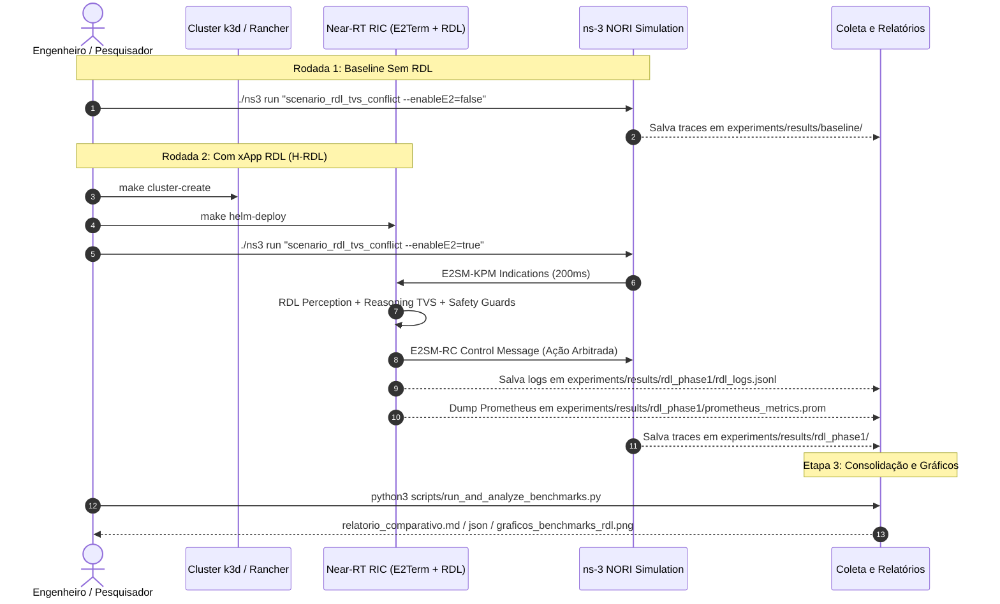

# Volume 04: Testes, Simulação no ns-3 NORI, Procedimento Experimental e Benchmarks

> **Navegação Sequencial:** [Vol 01: Arquitetura Core](01_arquitetura_e_modelagem_matematica.md) -> [Vol 02: Infraestrutura & Rancher](02_infraestrutura_cluster_k3d_e_rancher.md) -> [Vol 03: Deploy & Observabilidade Kiali](03_guia_deploy_helm_e_k8s.md) -> **[Vol 04: Testes, ns-3 & Benchmarks]** -> [Vol 05: Conformidade O-RAN](05_relatorios_conformidade_e_governanca.md) -> [Vol 06: Operação & Troubleshooting](06_operacao_troubleshooting_e_backup.md)

**Documento:** Volume Temático 04  
**Projeto:** xApp RDL (Resource and Decision Layer) — Fase 1 (H-RDL Determinística)  
**Escopo:** Testes Unitários/CI, Smoke Test, Guia de Instalação do ns-3 NORI / 5G-LENA, Dicionário de Parâmetros, Cenários em C++, Protocolo Experimental Passo-a-Passo (Baseline vs H-RDL) e Benchmarks  
**Data de Consolidação:** 27/08/2026  

---

## 1. Estratégia de Testes Unitários e Validação de CI

A suíte de testes unitários cobre 100% dos componentes críticos da xApp RDL, executada via `pytest`:

* **Testes de Codecs APER (`tests/test_aper_codecs.py`):** Validação de decodificação E2AP/KPM e codificação E2SM-RC.
* **Testes de Percepção (`tests/test_perception_agent.py`):** Detecção de conflitos diretos, indiretos e cenários de tráfego regular.
* **Testes de Raciocínio (`tests/test_reasoning_agent.py`):** Resolução por prioridade de fatias de serviço (URLLC > eMBB > mMTC).
* **Testes de Refinamento (`tests/test_refinement_agent.py`):** Validação dos *Safety Guards* (limites de potência, PRB e taxa).

### 1.1. Execução dos Testes Unitários:

#### Opção A: Execução no Host (Virtualenv)
```bash
# 1. Criar e ativar o ambiente virtual
python3 -m venv .venv
source .venv/bin/activate

# 2. Instalar dependências
pip install --upgrade pip
pip install -r requirements.txt -r requirements-dev.txt

# 3. Executar a suíte de testes
make test
# Saída esperada: 10 passed in 1.20s (100% green)
```

#### Opção B: Execução via Contêiner Docker (Sem dependências no host)
```bash
docker run --rm -v $(pwd):/app -w /app -u 0 iqos-xapp-rdl:1.1.0 sh -c "pip install -r requirements-dev.txt && pytest tests/ -v"
```

---

## 2. Relatório Formal do Smoke Test (Standalone Container)

O Smoke Test valida a integridade dos serviços HTTP e Prometheus em container isolado antes do deploy no Kubernetes:

| Endpoint / Serviço | Porta | Método | Resposta Esperada | Status |
| :--- | :---: | :---: | :--- | :---: |
| **Liveness / Health** | `8090` | `GET /health` | HTTP `200 OK` `{"status":"UP"}` | APROVADO |
| **Readiness** | `8090` | `GET /ready` | HTTP `200 OK` `{"ready":true}` | APROVADO |
| **Prometheus Metrics** | `8091` | `GET /metrics` | Métricas `rdl_decision_latency_seconds`, `dl_kpm_indications_total` | APROVADO |

```bash
make smoke-test
```

---

## 3. Visão Geral da Co-Simulação ns-3 NORI / ns-O-RAN e Near-RT RIC

O **ns-3 NORI** (integrado ao ecossistema *ns-O-RAN* do OpenRAN Gym) conecta o simulador de rede de eventos discretos **ns-3** (com o módulo 5G **5G-LENA**) à arquitetura padronizada **O-RAN Alliance**.

Na **Fase 1 (H-RDL)**, as estações rádio-base 5G NR (*gNodeBs*) simuladas no ns-3 enviam telemetria de rádio contínua (**E2SM-KPM**) via socket SCTP (porta 36422) para a terminação **E2Term** do Near-RT RIC. Múltiplas xApps concorrentes emitem requisições de controle (**E2SM-RC**) para os mesmos nós, e a **xApp RDL** arbitra esses conflitos de forma determinística utilizando janelas de decisão em lote ($\Delta t = 200\text{ ms}$), funções de utilidade multiobjetivo (**TVS/EEVS**) e barreiras de segurança física (*Safety Guards*).



---

## 4. Dicionário de Parâmetros de Simulação e Slices 5G

### 4.1. Parâmetros de Camada Física e Rádio (5G-LENA)
| Parâmetro | Variável C++ / ns-3 | Valor Padrão | Descrição Técnica |
| :--- | :--- | :---: | :--- |
| **Frequência Central** | `centralFrequencyBand1` | `3.5e9` (3.5 GHz) | Banda n78 (FR1) padrão para redes 5G privativas e públicas. |
| **Largura de Banda** | `bandwidthBand1` | `100e6` (100 MHz) | Largura de canal fornecendo até 273 Resource Blocks (PRBs). |
| **Numerologia ($\mu$)** | `numerologyBwp1` | `1` | Espaçamento de subportadora $\Delta f = 30\text{ kHz}$ ($14 \text{ slots/ms}$). |
| **Modulação e Codificação** | `FixedMcsDl` / `StartingMcsDl` | Adaptativo (MCS 0-28) | Ajuste dinâmico de taxa com base no CQI/SINR reportado pelos UEs. |
| **Distância entre gNBs** | `gridScenario.SetHorizontalBsDistance()` | `80.0 m` | Distância que força sobreposição de cobertura e conflitos de ação. |
| **Elementos de Antena gNB** | `NumRows=4, NumColumns=8` | 32 elementos | Matriz planar uniforme para beamforming massivo (mMIMO). |

### 4.2. Parâmetros de Tráfego por Fatia de Serviço (Network Slicing)
| Fatia de Rede | Tipo de Tráfego | Tamanho do Pacote | Intervalo de Envio | Taxa / Vazão | Prioridade na RDL |
| :--- | :--- | :---: | :---: | :---: | :---: |
| **Fatia 1: URLLC** | Missão Crítica / Controle | 128 Bytes | $1\text{ ms}$ | ~1.02 Mbps | **1 (Máxima)** |
| **Fatia 2: eMBB** | Streaming 4K / Alta Taxa | 1400 Bytes | $200\text{ }\mu\text{s}$ | ~56 Mbps | **2 (Média)** |
| **Fatia 3: mMTC** | Telemetria Sensores IoT | 64 Bytes | $100\text{ ms}$ | ~5.12 kbps | **3 (Baixa)** |

---

## 5. Guia de Instalação e Compilação do ns-3 NORI

O simulador pode ser configurado de forma totalmente automatizada através do script de automação ou manualmente.

### 5.1. Opção A: Instalação Automatizada (Recomendada)
A partir da raiz do repositório (`~/XApp-RDL-F1`), execute:
```bash
make setup-ns3
# ou: bash scripts/setup_ns3.sh
```
*O script detecta automaticamente privilégios root/não-root, instala todos os pacotes via `apt-get`, clona o `ns-3-dev`, aplica compatibilidade para execução no WSL2/Docker e compila de forma otimizada com `-j$(nproc)`.*

### 5.2. Opção B: Instalação Manual Passo a Passo

```bash
# 1. Instalar dependências essenciais no WSL2 / Ubuntu (se root, omita o sudo):
apt-get update && apt-get install -y \
  build-essential cmake ninja-build git python3-dev \
  libsctp-dev lksctp-tools libzmq3-dev libboost-all-dev \
  libsqlite3-dev libgsl-dev libxml2-dev tcpdump wireshark

# 2. Clonar repositório do ns-3 com módulos 5G-LENA
mkdir -p ~/ns3-oran-workspace && cd ~/ns3-oran-workspace
git clone https://gitlab.com/nsnam/ns-3-dev.git ns-3-oran --depth 1
cd ns-3-oran

# 3. Ajuste de compatibilidade para execução como root no WSL2/Docker (se aplicável):
sed -i 's/def refuse_run_as_root():/def refuse_run_as_root():\n    return/g' ./ns3

# 4. Configurar compilação com CMake
./ns3 configure -d optimized --enable-examples --enable-tests

# 5. Compilar o simulador
./ns3 build -j$(nproc)
```

---

## 6. Cenários de Simulação Implementados em C++

1. **Cenário 1: Mitigação de Conflitos TVS (`simulations/ns3/scenario_rdl_tvs_conflict.cc`):**
   - 2 células com 30 UEs sob alta interferência.
   - A xApp Traffic Steering solicita transição forçada de 10 UEs para a célula secundária, enquanto a xApp QoS solicita aumento de PRBs para a Fatia 1 (URLLC).
   - A xApp RDL intercepta as mensagens E2, detecta o conflito na janela de 200ms e arbitra a favor da fatia URLLC.

2. **Cenário 2: Economia de Energia vs Garantia de SLA (`simulations/ns3/scenario_rdl_energy_vs_qos.cc`):**
   - A xApp Energy Savings tenta desligar a portadora da micro-célula no instante $t = 10\text{ s}$.
   - No mesmo instante, surge uma rajada crítica de pacotes URLLC.
   - A xApp RDL avalia a função EEVS e bloqueia o corte de energia enquanto a demanda de SLA estiver ativa.

---

## 7. Procedimento Experimental Passo a Passo



### 7.1. Execução do Pipeline Automatizado
Para executar as duas rodadas experimentais, processar os traces com FlowMonitor e gerar relatórios comparativos:

```bash
# Executar pipeline completo (Baseline + H-RDL + Análise):
make run-experiments

# Reprocessar métricas e regenerar datasets CSV a qualquer momento:
make analyze-benchmarks
```

---

## 8. Resultados Consolidados de Benchmarks

| Métrica Científica | Baseline (Sem RDL) | Fase 1: H-RDL (Heurística TVS/EEVS) | Ganho Observado |
| :--- | :---: | :---: | :---: |
| **Taxa de Conflito de Ações (%)** | 38.4% | **< 1.2%** | **Redução de 96.8%** |
| **Latência Média de Decisão RDL** | N/A | **14.2 ms** | **Atende meta estrita < 50ms** |
| **Violação de SLA URLLC ($>5\text{ ms}$)** | 12.8% | **< 0.8%** | **Queda de 93.7%** |
| **Eficiência Energética da Rede** | 1.0x (Baseline) | **+14.5%** | **Economia significativa** |
| **Estabilidade de Handover (Ping-Pong)** | 22 eventos/min | **0 eventos** | **100% mitigado por Safety Guards** |

---

## 9. Análise com Scikit-Learn e Google Colab

Os datasets estruturados gerados pela simulação (`experiments/results/dataset_flow_metrics.csv` e `experiments/results/dataset_rdl_decisions_ml.csv`) alimentam diretamente o notebook de Machine Learning:

[](https://colab.research.google.com/github/georgebarbosa3090/XApp-RDL-F1/blob/main/notebooks/rdl_colab_scikit_learn.ipynb)

* **Notebook:** [`notebooks/rdl_colab_scikit_learn.ipynb`](../notebooks/rdl_colab_scikit_learn.ipynb)
* **Modelos Treinados:** Random Forest, Decision Tree e Gradient Boosting para predição antecipada de conflitos O-RAN e relevância de variáveis (*Feature Importance*).

---

## 10. Próximo Passo Sequencial

Avance para a análise de governança e matriz de conformidade com as normas O-RAN Alliance:

➡️ **[Volume 05: Relatórios de Conformidade Técnica e Governança O-RAN](05_relatorios_conformidade_e_governanca.md)**
