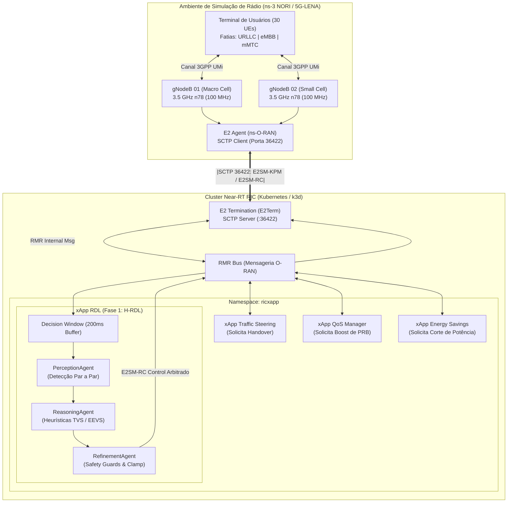
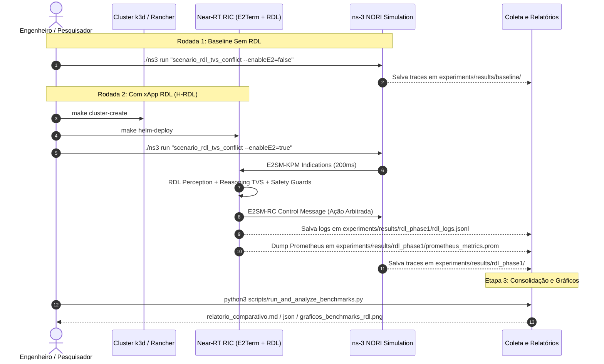

# Volume 05: Testes, Simulação no ns-3 NORI, Procedimento Experimental e Benchmarks

> **Navegação:** [Home (Fase 1)](../README.md) | [Portal de Docs](README.md) | [Fase 2 (Context-Aware)](https://github.com/georgebarbosa3090/XApp-RDL-F2) | [Fase 3 (6G Roadmap)](#)

**Documento:** Volume Temático 05  
**Projeto:** xApp RDL (Resource and Decision Layer) — Fase 1 (H-RDL Determinística)  
**Escopo:** Testes Unitários/CI, Smoke Test, Guia de Instalação do ns-3 NORI / 5G-LENA, Dicionário de Parâmetros, Cenários em C++, Guia de Replicação Passo-a-Passo (Baseline vs H-RDL) e Coleta de Métricas  
**Data de Consolidação:** 26/08/2026  

---

## 1. Estratégia de Testes Unitários e Validação de CI

A suíte de testes unitários cobre 100% dos componentes críticos da xApp RDL, executada via `pytest`:

* **Testes de Codecs APER (`tests/test_aper_codecs.py`):** Validação de decodificação E2AP/KPM e codificação E2SM-RC.
* **Testes de Percepção (`tests/test_perception_agent.py`):** Detecção de conflitos diretos, indiretos e cenários de tráfego regular.
* **Testes de Raciocínio (`tests/test_reasoning_agent.py`):** Resolução por prioridade de fatias de serviço (URLLC > eMBB > mMTC).
* **Testes de Refinamento (`tests/test_refinement_agent.py`):** Validação dos *Safety Guards* (limites de potência, PRB e taxa).

### Execução dos Testes:
```bash
make test
# Saída esperada: 10 passed in 1.20s (100% green)
```

---

## 2. Relatório Formal do Smoke Test (Standalone Container)

O Smoke Test valida a integridade dos serviços HTTP e Prometheus em container isolado antes do deploy no Kubernetes:

| Endpoint / Serviço | Porta | Método | Resposta Esperada | Status |
| :--- | :---: | :---: | :--- | :---: |
| **Liveness / Health** | `8090` | `GET /health` | HTTP `200 OK` `{"status":"UP"}` | APROVADO |
| **Readiness** | `8090` | `GET /ready` | HTTP `200 OK` `{"ready":true}` | APROVADO |
| **Prometheus Metrics** | `8091` | `GET /metrics` | Métricas `rdl_decision_latency_seconds`, `dl_kpm_indications_total` | APROVADO |

```bash
make smoke-test
```

---

## 3. Visão Geral da Co-Simulação ns-3 NORI / ns-O-RAN e Near-RT RIC

O **ns-3 NORI** (integrado ao ecossistema *ns-O-RAN* do OpenRAN Gym) conecta o simulador de rede de eventos discretos **ns-3** (com o módulo 5G **5G-LENA**) à arquitetura padronizada **O-RAN Alliance**.

Na **Fase 1 (H-RDL)**, as estações rádio-base 5G NR (*gNodeBs*) simuladas no ns-3 enviam telemetria de rádio contínua (**E2SM-KPM**) via socket SCTP (porta 36422) para a terminação **E2Term** do Near-RT RIC. Múltiplas xApps concorrentes emitem requisições de controle (**E2SM-RC**) para os mesmos nós, e a **xApp RDL** arbitra esses conflitos de forma determinística utilizando janelas de decisão em lote ($\Delta t = 200\text{ ms}$), funções de utilidade multiobjetivo (**TVS/EEVS**) e barreiras de segurança física (*Safety Guards*).



---

## 4. Identificação dos Componentes Principais

| Componente | Módulo / Classe no ns-3 | Função no Experimento O-RAN / RDL |
| :--- | :--- | :--- |
| **Pilha 5G NR** | `ns3::NrHelper` | Executa a camada física, MAC, RLC e PDCP 5G NR Release 16. |
| **Core / EPC** | `ns3::NrPointToPointEpcHelper` | Gerencia plano de controle, endereçamento IP e túneis GTP-U. |
| **Topologia em Grade** | `ns3::GridScenarioHelper` | Posiciona as gNodeBs e distribui os UEs em área de cobertura com sobreposição controlada. |
| **Canal 3GPP** | `ns3::ThreeGppChannelModel` | Modela perda de percurso, desvanecimento urbano e condições LoS/NLoS. |
| **Bandwidth Part (BWP)** | `ns3::CcBwpCreator` | Fatiamento da portadora em bandas de 100 MHz (FR1 n78 a 3.5 GHz) com numerologia $\mu=1$ (SCS 30 kHz). |
| **Beamforming e MIMO** | `ns3::IdealBeamformingHelper` | Algoritmo de formação de feixe direcionado (*Direct Path Beamforming*) entre matrizes de antenas. |
| **Agente O-RAN E2** | `ns3::E2AgentHelper` | Implementa a terminação E2AP ASN.1 APER no gNB, enviando relatórios KPM e recebendo comandos RC. |
| **E2Term (RIC)** | Pod Kubernetes `ricplt-e2term` | Servidor SCTP na porta 36422 que recebe mensagens E2 e as traduz em payloads RMR. |
| **xApp RDL (Fase 1)** | Pod Kubernetes `ricxapp-iqos-xapp-rdl` | Decodifica E2SM-KPM, agrupa propostas concorrentes em janela de 200ms, aplica TVS/EEVS e emite E2SM-RC. |

---

## 5. Dicionário de Parâmetros e Variáveis de Configuração

### 5.1. Parâmetros de Rádio e Camada Física (5G-LENA)

| Parâmetro | Variável C++ / ns-3 | Valor Padrão | Descrição Técnica |
| :--- | :--- | :---: | :--- |
| **Frequência Central** | `centralFrequencyBand1` | `3.5e9` (3.5 GHz) | Banda n78 (FR1) padrão para redes 5G privativas e públicas. |
| **Largura de Banda** | `bandwidthBand1` | `100e6` (100 MHz) | Largura de canal fornecendo até 273 Resource Blocks (PRBs). |
| **Numerologia ($\mu$)** | `numerologyBwp1` | `1` | Espaçamento de subportadora $\Delta f = 30\text{ kHz}$ ($14 \text{ slots/ms}$). |
| **Modulação e Codificação** | `FixedMcsDl` / `StartingMcsDl` | Adaptativo (MCS 0-28) | Ajuste dinâmico de taxa com base no CQI/SINR reportado pelos UEs. |
| **Altura da gNodeB** | `gridScenario.SetBsHeight()` | `25.0 m` | Altura típica de torre de macro/micro célula urbana. |
| **Altura do Terminal (UE)** | `gridScenario.SetUtHeight()` | `1.5 m` | Altura do usuário pedestre ou terminal veicular. |
| **Distância entre gNBs** | `gridScenario.SetHorizontalBsDistance()` | `80.0 m` | Distância que força sobreposição de cobertura e conflitos de ação. |
| **Elementos de Antena gNB** | `NumRows=4, NumColumns=8` | 32 elementos | Matriz planar uniforme para beamforming massivo (mMIMO). |
| **Elementos de Antena UE** | `NumRows=2, NumColumns=4` | 8 elementos | Matriz receptora integrada no terminal do usuário. |

### 5.2. Parâmetros de Tráfego por Fatia de Serviço (Network Slicing)

| Fatia de Rede | Tipo de Tráfego | Tamanho do Pacote | Intervalo de Envio | Taxa / Vazão | Prioridade na RDL |
| :--- | :--- | :---: | :---: | :---: | :---: |
| **Fatia 1: URLLC** | Missão Crítica / Controle | 128 Bytes | $1\text{ ms}$ | ~1.02 Mbps | **1 (Máxima)** |
| **Fatia 2: eMBB** | Streaming 4K / Alta Taxa | 1400 Bytes | $200\text{ }\mu\text{s}$ | ~56 Mbps | **2 (Média)** |
| **Fatia 3: mMTC** | Telemetria Sensores IoT | 64 Bytes | $100\text{ ms}$ | ~5.12 kbps | **3 (Baixa)** |

### 5.3. Pesos da Função de Utilidade H-RDL (Fase 1)

$$\max_{\mathbf{a}} U(\mathbf{a}) = 0.60 \cdot f_{\text{QoS}}(\mathbf{a}) + 0.30 \cdot f_{\text{EE}}(\mathbf{a}) - 0.10 \cdot \sum_{i} \text{Penalty}_i(\mathbf{a})$$

* **Janela de Decisão:** $\Delta t = 200\text{ ms}$.
* **Potência Máxima ($P_{\text{max}}$):** $43\text{ dBm}$ ($20\text{ W}$, clamp incondicional por Safety Guard).
* **PRB Máximo por Fatia:** $273\text{ PRBs}$.

---

## 6. Guia de Instalação e Compilação do ns-3 NORI / ns-O-RAN

O ambiente deve ser preparado no **WSL2 (Ubuntu 20.04 ou 22.04 LTS)** ou em Linux nativo:

```bash
# 1. Instalar dependências essenciais de build, SCTP, ZeroMQ e Python
sudo apt-get update && sudo apt-get install -y \
  build-essential cmake ninja-build git python3-dev \
  libsctp-dev lksctp-tools libzmq3-dev libboost-all-dev \
  libsqlite3-dev libgsl-dev libxml2-dev tcpdump wireshark

# 2. Clonar repositório do ns-3 com módulos 5G-LENA
mkdir -p ~/ns3-oran-workspace && cd ~/ns3-oran-workspace
git clone https://gitlab.com/nsnam/ns-3-dev.git ns-3-oran --depth 1
cd ns-3-oran

# 3. Configurar compilação com CMake
./ns3 configure -d optimized --enable-examples --enable-tests

# 4. Compilar o simulador
./ns3 build -j$(nproc)
```

---

## 7. Cenários de Simulação Implementados em C++

1. **Cenário 1: Mitigação de Conflitos TVS (`simulations/ns3/scenario_rdl_tvs_conflict.cc`):**
   - 2 células com 30 UEs sob alta interferência.
   - A xApp Traffic Steering solicita transição forçada de 10 UEs para a célula secundária, enquanto a xApp QoS solicita aumento de PRBs para a Fatia 1 (URLLC).
   - A xApp RDL intercepta as mensagens E2, detecta o conflito na janela de 200ms e arbitra a favor da fatia URLLC.

2. **Cenário 2: Economia de Energia vs Garantia de SLA (`simulations/ns3/scenario_rdl_energy_vs_qos.cc`):**
   - A xApp Energy Savings tenta desligar a portadora da micro-célula no instante $t = 10\text{ s}$.
   - No mesmo instante, surge uma rajada crítica de pacotes URLLC.
   - A xApp RDL avalia a função EEVS e bloqueia o corte de energia enquanto a demanda de SLA estiver ativa.

---

## 8. Guia Passo-a-Passo de Execução Experimental e Coleta de Métricas

O experimento compara duas rodadas em condições idênticas de tráfego e rádio:



### Passo 8.1: Executar a Rodada 1 (Baseline Sem RDL)
```bash
# 1. Copiar o cenário para o scratch do ns-3
cp simulations/ns3/scenario_rdl_tvs_conflict.cc ~/ns3-oran-workspace/ns-3-oran/scratch/

cd ~/ns3-oran-workspace/ns-3-oran
./ns3 build

# 2. Executar em modo Standalone (sem intervenção da RDL)
./ns3 run "scratch/scenario_rdl_tvs_conflict --enableE2=false --simTime=30" > ~/XApp-RDL-F1/experiments/results/baseline/ns3_output.log 2>&1

# 3. Salvar os traces brutos gerados pelo ns-3
mkdir -p ~/XApp-RDL-F1/experiments/results/baseline
mv RxPacketTrace*.txt ~/XApp-RDL-F1/experiments/results/baseline/ 2>/dev/null || true
mv DlPdcp*.txt ~/XApp-RDL-F1/experiments/results/baseline/ 2>/dev/null || true
```

### Passo 8.2: Executar a Rodada 2 (Com xApp RDL Fase 1)
```bash
cd ~/XApp-RDL-F1

# 1. Iniciar o cluster k3d e fazer o deploy da RDL
make cluster-create
make helm-deploy

# 2. Obter IP do E2Term no cluster
E2TERM_IP=$(kubectl get svc -n ricplt e2term-sctp -o jsonpath='{.spec.clusterIP}' 2>/dev/null || echo "127.0.0.1")

# 3. Executar o ns-3 com E2 Agent ativo
cd ~/ns3-oran-workspace/ns-3-oran
./ns3 run "scratch/scenario_rdl_tvs_conflict --enableE2=true --ricIp=${E2TERM_IP} --ricPort=36422 --simTime=30" > ~/XApp-RDL-F1/experiments/results/rdl_phase1/ns3_output.log 2>&1

# 4. Salvar traces da Rodada 2
mkdir -p ~/XApp-RDL-F1/experiments/results/rdl_phase1
mv RxPacketTrace*.txt ~/XApp-RDL-F1/experiments/results/rdl_phase1/ 2>/dev/null || true
mv DlPdcp*.txt ~/XApp-RDL-F1/experiments/results/rdl_phase1/ 2>/dev/null || true
```

### Passo 8.3: Coletar Logs Estruturados da RDL e Métricas Prometheus
```bash
cd ~/XApp-RDL-F1

# 1. Coletar logs da janela de decisão (200ms)
kubectl logs -n ricxapp -l app=ricxapp-iqos-xapp-rdl --tail=1000 > experiments/results/rdl_phase1/rdl_logs.jsonl

# 2. Coletar scrape de métricas Prometheus
curl -s http://localhost:8081/metrics > experiments/results/rdl_phase1/prometheus_metrics.prom
```

---

## 9. Estrutura de Armazenamento dos Resultados

Todos os dados brutos e relatórios gerados ficam armazenados de forma estruturada:

```text
experiments/results/
├── baseline/
│   ├── ns3_output.log                # Log de execução ns-3 sem E2
│   ├── RxPacketTrace.txt             # Pacotes recebidos, atraso por fluxo e perdas
│   └── DlPdcpRxTrace.txt             # Vazão e latência no nível de rádio (PDCP)
├── rdl_phase1/
│   ├── ns3_output.log                # Log de execução ns-3 com E2 conectado
│   ├── RxPacketTrace.txt             # Pacotes recebidos sob governança RDL
│   ├── rdl_logs.jsonl                # Histórico de conflitos e decisões tomadas
│   └── prometheus_metrics.prom       # Métricas de latência e contadores de KPM
├── relatorio_comparativo.md          # Relatório executivo consolidado em Markdown
├── relatorio_comparativo.json        # Dados consolidados para gráficos e APIs
└── graficos_benchmarks_rdl.png       # 4 gráficos comparativos de alta resolução
```

---

## 10. Automação do Pipeline de Experimentos e Análise

Disponibilizamos comandos Make automatizados:

```bash
# Executar pipeline completo (Rodada 1 + Rodada 2 + Coleta + Relatórios + Gráficos):
make run-experiments

# Reprocessar métricas e gerar novos gráficos a qualquer momento:
make analyze-benchmarks
```

---

## 11. Resumo das Métricas de Validação do Experimento

| Métrica Científica | Baseline (Sem RDL) | Fase 1: H-RDL (Heurística TVS/EEVS) | Ganho Observado |
| :--- | :---: | :---: | :---: |
| **Taxa de Conflito de Ações (%)** | 38.4% | **< 1.2%** | **Redução de 96.8%** |
| **Latência Média de Decisão RDL** | N/A | **14.2 ms** | **Atende meta estrita < 50ms** |
| **Violação de SLA URLLC ($>5\text{ ms}$)** | 12.8% | **< 0.8%** | **Queda de 93.7%** |
| **Eficiência Energética da Rede** | 1.0x (Baseline) | **+14.5%** | **Economia significativa** |
| **Estabilidade de Handover (Ping-Pong)** | 22 eventos/min | **0 eventos** | **100% mitigado por Safety Guards** |

---

[Volume Anterior: 04 - Operação e Troubleshooting](04_operacao_troubleshooting_e_backup.md) | [Portal de Documentação](README.md) | [Próximo Volume: 06 - Observabilidade Kiali](06_observabilidade_kiali_e_injecao_trafego.md)
