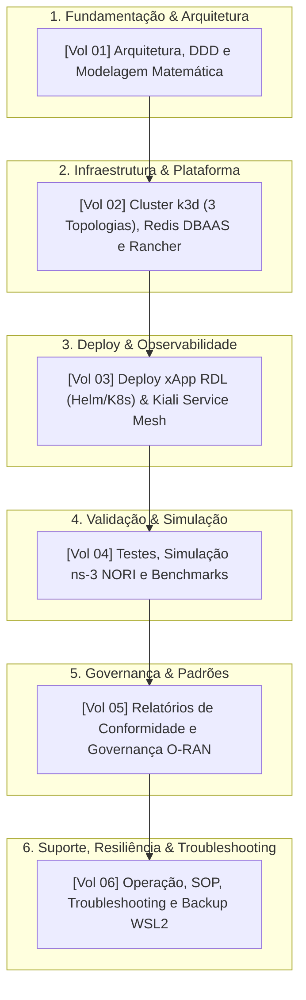

# Portal de Documentação Técnica: xApp RDL (Fase 1)

> ### Navegação Multi-Fases do Projeto RDL (Resource and Decision Layer)
> | Fase | Descrição e Paradigma | Status | Repositório |
> | :---: | :--- | :---: | :---: |
> | **Fase 1 (Atual)** | **RDL Determinística e Segura (H-RDL)** | **Implementada / Operacional** | [georgebarbosa3090/XApp-RDL-F1](https://github.com/georgebarbosa3090/XApp-RDL-F1) |
> | **Fase 2** | **RDL Baseada em Contexto e MARL (CA-RDL)** | **Ativa / Em Evolução** | [georgebarbosa3090/XApp-RDL-F2](https://github.com/georgebarbosa3090/XApp-RDL-F2) |
> | **Fase 3** | **RDL Autônoma e Federada 6G (Zero-Touch)** | **Roadmap / Planejada** | *Em especificação futura* |

---

## Jornada de Engenharia e Estrutura Sequencial

A documentação da **xApp RDL (Fase 1 — H-RDL)** está organizada em uma **jornada técnica estritamente sequencial** em **6 Volumes Temáticos**, guiando o engenheiro desde os conceitos de modelagem e provisionamento de infraestrutura até a observabilidade imediata, simulação em rádio 5G e procedimentos finais de troubleshooting/backup:

---

## Volumes Temáticos Sequenciais

### 1. Arquitetura Core e Teoria
* **[Volume 01: Arquitetura, Módulos Core e Modelagem Matemática](01_arquitetura_e_modelagem_matematica.md)**
  - **Público:** Engenheiros de Software, Arquitetos O-RAN e Pesquisadores.
  - **Conteúdo:** Fundamentos de Clean Architecture e DDD; Agentes de Percepção (janela 200ms), Raciocínio (TVS/EEVS) e Refinamento (*Safety Guards*); Codecs ASN.1 APER para E2AP, E2SM-KPM v2.0 e E2SM-RC v1.0; Formulação matemática formal da arbitragem multiobjetivo.

---

### 2. Infraestrutura de Cluster e Plataforma
* **[Volume 02: Infraestrutura de Cluster (k3d / K8s Puro), 3 Topologias, Redis DBAAS e Rancher Dashboard](02_infraestrutura_cluster_k3d_e_rancher.md)**
  - **Público:** Engenheiros DevOps, SysAdmins e Operadores de Infraestrutura.
  - **Conteúdo:** Requisitos completos de sistema; Configuração detalhada das **3 Topologias de Cluster k3d** (Single-Node ~450MB, Dual-Node ~900MB e Multi-Node ~1.500MB); Mapeamento de portas O-RAN (SCTP 36422, HTTP 8080/8081, RMR 4560/4561, Redis 6379); Levantamento dos namespaces `ricplt` e `ricxapp` com **Redis DBAAS** (Shared Data Layer); Vinculação e importação resiliente no **Rancher Dashboard UI** (`https://127.0.0.1:8443`).

---

### 3. Deploy da Aplicação e Observabilidade Imediata
* **[Volume 03: Guia de Deploy da xApp RDL (Helm & K8s) e Observabilidade Imediata com Kiali](03_guia_deploy_helm_e_k8s.md)**
  - **Público:** Engenheiros de Deploy, SRE e Operadores de NOC.
  - **Conteúdo:** Deploy oficial via Helm Chart (`v1.1.0`) e Kubernetes puro (Kustomize); Onboarding O-RAN DMS CLI; **Observabilidade Imediata com Istio & Kiali Dashboard** (`http://localhost:20001/kiali`); Injeção contínua de tráfego sintético (`make start-traffic`); Grafo topológico animado em tempo real e monitoramento de métricas no Rancher.

---

### 4. Validação Científica, Simulação 5G e Benchmarks
* **[Volume 04: Testes, Simulação no ns-3 NORI, Procedimento Experimental e Benchmarks](04_testes_simulacao_ns3_e_benchmarks.md)**
  - **Público:** Cientistas de Redes, Engenheiros de Teste e Pesquisadores de Simulação 5G/6G.
  - **Conteúdo:** Bateria de testes unitários (10/10 PASS) e Smoke Test; Guia de instalação do ns-3 NORI / 5G-LENA; Dicionário completo de parâmetros de rádio e fatias de serviço (URLLC, eMBB, mMTC); Cenários C++ (`scenario_rdl_tvs_conflict.cc`, `scenario_rdl_energy_vs_qos.cc`); Procedimento experimental passo a passo (Baseline sem RDL vs Com H-RDL); Datasets CSV, gráficos estatísticos e integração com Google Colab / Scikit-Learn.

---

### 5. Governança, Conformidade e Rastreabilidade
* **[Volume 05: Relatórios de Conformidade Técnica e Governança O-RAN](05_relatorios_conformidade_e_governanca.md)**
  - **Público:** Gestores Técnicos, Auditores de Segurança e Comitês de Governança.
  - **Conteúdo:** Matriz formal de rastreabilidade de requisitos técnicos (REQ-RDL-01 a REQ-RDL-10); Auditoria de conformidade com os padrões O-RAN Alliance (WG2/WG3), 3GPP e Linux Foundation O-RAN SC; Relatório de segurança Kubernetes (SecurityContext não-root).

---

### 6. Operação Contínua, Troubleshooting e Backup
* **[Volume 06: Operação, Troubleshooting e Procedimentos de Backup Bare-Metal](06_operacao_troubleshooting_e_backup.md)**
  - **Público:** Equipes de Suporte N2/N3, SRE e Administradores de Redes.
  - **Conteúdo:** Procedimento Operacional Padrão (SOP) de ciclo de vida e sincronização; **Guia Exaustivo de Troubleshooting** (resolução de erros de DNS/Rancher, `cattle-cluster-agent` CrashLoop, `ErrImageNeverPull`, `stat deploy/helm` ausente, falhas de dependências Python); Procedimento de Backup e Restauração bare-metal de snapshots WSL2 Ubuntu 20.04 via PowerShell.

---

## Trilhas de Leitura Recomendadas

| Perfil / Objetivo | Sequência Recomendada de Leitura |
| :--- | :--- |
| **Engenheiro DevOps / SRE** | [Volume 02](02_infraestrutura_cluster_k3d_e_rancher.md) -> [Volume 03](03_guia_deploy_helm_e_k8s.md) -> [Volume 06](06_operacao_troubleshooting_e_backup.md) |
| **Pesquisador Científico / Simulação 5G** | [Volume 01](01_arquitetura_e_modelagem_matematica.md) -> [Volume 04](04_testes_simulacao_ns3_e_benchmarks.md) -> [Volume 05](05_relatorios_conformidade_e_governanca.md) |
| **Arquiteto de Software O-RAN** | [Volume 01](01_arquitetura_e_modelagem_matematica.md) -> [Volume 02](02_infraestrutura_cluster_k3d_e_rancher.md) -> [Volume 03](03_guia_deploy_helm_e_k8s.md) -> [Volume 04](04_testes_simulacao_ns3_e_benchmarks.md) |
| **Operador de NOC / Observabilidade** | [Volume 02](02_infraestrutura_cluster_k3d_e_rancher.md) -> [Volume 03](03_guia_deploy_helm_e_k8s.md) -> [Volume 06](06_operacao_troubleshooting_e_backup.md) |
| **Auditor de Qualidade e Governança** | [Volume 05](05_relatorios_conformidade_e_governanca.md) -> [Volume 01](01_arquitetura_e_modelagem_matematica.md) -> [Volume 04](04_testes_simulacao_ns3_e_benchmarks.md) |

---

[Voltar para a Página Inicial (README.md)](../README.md)
