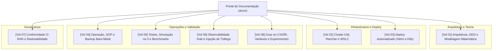

# Portal de Documentação Técnica: xApp RDL (Fase 1)

> ### Navegação Multi-Fases do Projeto RDL (Resource and Decision Layer)
> | Fase | Descrição e Paradigma | Status | Repositório |
> | :---: | :--- | :---: | :---: |
> | **Fase 1 (Atual)** | **RDL Determinística e Segura (H-RDL)** | **Implementada / Operacional** | [georgebarbosa3090/XApp-RDL-F1](https://github.com/georgebarbosa3090/XApp-RDL-F1) |
> | **Fase 2** | **RDL Baseada em Contexto e MARL (CA-RDL)** | **Ativa / Em Evolução** | [georgebarbosa3090/XApp-RDL-F2](https://github.com/georgebarbosa3090/XApp-RDL-F2) |
> | **Fase 3** | **RDL Autônoma e Federada 6G (Zero-Touch)** | **Roadmap / Planejada** | *Em especificação futura* |

---

## Visão Geral da Documentação

A documentação da **xApp RDL (Fase 1 — H-RDL)** está categorizada e modularizada em **8 Volumes Temáticos Independentes**, permitindo que diferentes perfis de engenharia (Arquitetos de Software, Engenheiros DevOps/SRE, Pesquisadores de Redes e Auditores de Governança) encontrem rapidamente as diretrizes necessárias.

---

## Volumes Temáticos Separados

### 1. Arquitetura, Engenharia Core e Teoria
* **[Volume 01: Arquitetura, Módulos Core e Modelagem Matemática](01_arquitetura_e_modelagem_matematica.md)**
  - **Público:** Engenheiros de Software, Arquitetos O-RAN e Pesquisadores.
  - **Conteúdo:** Fundamentos de Clean Architecture e DDD; Agentes de Percepção (janela 200ms), Raciocínio (TVS/EEVS) e Refinamento (*Safety Guards*); Codecs ASN.1 APER para E2AP, E2SM-KPM v2.0 e E2SM-RC v1.0; Modelagem matemática formal e formulação analítica do problema de arbitragem.

---

### 2. Infraestrutura e Plataforma de Execução
* **[Volume 02: Infraestrutura de Cluster k3d, Rancher Dashboard e Operações O-RAN](02_infraestrutura_cluster_k3d_e_rancher.md)**
  - **Público:** Engenheiros DevOps, SysAdmins e Operadores de Infraestrutura.
  - **Conteúdo:** Topologias de cluster no WSL2 (1 Server + 0 Agents vs Multi-Node); Mapeamento de portas O-RAN (SCTP 36422, RMR 4560/4561, HTTP 8080/8081); Instalação e gestão via Rancher Dashboard UI; Agente especialista `07-k8s-oran-cluster-operator`.

---

### 3. Implantação, Empacotamento e Automação (CI/CD)
* **[Volume 03: Guia de Implantação e Automação de Deploy (Helm e Kubernetes Puro)](03_guia_deploy_helm_e_k8s.md)**
  - **Público:** Engenheiros de Deploy, SRE e Integradores de Sistemas.
  - **Conteúdo:** Empacotamento de Helm Charts oficiais (`v1.1.0`); Deploy declarativo com Kustomize (`deploy/kubernetes/`); Scripts de automação `make helm-deploy` e `make k8s-deploy`; Onboarding no O-RAN App Manager / DMS CLI.

---

### 4. Operação Contínua, Resiliência e Backup
* **[Volume 04: Operação, Troubleshooting e Procedimentos de Backup Bare-Metal](04_operacao_troubleshooting_e_backup.md)**
  - **Público:** Equipes de Suporte N2/N3, SRE e Administradores de Redes.
  - **Conteúdo:** Procedimento Operacional Padrão (SOP) de inicialização e desligamento; Diagnóstico e correção de falhas comuns (`ErrImageNeverPull`, desconexão de agente Rancher, falha de rotas RMR); Procedimento de backup e restauração bare-metal de imagens WSL2 Ubuntu 20.04.

---

### 5. Validação Científica, Testes e Simulação em Rede
* **[Volume 05: Testes, Simulação em ns-3 O-RAN e Benchmarks Científicos](05_testes_simulacao_ns3_e_benchmarks.md)**
  - **Público:** Cientistas de Redes, Engenheiros de Teste e Pesquisadores.
  - **Conteúdo:** Bateria de testes unitários (10/10 aprovados); Smoke test automatizado em Docker; Cenário de simulação 5G NR no `ns-O-RAN` com tráfego SCTP real; Benchmarks comparativos.

* **[Volume 08: Guia de Instalação do ns-3 NORI, Parâmetros e Experimentos O-RAN](08_guia_experimentos_ns3_nori.md)**
  - **Público:** Pesquisadores 5G/6G, Engenheiros de Simulação e Cientistas de Dados.
  - **Conteúdo:** Passo-a-passo de compilação do ns-3 NORI / 5G-LENA; Análise comparativa dos scripts do curso; Dicionário completo de parâmetros (Rádio, E2, Slices, Utilidade); Cenários C++ prontos (`scenario_rdl_tvs_conflict.cc`, `scenario_rdl_energy_vs_qos.cc`); Procedimento de replicação de experimentos ponta a ponta.

---

### 6. Observabilidade de Rede e Service Mesh
* **[Volume 06: Observabilidade Service Mesh com Kiali e Injeção de Tráfego O-RAN](06_observabilidade_kiali_e_injecao_trafego.md)**
  - **Público:** Engenheiros de Observabilidade e Operadores de NOC.
  - **Conteúdo:** Integração de Service Mesh com Istio no cluster O-RAN; Visualização em grafo topológico animado em tempo real no Kiali Dashboard (`http://localhost:20001/kiali`); Injetor de tráfego contínuo sintético (`make inject-traffic`).

---

### 7. Governança, Conformidade e Rastreabilidade
* **[Volume 07: Relatórios de Conformidade Técnica e Governança O-RAN](07_relatorios_conformidade_e_governanca.md)**
  - **Público:** Gestores Técnicos, Auditores de Segurança e Comitê de Governança.
  - **Conteúdo:** Matriz formal de rastreabilidade de requisitos técnicos (REQ-RDL-01 a REQ-RDL-10); Conformidade com os padrões O-RAN Alliance (WG2/WG3) e especificações 3GPP; Relatório de segurança Kubernetes.

---

## Trilhas de Leitura Recomendadas

| Perfil / Objetivo | Sequência Recomendada de Leitura |
| :--- | :--- |
| **Pesquisador Científico / Simulação 5G** | [Volume 01](01_arquitetura_e_modelagem_matematica.md) -> [Volume 08](08_guia_experimentos_ns3_nori.md) -> [Volume 05](05_testes_simulacao_ns3_e_benchmarks.md) |
| **Arquiteto de Software O-RAN** | [Volume 01](01_arquitetura_e_modelagem_matematica.md) -> [Volume 05](05_testes_simulacao_ns3_e_benchmarks.md) -> [Volume 07](07_relatorios_conformidade_e_governanca.md) |
| **Engenheiro DevOps / SRE** | [Volume 02](02_infraestrutura_cluster_k3d_e_rancher.md) -> [Volume 03](03_guia_deploy_helm_e_k8s.md) -> [Volume 04](04_operacao_troubleshooting_e_backup.md) |
| **Operador de NOC / Observabilidade** | [Volume 03](03_guia_deploy_helm_e_k8s.md) -> [Volume 06](06_observabilidade_kiali_e_injecao_trafego.md) -> [Volume 04](04_operacao_troubleshooting_e_backup.md) |
| **Auditor de Qualidade e Governança** | [Volume 07](07_relatorios_conformidade_e_governanca.md) -> [Volume 01](01_arquitetura_e_modelagem_matematica.md) -> [Volume 08](08_guia_experimentos_ns3_nori.md) |

---

[Voltar para a Página Inicial (README.md)](../README.md)
