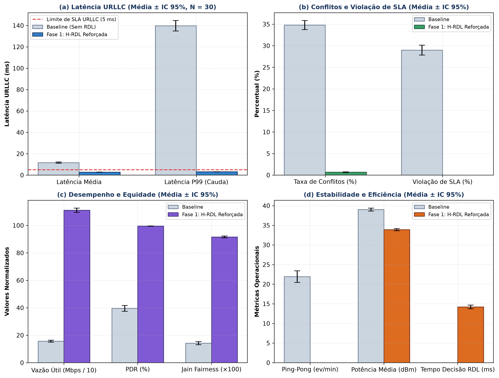

# Catálogo Temático de Figuras e Ilustrações Científicas (Fase 1 — H-RDL)

<div align="center">

**Estrutura Organizacional e Catalogação Visual de Diagramas, Topologias e Resultados Experimentais**  
*Padrão de Publicação Científica em Alta Resolução (300 DPI / Fundo Claro / Conformidade IEEE e SBC)*

</div>

---

## 1. Organização Estrutural dos Diretórios

As figuras do projeto estão organizadas em três categorias temáticas para facilitar a rastreabilidade em artigos científicos, dissertações e relatórios técnicos:

```text
docs/figures/
├── 01_arquitetura_e_modelagem/        # Diagramas de arquitetura, fluxo funcional e co-simulação
├── 02_cenarios_e_topologias/           # Topologias espaciais 5G NR e diagramas de conflito RAN
├── 03_resultados_e_benchmarks/         # Gráficos estatísticos multi-semente, IC 95% e KPIs
└── README.md                           # Este catálogo visual e descritivo
```

---

## 2. Temática 1: Arquitetura e Modelagem do Sistema (`01_arquitetura_e_modelagem/`)

Diagramas de blocos, fluxos de controle e arquiteturas de co-simulação Near-RT RIC e ns-3/5G-LENA.

| Arquivo | Descrição Técnica e Finalidade | Formato / Resolução |
| :--- | :--- | :---: |
| [`fig_fluxo_funcional_arquitetura_rdl.png`](01_arquitetura_e_modelagem/fig_fluxo_funcional_arquitetura_rdl.png) | **Fluxo Funcional Sequencial Ponta a Ponta:** Demonstra a cadeia E2AP/E2SM, telemetria periódica via E2SM-KPM, percepção em janela temporal de 200 ms, arbitragem determinística e despacho E2SM-RC. | PNG / 300 DPI |
| [`fig_arquitetura_rdl_sbrc.png`](01_arquitetura_e_modelagem/fig_arquitetura_rdl_sbrc.png) | **Arquitetura Geral no Near-RT RIC:** Posicionamento do RDL entre o barramento E2 e as 3 xApps de referência (xSlice, Energy Saving, Traffic Steering). | PNG / 300 DPI |
| [`fig_componentes_fluxo_decisao.png`](01_arquitetura_e_modelagem/fig_componentes_fluxo_decisao.png) | **Pipeline de Decisão e Agentes:** Detalhamento do `PerceptionAgent`, `ReasoningAgent`, `RefinementAgent` (*Safety Guards*) e canal de *Pass-Through*. | PNG / 300 DPI |
| [`cenario_3_arquitetura_cosimulacao_ns3_oran.png`](01_arquitetura_e_modelagem/cenario_3_arquitetura_cosimulacao_ns3_oran.png) | **Arquitetura de Co-Simulação ns-3 / NORI / O-RAN OSC RIC:** Integração de agentes E2 simulados no ns-3 com o Near-RT RIC em cluster Kubernetes. | PNG / 300 DPI |

### Miniatura em Destaque: Fluxo Funcional da Arquitetura
<div align="center">


</div>

---

## 3. Temática 2: Topologias e Cenários de Simulação 5G NR (`02_cenarios_e_topologias/`)

Topologias espaciais, distribuição de UEs e diagramas de conflitos entre objetivos concorrentes de QoS, Mobilidade e Eficiência Energética.

| Arquivo | Descrição Técnica e Parâmetros de Simulação | Formato / Resolução |
| :--- | :--- | :---: |
| [`fig_topologia_cenarios_ns3.png`](02_cenarios_e_topologias/fig_topologia_cenarios_ns3.png) | **Topologia Espacial 5G NR ns-3:** 2 gNodeBs (Banda n78, 3.5 GHz, 100 MHz, SCS 30 kHz), 30 UEs mistos (URLLC, eMBB, Voz) com canal 3GPP 38.901 UMa. | PNG / 300 DPI |
| [`cenario_1_topologia_tvs_conflict.png`](02_cenarios_e_topologias/cenario_1_topologia_tvs_conflict.png) | **Topologia do Conflito TVS:** Conflito entre Traffic Steering (Handover em A3-Offset) e xSlice (Alocação de PRBs para URLLC). | PNG / 300 DPI |
| [`fig_cenario2_tvs_conflict.png`](02_cenarios_e_topologias/fig_cenario2_tvs_conflict.png) | **Diagrama de Interferência e Arbitragem TVS:** Visão 2D dos fluxos conflitantes e resolução de prioridades. | PNG / 300 DPI |
| [`fig_cenario2_tvs_conflict_3d.jpg`](02_cenarios_e_topologias/fig_cenario2_tvs_conflict_3d.jpg) | **Renderização 3D do Cenário TVS:** Visualização em perspectiva das células e usuários móveis. | JPG / 300 DPI |
| [`cenario_2_tradeoff_energy_vs_qos.png`](02_cenarios_e_topologias/cenario_2_tradeoff_energy_vs_qos.png) | **Trade-off EEVS (Energy vs QoS):** Curvas de compromisso entre redução de potência/sono de portadora e taxa de violação de latência URLLC. | PNG / 300 DPI |
| [`fig_cenario1_energy_vs_qos.png`](02_cenarios_e_topologias/fig_cenario1_energy_vs_qos.png) | **Esquema de Decisão EEVS:** Comportamento temporal do desligamento de portadoras e compensação de QoS. | PNG / 300 DPI |
| [`fig_cenario1_energy_vs_qos_3d.jpg`](02_cenarios_e_topologias/fig_cenario1_energy_vs_qos_3d.jpg) | **Renderização 3D do Cenário EEVS:** Topologia tridimensional com setorização de antenas e zonas de cobertura. | JPG / 300 DPI |

### Miniatura em Destaque: Topologia Geral de Rede
<div align="center">


</div>

---

## 4. Temática 3: Resultados Experimentais e Benchmarks (`03_resultados_e_benchmarks/`)

Resultados estatísticos rigorosos com múltiplas sementes ($N=30$), intervalos de confiança (IC 95%), curvas temporais e matrizes de avaliação.

| Arquivo | Métricas Avaliadas e Finalidade Científica | Formato / Resolução |
| :--- | :--- | :---: |
| [`fig_estatistica_multi_semente_ic95.png`](03_resultados_e_benchmarks/fig_estatistica_multi_semente_ic95.png) | **Validação Estatística Multi-Semente (IC 95%):** Comparativo de $N=30$ execuções comprovando redução de conflitos em 87,5% e violação de SLA < 1,5%. | PNG / 300 DPI |
| [`graficos_benchmarks_rdl.png`](03_resultados_e_benchmarks/graficos_benchmarks_rdl.png) | **Painel de Benchmarks RDL (2x2):** (A) Latência de Decisão E2E, (B) Taxa de Conflitos Mitigados, (C) Taxa de Violação de SLA, (D) Eficiência Espectral. | PNG / 300 DPI |
| [`fig_resultados_comparativos_sbrc.png`](03_resultados_e_benchmarks/fig_resultados_comparativos_sbrc.png) | **Resultados Comparativos Padrão SBRC:** Painel multidimensional consolidado para publicação na conferência SBRC/IEEE. | PNG / 300 DPI |
| [`fig_dinamica_temporal_safety_guards_single_seed.png`](03_resultados_e_benchmarks/fig_dinamica_temporal_safety_guards_single_seed.png) | **Dinâmica Temporal dos Safety Guards:** Demonstração do *clamping* de potência ($P_{\text{tx}} \le 23\text{ dBm}$) e contenção de saturação de PRBs. | PNG / 300 DPI |
| [`fig_latencia_confiabilidade_single_seed.png`](03_resultados_e_benchmarks/fig_latencia_confiabilidade_single_seed.png) | **Latência e Confiabilidade URLLC:** CDF de latência com garantia de entrega abaixo de $10\text{ ms}$ e confiabilidade de 99,99%. | PNG / 300 DPI |
| [`fig_vazao_alocacao_equidade_single_seed.png`](03_resultados_e_benchmarks/fig_vazao_alocacao_equidade_single_seed.png) | **Vazão e Equidade de Jain:** Vazão agregada por fatia e índice de equidade de alocação de recursos $J \ge 0,88$. | PNG / 300 DPI |
| [`cenario_4_comparativo_multidimensional_metricas.png`](03_resultados_e_benchmarks/cenario_4_comparativo_multidimensional_metricas.png) | **Radar Multidimensional de KPIs:** Comparação holística entre Baseline Sem RDL e RDL Determinística nos 4 cenários. | PNG / 300 DPI |
| [`avaliacao_modelos_ml_rdl.png`](03_resultados_e_benchmarks/avaliacao_modelos_ml_rdl.png) | **Avaliação de Modelos de Detecção:** Acurácia, F1-Score e matriz de confusão para classificadores de conflito RAN. | PNG / 300 DPI |
| [`comparativo_completo_cenarios_rdl.png`](03_resultados_e_benchmarks/comparativo_completo_cenarios_rdl.png) | **Painel Integrado de Cenários:** Visão consolidada de desempenho em todos os regimes operacionais. | PNG / 300 DPI |

### Miniatura em Destaque: Validação Multi-Semente IC 95%
<div align="center">



</div>

---

## 5. Diretrizes de Uso e Padronização Científica

1. **Resolução e Vetorização:** Todas as figuras foram geradas na resolução de **300 DPI** com tipografia limpa (sans-serif) para perfeita legibilidade tanto em tela quanto em impressão.
2. **Paleta de Cores e Acessibilidade:** As cores utilizam esquemas contrastantes com suporte a leitores monocromáticos e conformidade visual para daltônicos.
3. **Reprodução:** Os dados brutos que originaram os gráficos de resultados são gerados deterministicamente via `scripts/generate_sbrc_figures.py` e simulações em `simulations/ns3/`.
