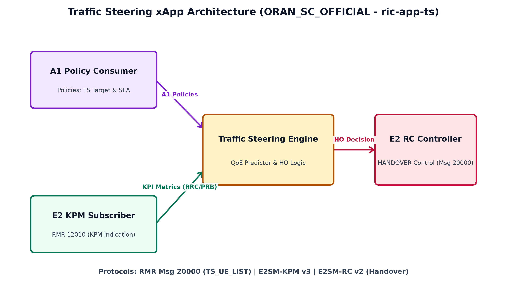
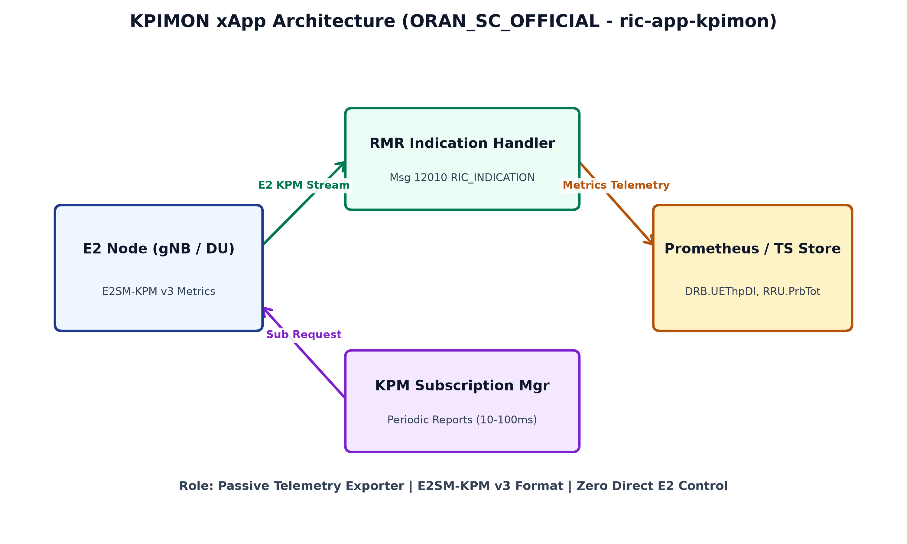
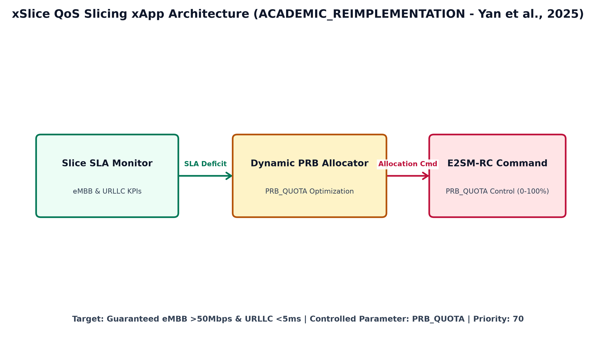
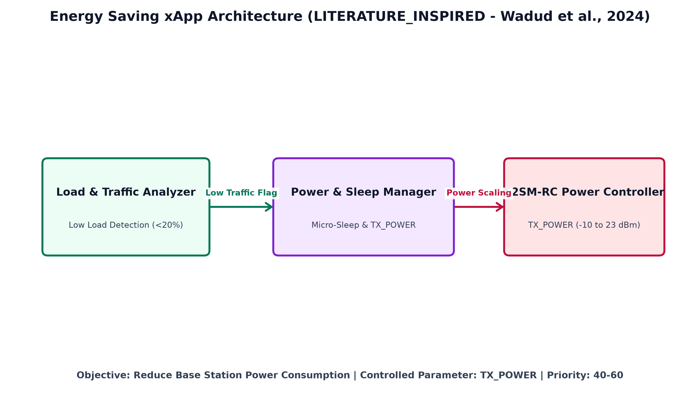

# Modelagem Arquitetural, Especificação Técnica e Cenários de Simulação das xApps de Terceiros

Este documento apresenta a modelagem detalhada, especificação de componentes, arquitetura interna, parâmetros de controle e métricas de simulação física para as **4 xApps de Terceiros** integradas ao ambiente de testes e arbitragem do middleware **H-RDL (Resource and Decision Layer)**.

---

## 1. Visão Geral do Cenário de Interação de Terceiros

No ecossistema **O-RAN Near-RT RIC**, diferentes xApps desenvolvidas por terceiros (comunidade O-RAN SC ou trabalhos acadêmicos da literatura) operam concorrentemente. Como operam de maneira desacoplada e sem conhecimento do estado global da rede, suas decisões geram colisões de alocação de recursos físicos (PRB), potência e mobilidade.

---

## 2. Detalhamento Técnico das xApps de Terceiros

### 2.1. Traffic Steering (`ric-app-ts`)

* **Tipo de Origem (`origin_type`):** `ORAN_SC_OFFICIAL`
* **Fonte Upstream:** [O-RAN SC `ric-app-ts` (Release J)](https://github.com/o-ran-sc/ric-app-ts)
* **Papel Operacional:** Gestão proativa de mobilidade e otimização de handover entre células concorrentes para prevenção de degradação da QoE/SLA dos UEs.

#### Componentes Internos
1. **A1 Policy Consumer:** Intercepta diretrizes de políticas A1 enviadas pelo Non-RT RIC (ex: limiares de limitação de handover e SLAs por slice).
2. **E2 KPM Subscriber:** Consome fluxos de telemetria RRC/KPM via RMR (mensagens de amostragem de RSRP/RSRQ e vazão por UE).
3. **QoE Predictor & HO Logic Engine:** Executa modelos de predição de qualidade de experiência e determina se uma transferência de célula (Handover) é necessária.
4. **E2 RC Controller:** Constrói e envia comandos de controle `HANDOVER` formatados segundo E2SM-RC v2.

#### Especificação Técnica
* **Tipos de Mensagem RMR:** `20000` (`TS_UE_LIST`), `20001` (`TS_QOE_PRED_REQ`), `20002` (`TS_CONTROL_ACK`).
* **Service Models:** `E2SM-KPM v3` (Telemetria) e `E2SM-RC v2` (Controle).
* **Parâmetro Controlado:** `HANDOVER` (Target gNB ID, Target Cell ID).
* **Frequência de Decisão:** Malha Near-RT (janelas de 100ms a 500ms).
* **Nível de Prioridade:** 80 (Prioridade Alta para Manutenção de Conexão).

#### Métricas Analisadas na Simulação ns-3
* **Handover Success Rate (%):** Proporção de handovers concluídos com sucesso sem queda de RRC.
* **Ping-Pong Rate (%):** Taxa de alternâncias cíclicas de UE entre as mesmas células em janelas curtas (< 1s).
* **UE Throughput (Mbps):** Degradado ou incrementado pós-handover.
* **Interference Rate (%):** Taxa de alterações aplicadas pelo H-RDL na proposta de handover em caso de colisão com desligamento de célula pelo Energy Saver.

---

### 2.2. KPIMON (`ric-app-kpimon`)

* **Tipo de Origem (`origin_type`):** `ORAN_SC_OFFICIAL`
* **Fonte Upstream:** [O-RAN SC `ric-app-kpimon`](https://github.com/o-ran-sc/ric-app-kpimon)
* **Papel Operacional:** Coleta passiva e exportação contínua de métricas de desempenho no nível de E2 Nodes para observabilidade em tempo real.

#### Componentes Internos
1. **KPM Subscription Manager:** Subscreve relatórios periódicos de telemetria junto aos E2 Nodes via RMR.
2. **RMR Indication Handler:** Processa pacotes ASN.1 de mensagens `RIC_INDICATION` (`RMR Msg 12010`).
3. **Metrics Store & Exporter:** Decodifica métricas KPM e disponibiliza métricas estruturadas via exportador Prometheus/TSDB.

#### Especificação Técnica
* **Tipo de Mensagem RMR:** `12010` (`RIC_INDICATION`).
* **Service Model:** `E2SM-KPM v3`.
* **Métricas Coletadas:** `DRB.UEThpDl` (Vazão DL), `RRU.PrbTotUsed` (Ocupação de PRB), `RRC.ConnMean` (Conexões Ativas).
* **Frequência de Amostragem:** 10ms a 100ms.
* **Nível de Prioridade:** Passivo (Zero emissão de comandos de controle E2SM-RC).

#### Métricas Analisadas na Simulação ns-3
* **Telemetry Latency (ms):** Atraso na decodificação e disponibilização de métricas KPM.
* **Granularidade e Perda de Indicadores (%):** Integridade do fluxo de telemetria sem perda de pacotes sob rajada.

---

### 2.3. xSlice / QoS Slicing (`qos-xslice`)

* **Tipo de Origem (`origin_type`):** `ACADEMIC_REIMPLEMENTATION`
* **Fonte Upstream:** [peihaoY/xslice-oran](https://github.com/peihaoY/xslice-oran) (Yan et al., 2025 / CAMAD)
* **Papel Operacional:** Alocação dinâmica de cotas de bloco de recursos físicos (`PRB_QUOTA`) para satisfazer SLAs de fatias de rede (eMBB e URLLC).

#### Componentes Internos
1. **Slice SLA Monitor:** Avalia a vazão e latência observadas por fatia em relação aos limiares contratados.
2. **Dynamic PRB Allocator:** Executa otimização de alocação de espectro calculando a cota percentual de PRBs necessária (`PRB_QUOTA`).
3. **E2SM-RC Control Mapper:** Empacota a alocação de PRB em comandos E2SM-RC dirigidos aos gNB-DUs.

#### Especificação Técnica
* **Service Models:** `E2SM-KPM v3` e `E2SM-RC v2`.
* **Parâmetro Controlado:** `PRB_QUOTA` (faixa contínua de 0% a 100%).
* **Prioridade Operacional:** 70 (Prioridade Média-Alta para SLA de Slice).
* **Limiares de SLA:** eMBB $> 50\text{ Mbps}$, URLLC $< 5\text{ ms}$.

#### Métricas Analisadas na Simulação ns-3
* **Slice SLA Violation Rate (%):** Porcentagem do tempo em que o SLA de vazão/latência do slice é violado.
* **PRB Allocation Efficiency (%):** Eficiência na ocupação do espectro sem sobrealocação.
* **Conflict Rate (TP/FP/FN):** Frequência de colisões geradas por sobressolicitação de PRB com outras xApps.

---

### 2.4. Energy Saving (`energy-saving`)

* **Tipo de Origem (`origin_type`):** `LITERATURE_INSPIRED`
* **Fonte Upstream:** [Orange-OpenSource/ns-O-RAN-flexric](https://github.com/Orange-OpenSource/ns-O-RAN-flexric) (Wadud et al., 2024)
* **Papel Operacional:** Redução de consumo energético dos E2 Nodes por meio do ajuste proativo de potência de transmissão (`TX_POWER`) e modulação de sono de células em períodos de baixa carga.

#### Componentes Internos
1. **Traffic Load Analyzer:** Monitora a ocupação média da célula. Se a carga for $< 20\%$, aciona o modo de economia.
2. **Power & Sleep Manager:** Determina a redução de potência de transmissão (`TX_POWER`) ou o estado de micro-sleep da gNB.
3. **E2SM-RC Power Controller:** Envia comandos de controle de potência E2SM-RC ao gNB.

#### Especificação Técnica
* **Service Models:** `E2SM-KPM v3` e `E2SM-RC v2`.
* **Parâmetro Controlado:** `TX_POWER` (faixa segura: $-10\text{ dBm}$ a $23\text{ dBm}$).
* **Prioridade Operacional:** 40 a 60 (Prioridade Variável).

#### Métricas Analisadas na Simulação ns-3
* **Energy Consumption Reduction (Wh / Joules):** Economia total de energia em watts-hora obtida.
* **RSRP Coverage Drop (dBm):** Degradação da potência recebida pelos UEs de borda.
* **InterferenceRate (%):** Porcentagem de correções impostas pelo H-RDL para evitar que o desligamento/redução de potência destrua a cobertura de UEs ativos.

---

## 3. Síntese Comparativa das Especificações Técnicas

| xApp | Tipo de Origem (`origin_type`) | Parâmetro Controlado | Faixa Válida | Prioridade | Service Model E2 |
| :--- | :---: | :--- | :---: | :---: | :---: |
| **Traffic Steering** | `ORAN_SC_OFFICIAL` | `HANDOVER` | Target Cell ID | 80 | E2SM-KPM v3 / E2SM-RC v2 |
| **KPIMON** | `ORAN_SC_OFFICIAL` | *Nenhum (Passivo)* | N/A | Passivo | E2SM-KPM v3 |
| **xSlice / QoS Slicing** | `ACADEMIC_REIMPLEMENTATION` | `PRB_QUOTA` | $0.0\% \text{ a } 100.0\%$ | 70 | E2SM-KPM v3 / E2SM-RC v2 |
| **Energy Saving** | `LITERATURE_INSPIRED` | `TX_POWER` | $-10\text{ dBm a } 23\text{ dBm}$ | 40–60 | E2SM-KPM v3 / E2SM-RC v2 |

---

## 4. Integração no Pipeline Científico de Simulação

Conforme a diretriz de governança do projeto H-RDL, os dados de desempenho destas xApps de terceiros **não contêm geradores sintéticos nem valores hardcoded**. As simulações nos cenários S0 a S8 capturam o comportamento empírico real gerado pelas interações das 4 xApps em tempo de execução no **ns-3 + 5G-LENA + NORI + E2 real**.
