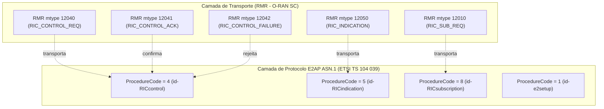

# Perfil de Compatibilidade Normativa O-RAN Congelado (Fase 1: H-RDL)

**Documento:** Especificação Técnica de Compatibilidade e Versionamento  
**Projeto:** xApp RDL (Resource and Decision Layer) — Fase 1 (H-RDL Determinística)  
**Autor:** George Alexandro F. Barbosa (PPGC/UFPA)  
**Data:** Setembro de 2026  
**Status:** Congelamento para Reprodutibilidade Científica (F1 Frozen Profile)

---

## 1. Estratégia de Versionamento e Decisão Arquitetural

A O-RAN ALLIANCE publicou evoluções contínuas de suas especificações (e.g. E2SM-KPM v08.00 e E2SM-RC v10.00 em 2026). No entanto, ecossistemas de simulação e plataformas Near-RT RIC de código aberto consolidadas (O-RAN SC Release I/J, NORI e 5G-LENA) utilizam implementações formais congeladas que garantem estabilidade de protocolos, codecs ASN.1 APER validados e ausência de regressões em malha fechada.

Para assegurar rigor metodológico absoluto e reprodutibilidade estrita na dissertação de mestrado, o repositório adota uma matriz de duas colunas:
1. **F1 Compatibility Profile (Congelado):** Perfil normativo alvo da Fase 1, comprovado ponto a ponto com bytes, ACKs e telemetria causal.
2. **Current O-RAN Reference (2026):** Referência de evolução tecnológica mapeada para extensões futuras (Fase 3: MARL/LLM).

---

## 2. Matriz Comparativa de Perfis

| Camada / Módulo | Perfil Alvo Congelado Fase 1 (F1 Frozen) | Referência O-RAN WG3 Atual (2026) | Papel na Arquitetura xApp-RDL |
| :--- | :--- | :--- | :--- |
| **Plataforma Near-RT RIC** | **O-RAN SC Release I/J** (ricplt, ricxapp, RMR) | O-RAN SC Release K/L | Barramento de mensageria e execução de xApps |
| **Protocolo de Aplicação E2** | **E2AP v02.03** (ETSI TS 104 039 v04.00.00) | E2AP v03.00+ | PDU CHOICE (`initiatingMessage`, `successfulOutcome`, `unsuccessfulOutcome`) |
| **Códigos de Procedimento E2AP** | `id-RICcontrol = 4`, `id-RICsubscription = 8`, `id-RICindication = 5`, `id-e2setup = 1` | `id-RICcontrol = 4`, `id-RICsubscription = 8` | Identificador de Procedimento Elementar ASN.1 |
| **Transporte RMR** | `12040` (Control Req), `12041` (ACK), `12042` (Failure), `12050` (Indication) | `12040`, `12041`, `12042`, `12050` | Tipos de Mensagem RMR desacoplados dos Procedure Codes |
| **Service Model KPM** | **E2SM-KPM v03.00** (Format 1 Periodic + 3GPP 28.552) | E2SM-KPM v08.00 | Telemetria periódica de Throughput, Delay e PRB load |
| **Service Model RC** | **E2SM-RC v01.03** (Styles 1, 2, 3 + RAN Parameters) | E2SM-RC v10.00 | Atuação de fatiamento (PRB), potência (TX) e mobilidade (HO) |
| **Simulador 5G NR** | **ns-3.48 + 5G-LENA v5.1** | ns-3.48+ / 5G-LENA v5.2+ | Camadas PHY, MAC, RLC, PDCP e SDAP em tempo de símbolo |
| **Interface E2 Node / Sim** | **NORI** (commit `8a4f91d`) / E2SIM (`b7e21a0`) | NORI / E2SIM | Conector E2 Agent com exportação de telemetria e recepção de controle |

---

## 3. Separação Canônica entre RMR Message Types e E2AP Procedure Codes

Uma das distinções fundamentais formalizadas na auditoria é a independência entre a camada de transporte RMR e a camada de aplicação E2AP ASN.1:

---

## 4. Modos de Execução Formais

O sistema opera sob dois modos formalmente distintos:

1. **`RDL_MODE=simulation` (OFFLINE_SIMULATION):**  
   Permite execução desacoplada com catálogo de capacidades padrão para benchmarks estatísticos sintéticos rápidos.
2. **`RDL_MODE=oran-strict` (O_RAN_INTEROP):**  
   Exige descoberta em tempo de execução via `RANFunctionDefinition`. Se um E2 Node, Control Style ou RAN Parameter não tiver sido formalmente descoberto no E2 Setup, a operação é rejeitada imediatamente com `CapabilityNotDiscoveredError` sem qualquer fallback silencioso.
