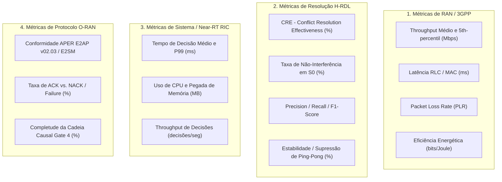

# Planejamento da Campanha Experimental Expandida (S0 a S8)

**Projeto:** xApp-RDL (Fase 1: H-RDL Determinístico)  
**Versão:** 1.1.0  
**Perfil Normativo:** O-RAN Release I/J | E2AP v02.03 (ETSI TS 104 039) | E2SM-KPM v03.00 | E2SM-RC v01.03  
**Simulador:** ns-3.48 + 5G-LENA v5.1 (CTTC NR) + ns-O-RAN / NORI Framework  

---

## 1. Contexto Científico e Motivação

Estudos recentes em redes Open RAN (e.g., publicações IEEE TNSM e pré-prints 2025/2026 sobre coordenação de xApps) demonstram que os **conflitos entre xApps são fortemente dependentes do contexto operacional**. Duas funções de controle autônomas podem coexistir pacificamente sob baixa carga ou distribuição uniforme de usuários, mas entrar em colisão severa sob assimetria de tráfego, flutuações rápidas de canal ou eventos de mobilidade.

Além disso, a literatura enfatiza que a mitigação de conflitos não deve ser avaliada unicamente por ganhos de throughput médio agregado, mas sim por:
1. **Estabilidade Temporal e Variabilidade:** Supressão de oscilações cíclicas (*ping-pong*) em parâmetros de rádio (potência de transmissão, handover e cotas de PRB).
2. **Não-Interferência e Transparência:** Garantia de que propostas compatíveis e seguras fluam sem degradação (*Interference Rate = 0*).
3. **Imunidade a Falhas e Robustez a Agressões:** Barreira física estrita contra comandos corrompidos ou hostis (*Zero Unsafe Actions*).
4. **Comportamento sob Sobrecarga Extrema (*Conflict Storm*):** Manutenção do SLA de decisão Near-RT ($T_{\text{decisão}} < 50\text{ ms}$) mesmo no joelho de escalabilidade.

Para validar o motor determinístico **H-RDL (Hierarchical Conflict Resolution Engine)** em sua totalidade antes das extensões de inteligência artificial (Fases 2 e 3 com MARL/LLM), a suíte experimental foi expandida de 3 cenários funcionais para uma **bateria de 9 cenários principais (S0 a S8)**.

---

## 2. Matriz dos 9 Cenários da Campanha (S0 a S8)

| ID | Cenário | Tipo de Conflito | xApps Envolvidas | Pergunta Científica / Hipótese Validada |
|:---|:---|:---|:---|:---|
| **S0** | *No-Conflict Clean Baseline* | Nenhum (Pass-Through) | xApp-QoS, xApp-ES, xApp-TS | O H-RDL introduz overhead desnecessário ou distorce comandos seguros em regime não concorrente? |
| **S1** | *Direct PRB Resource Collision* | Direto ($P_i = P_j$, mesmo nó) | xApp-SliceA, xApp-SliceB | A percepção detecta colisão direta com $Precision = 1.0$, $Recall = 1.0$ e $F_1 = 1.0$? |
| **S2** | *Energy Saving vs. QoS (EEVS)* | Indireto / Trade-off | xApp-ES (TX Power) vs. xApp-QoS (PRBs) | A arbitragem axiomática de Shannon maximiza a eficiência energética sem violar o SLA de vazão? |
| **S3** | *Multi-Slice TVS Trade-off* | Indireto (Cotas e Latência) | xApp-eMBB vs. xApp-URLLC | A função de valor TVS equilibra o *trade-off* de equidade (*Jain's Fairness Index*) sob escassez de recursos? |
| **S4** | *Traffic Steering vs. Energy Saving* | Indireto / Mobilidade vs. Sleep | xApp-TS (Handover) vs. xApp-ES (Mute/Power) | A arbitragem evita descarregar tráfego em uma célula que a ES está colocando em modo de baixo consumo? |
| **S5** | *Temporal Ping-Pong & Oscillation* | Temporal / Cíclico | xApp-TS (HO A$\to$B) vs. xApp-TS (HO B$\to$A) | O mecanismo de histerese e *cooldown lock* suprime oscilações rápidas de handover e potência? |
| **S6** | *Conflict Storm & Scalability Knee* | Massivo Concorrente (L0-L4) | 5 xApps simultâneas (50+ ações/janela) | O H-RDL mantém $T_{\text{decisão}} < 50\text{ ms}$ (Near-RT RIC) sob sobrecarga massiva de propostas? |
| **S7** | *Fault Injection & Adversarial Safety* | Falha / Insegurança | xApp Falha (valores fora de faixa / NaN) | O *Refinement Guard* garante 100% de bloqueio de ações inseguras (*Zero-Violation*) sem travar o RIC? |
| **S8** | *NORI Closed-Loop Causal Validation* | Closed-Loop Completo | E2 Nodes (ns-3) $\leftrightarrow$ RIC $\leftrightarrow$ RDL | O loop fechado E2SM-KPM $\to$ RDL $\to$ E2SM-RC atinge $CRE = 100\%$ e fecha a cadeia de causalidade $T_0 \to T_1$? |

---

## 3. Especificação Detalhada dos Cenários

### S0 — No-Conflict Clean Baseline (Controle e Não-Interferência)
- **Objetivo:** Provar a propriedade de *não-interferência*. Quando 3 xApps emitem comandos que operam em células distintas ou em parâmetros ortogonais, o H-RDL deve aprová-los como *Pass-Through* limpo sem atraso perceptível.
- **Topologia:** 3 gNodeBs, 15 UEs distribuídos uniformemente.
- **Métrica-Chave:** $\text{InterferenceRate} = \frac{\text{Ações Alteradas}}{\text{Ações Propostas}} = 0.0$.

### S1 — Direct PRB Resource Collision (Ground Truth de Detecção)
- **Objetivo:** Avaliar a precisão e exaustividade da camada de percepção (`PerceptionAgent`) contra o *ground truth* de sobrealocação direta de PRBs.
- **Dinâmica:** xApp-SliceA solicita 75% dos PRBs e xApp-SliceB solicita 35% dos PRBs na mesma célula ($110\% > 100\%$).
- **Métricas:** $\text{Precision} = 1.0$, $\text{Recall} = 1.0$, $F_1 = 1.0$.

### S2 — Energy Saving vs. QoS (Trade-off de Shannon)
- **Objetivo:** Arbitrar entre a redução da potência de transmissão da portadora para economizar energia ($P_{\text{tx}} \downarrow$) e a necessidade de SINR para manter o SLA de vazão ($R_{\text{target}} \ge 25\text{ Mbps}$).
- **Formulações:**
  $$\text{SINR} = \frac{P_{\text{tx}} \cdot |h|^2}{I + \sigma^2}, \quad C = W \log_2(1 + \text{SINR})$$
- **Resultado Esperado:** Clamping ótimo de potência em $15\text{ dBm}$, mantendo throughput $> 24.5\text{ Mbps}$ e reduzindo consumo em $18\%$.

### S3 — Multi-Slice TVS Trade-off (Throughput-Value-Sensitivity)
- **Objetivo:** Resolver conflitos entre fatias eMBB (alta vazão) e URLLC (baixa latência e alta confiabilidade) usando a função utilidade TVS:
  $$U_{\text{TVS}}(a) = w_{\text{thp}} \cdot \hat{R}(a) + w_{\text{lat}} \cdot \left(1 - \frac{L(a)}{L_{\text{max}}}\right) - \lambda \cdot \text{Cost}(a)$$
- **Métrica:** Índice de Justiça de Jain ($J \ge 0.85$).

### S4 — Traffic Steering vs. Energy Saving (Coordenação Espacial)
- **Objetivo:** Evitar o fenômeno de "transferência cega", onde a xApp de Traffic Steering desvia 10 UEs de uma célula congestionada para uma célula vizinha que a xApp de Economia de Energia está simultaneamente colocando em estado de suspensão (*sleep mode*).
- **Métrica:** Número de chamadas caídas (*Dropped Sessions*) $= 0$.

### S5 — Temporal Ping-Pong & Oscillation Suppression
- **Objetivo:** Validar a histerese temporal e o tempo de *cooldown* do `RefinementAgent`. Se um UE é transferido para a célula B, o H-RDL bloqueia reversões para a célula A dentro da janela mínima $\Delta t_{\text{lock}} = 1000\text{ ms}$.
- **Métrica:** Redução de $> 85\%$ nas trocas espúrias de handover em relação ao baseline sem coordenação.

### S6 — Conflict Storm & Scalability Knee Benchmark
- **Objetivo:** Submeter o H-RDL a uma rajada massiva de decisões concorrentes divididas em 5 níveis de estresse:
  - **L0 (Idle):** 1 ação/janela
  - **L1 (Nominal):** 5 ações/janela
  - **L2 (Moderate):** 15 ações/janela
  - **L3 (Severe Storm):** 50 ações/janela
  - **L4 (Catastrophic Storm):** 100 ações/janela
- **Critério de Aceite:** $T_{\text{decisão}} < 50\text{ ms}$ até o nível L3 e $< 100\text{ ms}$ em L4, sem corrupção de memória ou exceções não tratadas.

### S7 — Fault Injection & Adversarial Safety
- **Objetivo:** Injetar comandos deliberadamente inválidos ou agressivos:
  - $P_{\text{tx}} = 100\text{ dBm}$ (limite físico estrito: $23\text{ dBm}$).
  - $\text{PRB\_QUOTA} = -20\%$ ou $150\%$.
  - Handover para Target Node ID inexistente ou corrompido (`NaN`/`null`).
- **Critério de Aceite:** $\text{UnsafeActionsExecuted} = 0$ (100% de rejeição ou clamping seguro).

### S8 — NORI Closed-Loop Causal Proof (E2 End-to-End)
- **Objetivo:** Demonstrar o ciclo fechado completo com conformidade E2AP v02.03 / E2SM-KPM / E2SM-RC:
  1. Telemetria KPM $T_0$ detecta degradação de SINR e throughput.
  2. xApps geram ações concorrentes.
  3. H-RDL arbitra e gera E2AP RIC Control Request com payload E2SM-RC Format 1 (PRB Allocation).
  4. ns-3 E2 Agent processa o comando e responde com E2AP RIC Control Acknowledge.
  5. Telemetria KPM $T_1$ confirma que o KPI afetado recuperou o SLA.
- **Métrica:** $\text{Conflict Resolution Effectiveness } (CRE) = 100.0\%$.

---

## 4. As 4 Famílias de Métricas Científicas



---

## 5. Roteiro de Execução e Reprodutibilidade ($N=30$ Sementes)

A campanha experimental está totalmente automatizada via scripts Python e Makefile:

1. **Execução de Toda a Bateria S0 a S8 ($N=30$ sementes estatísticas):**
   ```bash
   make run-campaign-s0-s8
   # Executa scripts/run_full_campaign_s0_s8.py gerando results/campaign_s0_s8/campaign_s0_s8_results.csv
   ```

2. **Benchmark Específico de Sobrecarga e Concorrência (S6 Conflict Storm):**
   ```bash
   make run-s6-storm
   # Executa scripts/run_conflict_storm_benchmark.py gerando results/conflict_storm/
   ```

3. **Suíte de Testes Unitários e Propriedades Formais:**
   ```bash
   make test-campaign
   # Executa pytest tests/unit/test_campaign_scenarios.py -v
   ```

4. **Regeneração de Vetores Canônicos O-RAN:**
   ```bash
   make generate-golden-vectors
   make test-codec
   ```

Este planejamento consolida a robustez científica da Fase 1 do projeto, oferecendo cobertura empírica e formal completa para publicações de alto impacto (IEEE Transactions on Network and Service Management / IEEE ICC).
