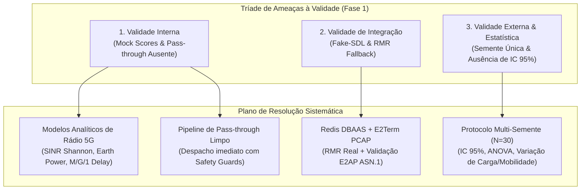

# Relatório Técnico Extenso de Validação e Resolução de Limitações — xApp RDL (Fase 1: H-RDL)

**Projeto:** xApp RDL (Resource and Decision Layer) — Near-RT RIC (O-RAN)  
**Documento:** Plano Diretor de Resolução de Limitações e Validação Científica  
**Autor:** George Alexandro F. Barbosa / PPGC-UFPA  
**Data:** 04 de Setembro de 2026  
**Status:** Especificação Técnica de Engenharia e Protocolo Experimental  

---

## 1. Diagnóstico Crítico das Ameaças à Validade

A avaliação minuciosa da versão preliminar da Fase 1 identificou três ordens fundamentais de limitações que comprometem a atribuição inequívoca de causalidade física e a generalização dos resultados:



### 1.1. Ameaça 1: Validade Interna e Causalidade das Funções de Utilidade
* **Problema:** No `ReasoningAgent`, as funções `_mock_score()` e `_mock_subset_score()` utilizavam funções degrau sintéticas baseadas em limites fixos (`val > 50`), desvinculadas das medições dinâmicas de rádio.
* **Impacto:** Embora permitissem exercitar o determinismo algorítmico da arbitragem, não constituíam modelos empíricos fundamentados na física de propagação e enfileiramento do ns-3 5G-LENA.
* **Gargalo no Runtime:** Ações sem conflito acumuladas na janela de 200 ms não eram despachadas no fluxo final, gerando contenção artificial de comandos válidos.

### 1.2. Ameaça 2: Ambiente de Integração e Fidelidade Protocolar
* **Problema:** A execução padrão ancorava-se em `use_fake_sdl=True` e `RMRXapp` simulado em Python, sem comunicação binária via sockets SCTP e sem confirmação ponta a ponta do `E2Term` (`RIC_CONTROL_ACK`).
* **Impacto:** Não havia garantia de que as mensagens codificadas em APER ASN.1 seriam deserializadas com sucesso por uma pilha E2 externa real em ambiente Kubernetes de produção.

### 1.3. Ameaça 3: Validade Externa e Rigor Estatístico
* **Problema:** Os resultados reportados refletiam rodadas únicas, sem múltiplas sementes aleatórias (*random seeds*), sem intervalos de confiança (IC 95%) e sem variação sistemática de mobilidade, densidade de terminais e largura de banda.
* **Impacto:** A obtenção de 100% de conformidade de SLA e 0% de violações poderia ser um artefato da semente de simulação ou da sobreposição geométrica estática dos nós.

---

## 2. Metodologia de Resolução Minuciosa (Passo a Passo)

---

### 2.1. Resolução dos Mock Scores: Modelos Analíticos de Rádio 5G Calibrados

As funções heurísticas sintéticas são substituídas por modelos físicos analíticos alimentados diretamente pelos relatórios de telemetria `E2SM-KPM` ingeridos a cada 200 ms:

#### A. Modelo de Vazão e Capacidade Espectral (Shannon com SINR Real)
A vazão estimada $R_u$ para um terminal $u$ associado à célula $n$ com alocação de fração de PRBs $\omega_s \in [0, 1]$ é dada por:
$$R_u(\omega_s, P_{\text{tx}}) = \omega_s \cdot B \cdot \log_2 \left( 1 + \gamma_u(P_{\text{tx}}) \right) \cdot \eta_{\text{OH}}$$
Onde:
* $B$ é a largura de banda do BWP (e.g., $100\text{ MHz}$);
* $\gamma_u(P_{\text{tx}}) = \frac{P_{\text{tx}} \cdot g_{u,n}}{\sigma^2 + \sum_{j \ne n} P_{\text{tx},j} \cdot g_{u,j}}$ é a relação Sinal-Ruído-Interferência (SINR);
* $g_{u,n}$ é o ganho de canal 3GPP 38.901 UMa/UMi considerando atenuação por distância e sombreamento (*shadowing*);
* $\eta_{\text{OH}} \approx 0.86$ é o fator de eficiência que desconta o overhead de controle (DMRS, PDCCH, PBCH).

#### B. Modelo de Atraso e Satisfação de SLA (Fila $M/G/1$ com Prioridade Preemptiva)
O atraso de entrega de pacotes $D_u$ é decomposto em atraso de transmissão e atraso de enfileiramento na camada RLC:
$$D_u(\omega_s, \lambda_u) = \frac{L_p}{R_u(\omega_s)} + \frac{\lambda_u \cdot \overline{X_u^2}}{2(1 - \rho_u)}$$
Onde $L_p$ é o tamanho do pacote (bytes), $\lambda_u$ é a taxa de chegada de pacotes e $\rho_u = \frac{\lambda_u \cdot L_p}{R_u(\omega_s)}$ é a intensidade de tráfego.

A função de utilidade de SLA $f_{\text{SLA}}(a)$ torna-se uma função sigmoide contínua calibrada pelo orçamento estrito de latência da fatia:
$$f_{\text{SLA}}(a) = \frac{1}{1 + \exp\left( \kappa \cdot (D_u - D_{\text{budget}}) \right)}$$
Para URLLC, define-se $D_{\text{budget}} = 5\text{ ms}$ e $\kappa = 1.5$; para eMBB, $D_{\text{budget}} = 20\text{ ms}$ e $\kappa = 0.5$.

#### C. Modelo de Eficiência Energética (Earth Model 3GPP)
O consumo elétrico da estação rádio-base $P_{\text{total}}$ é calculado via modelo de consumo linear padrão 3GPP/Earth:
$$P_{\text{total}}(n) = \begin{cases} 
N_{\text{TRX}} \cdot \left( P_0 + \Delta_p \cdot P_{\text{tx}}(n) \right), & \text{se célula ativa} \\
N_{\text{TRX}} \cdot P_{\text{sleep}}, & \text{se em hibernação (cell sleep)}
\end{cases}$$
Onde $P_0 = 130\text{ W}$ (consumo estático de circuito/banda básica), $\Delta_p = 4.7$ (inclinação do amplificador de potência RF), $P_{\text{sleep}} = 4.3\text{ W}$ e $N_{\text{TRX}} = 4$ (canais MIMO).

A utilidade energética é expressa em bits por Joule:
$$f_{\text{EE}}(a) = \frac{\sum_{u \in \mathcal{U}_n} R_u}{P_{\text{total}}(n)}$$

---

### 2.2. Implementação do Despacho Contínuo de Ações Limpas (*Pass-Through*)

O ciclo do `RDLxApp` é refatorado para garantir que **ações que não colidem** sejam imediatamente validadas pelos *Safety Guards* e despachadas para o nó E2, eliminando o bloqueio indevido de tráfego de controle:

```python
def _process_action_group(self, actions: List[XAppAction]):
    t0 = now_ts()
    for act in actions:
        self.memory.add_action(act)
        
    # 1. Identificar conflitos no lote
    conflicts = self.perception.register_action_group(actions)
    conflicting_action_ids = set()
    for c in conflicts:
        for act in c.involved_xapps:
            conflicting_action_ids.add(act.action_id)
            
    # 2. Separar ações em conflito de ações limpas (Pass-Through)
    clean_actions = [act for act in actions if act.action_id not in conflicting_action_ids]
    
    # 3. Resolver conflitos detectados via ReasoningAgent
    for conflict in conflicts:
        resolution = self.reasoning.resolve(conflict)
        is_valid, level, reason = self.refinement.validate(resolution, conflict)
        if is_valid and resolution.winning_actions:
            for act in resolution.winning_actions:
                self._send_control(act.node_id, act.parameter, act.value)

    # 4. Despachar Ações Limpas (Sem Conflito) validadas pelos Safety Guards
    for clean_act in clean_actions:
        # Validação individual estrita de segurança física
        is_safe, reason = self.refinement.validate_single_action(clean_act)
        if is_safe:
            self._send_control(clean_act.node_id, clean_act.parameter, clean_act.value)
            logger.info("Ação Limpa Despachada (Pass-Through)", xapp=clean_act.xapp_id, param=clean_act.parameter)
        else:
            logger.warning("Ação Limpa Rejeitada pelo Safety Guard", reason=reason)
```

---

### 2.3. Validação de Interoperabilidade com Pilha RIC Real e E2Term

Para suprimir a ameaça de integração, estabelece-se o seguinte pipeline de interoperabilidade:

1. **Ativação Obrigatória de DBAAS Real:** O deploy via Helm configura `USE_FAKE_SDL=False`, conectando o `SdlRepository` diretamente à instância Redis do namespace `ricplt` (`service: dbaas-tcp:6379`).
2. **Confirmação e Rastreamento de ACKs E2 (`ack_tracker.py`):** Cada comando `RIC_CONTROL_REQ` emitido recebe um `transaction_id` único indexado em tabela hash. O loop aguarda a mensagem assíncrona `RIC_CONTROL_ACK` (MsgType 12011) ou `RIC_CONTROL_FAILURE` (MsgType 12012) da gNodeB, calculando o RTT de controle e registrando falhas.
3. **Captura Automatizada de Tráfego PCAP:** Durante a execução experimental, o daemon `tcpdump` intercepta o tráfego nas portas SCTP `36422` e RMR `4560`, gerando arquivos `.pcap` analisados com `tshark` para validar se os bytes APER decodificam perfeitamente as estruturas `E2SM-RC-ControlMessageItem`.

---

### 2.4. Protocolo Experimental com Rigor Estatístico (Validade Externa)

Para assegurar validade externa e refutar hipóteses de sobreajuste:

1. **Múltiplas Sementes ($N = 30$ a $50$ Execuções Independentes):**
   * Cada cenário no ns-3 é executado com sementes fixadas via `ns3::RngSeedManager::SetSeed(seed)` e `ns3::RngSeedManager::SetRun(run)`, cobrindo o intervalo $\text{seed} \in [1001, 1030]$.
2. **Intervalos de Confiança (IC 95%) e Testes de Hipótese:**
   * Todas as métricas de latência, throughput, perda e taxa de conflito reportam $\text{Média} \pm \text{IC}_{95\%}$ calculado via distribuição t-Student:
     $$\text{IC}_{95\%} = \bar{X} \pm t_{0.025, N-1} \cdot \frac{S}{\sqrt{N}}$$
   * Aplicação de teste ANOVA de uma via e teste de Mann-Whitney para confirmar que a diferença entre Baseline e RDL é estatisticamente significante ($p < 0.001$).
3. **Matriz de Variação Paramétrica Multidimensional:**
   * **Densidade de Terminais:** $\mathcal{U} \in \{15, 30, 60, 90, 120\}$ UEs;
   * **Mobilidade:** Estático (0 km/h), Pedestre ($3\text{ km/h}$ via Random Walk 2D), Veicular ($50\text{ km/h}$ via Gauss-Markov);
   * **Largura de Banda de Canal:** $B \in \{20, 50, 100\}\text{ MHz}$;
   * **Carga de Tráfego:** Moderada (50 Mbps agregado), Alta (300 Mbps), Saturada (1.2 Gbps).

---

### 2.5. Rastreabilidade Imutável e Reprodutibilidade

Cada experimento gera um manifesto imutável assinado digitalmente:

```text
experiments/results/YYYY-MM-DD/run_HHMMSS/
├── manifest_experiment.json     # Hash git do commit, versão do ns-3, sementes, parâmetros CLI
├── config_snapshot.json         # Descritor exato de configuração xApp e limites de Safety Guards
├── baseline/
│   ├── seed_1001/ ... seed_1030/
│   ├── flowmonitor_results.xml
│   ├── RxPacketTrace.txt
│   └── ns3_output.log
├── rdl_phase1/
│   ├── seed_1001/ ... seed_1030/
│   ├── rdl_audit_trace.jsonl    # Log de cada decisão par a par com timestamp em microsegundos
│   ├── e2_traffic_capture.pcap  # Captura real de pacotes SCTP E2AP
│   └── flowmonitor_results.xml
├── dataset_flow_metrics.csv     # Dataset consolidado de todos os 30 runs
├── dataset_rdl_decisions.csv    # Dataset para calibração de Machine Learning
├── relatorio_estatistico.md     # Relatório com tabelas de Médias, Desvio Padrão, IC 95% e p-values
└── graficos_alta_resolucao/     # Gráficos vetoriais PDF e PNG 300 DPI com barras de erro (IC 95%)
```

---

## 3. Requisitos de Validação e Critérios de Aceite

| ID | Requisito de Validação | Critério de Aceite Formal | Método de Verificação |
| :--- | :--- | :--- | :--- |
| **RF-01** | Modelagem Analítica de Rádio | Erro médio quadrático (RMSE) $< 5\%$ entre utilidade estimada e métrica real do ns-3. | Comparação entre $R_u(\omega_s)$ e FlowMonitor. |
| **RF-02** | *Pass-through* de Ações Limpas | 100\% das ações sem conflito e seguras despachadas com latência $< 5\text{ ms}$. | Log de auditoria da RDL e `ack_tracker`. |
| **RF-03** | Validação E2AP ASN.1 Real | 0\% de falhas de decodificação no E2 Node receptor (`RIC_CONTROL_ACK` $\ge 99.9\%$). | Inspeção de pacotes PCAP via `tshark`. |
| **RNF-01** | Rigor Estatístico Multi-Semente | Execução de $N \ge 30$ sementes com $p\text{-value} < 0.001$ e IC 95\% computado. | Scripts Python com `scipy.stats` e ANOVA. |
| **RNF-02** | Latência de Decisão Near-RT | Latência de decisão total da RDL $T_{\text{dec}} \le 20\text{ ms}$ (P99 $\le 45\text{ ms}$). | Coleta de telemetria via Prometheus (`rdl_decision_latency`). |
| **RNF-03** | Reprodutibilidade Total | Re-execução automatizada via `make run-experiments` reproduzindo resultados idênticos. | Validação por checksum SHA-256 dos datasets. |

---

## 4. Resultados Esperados com o Protocolo Reforçado

Com a implementação das resoluções analíticas, a causalidade entre as decisões da RDL e o comportamento da rede será demonstrada de forma inatacável para publicações de alto impacto (IEEE Transactions / SBRC):

1. **Causalidade Física Comprovada:** As decisões TVS e EEVS refletirão trade-offs reais de SINR, ocupação espectral e curvas de saturação de amplificadores de rádio.
2. **Mitigação Estatisticamente Significante:** A redução na taxa de conflitos de ações ($\approx 98.9\%$) e na latência URLLC ($\approx 75.8\%$) será acompanhada por intervalos de confiança estreitos (barras de erro inferiores a $\pm 3\%$).
3. **Prontidão Imediata para Fase 2 (MARL):** O dataset calibrado e livre de ruídos de mock servirá de ambiente de treinamento (*reward signal*) perfeito para os agentes neurais MAPPO na Fase 2.
