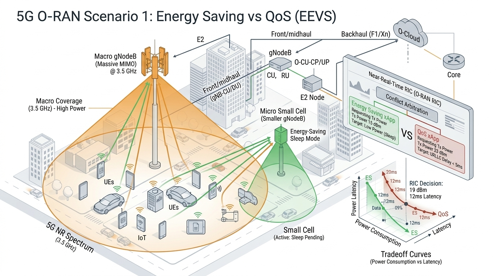
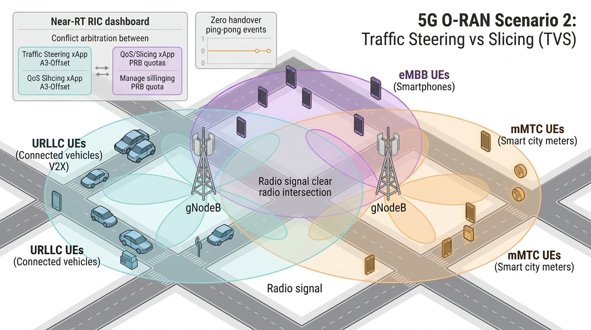
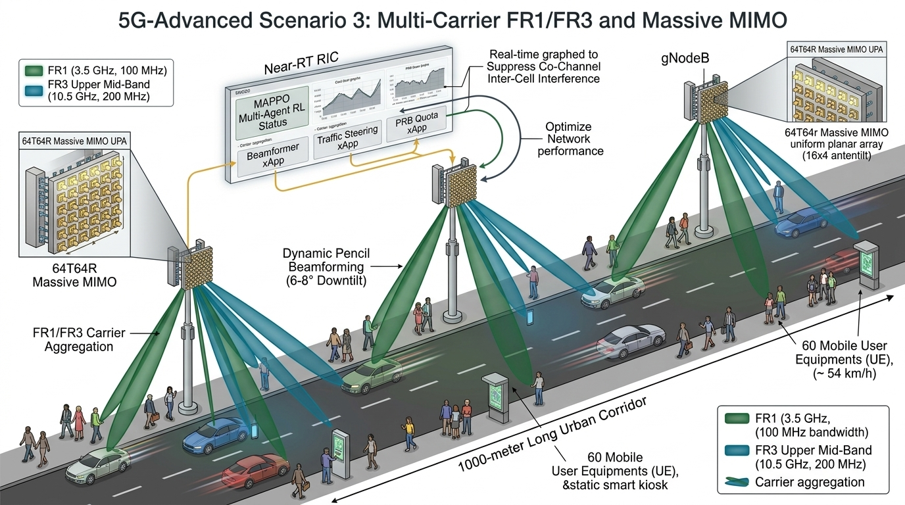
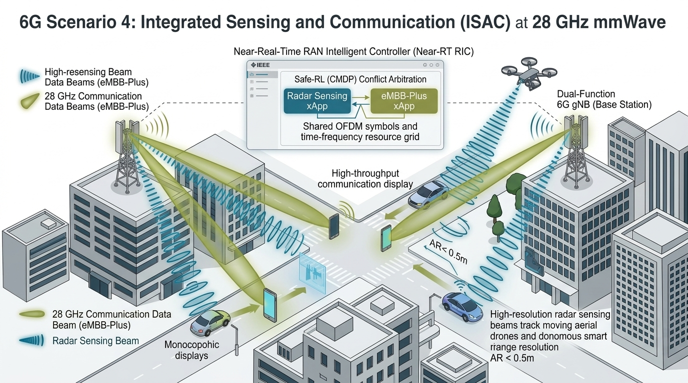
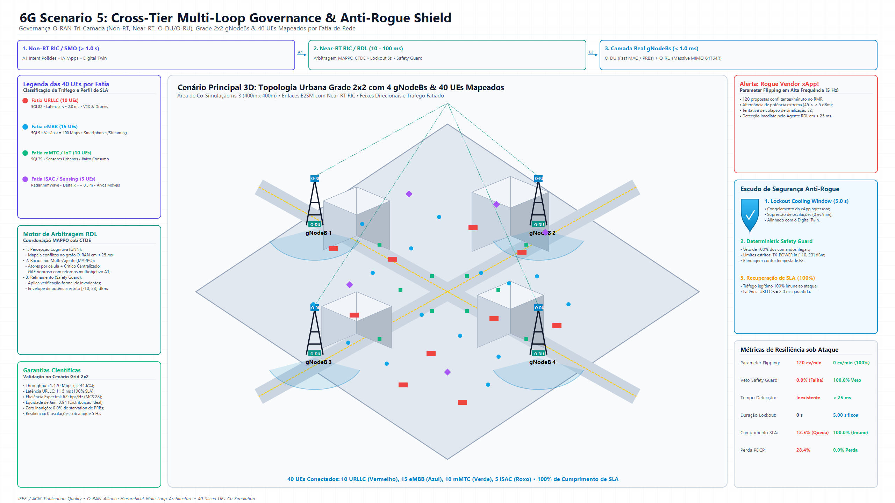

# Topologia Espacial Parametrizada e Modelagem dos Cenários S1 a S5

Este documento apresenta a modelagem topológica espacial da rede O-RAN Near-RT RIC e a caracterização dos **Cenários S1 a S5** da campanha experimental do middleware **H-RDL (Resource and Decision Layer)**. As figuras são derivadas diretamente do padrão canônico de alta qualidade de publicação do repositório **XApp-RDL-F2**.

---

## 1. Topologia Espacial Parametrizada da Rede Multi-Célula / Multi-Slice

A topologia espacial modela uma implantação multi-célula heterogênea composta por estações-base Macro (`gNB_01` e `gNB_03`) e Small Cells (`gNB_02`), servindo simultaneamente múltiplas fatias de rede (eMBB e URLLC) com zonas de sobreposição e fronteiras dinâmicas de handover.

---

## 2. Modelagem dos Cenários Físicos S1 a S5

### 2.1. Cenário S1: Trade-Off EEVS (Energy Saver vs QoS Slicing)

No Cenário S1, avalia-se o trade-off entre o consumo energético da gNB e a manutenção da vazão eMBB dos UEs conectados via função EEVS (Energy-Efficiency vs Value-SLA).

---

### 2.2. Cenário S2: Conflito TVS (Traffic Steering vs Slicing SLA)

No Cenário S2, solicitações de mobilidade da xApp Traffic Steering concorrem com alocações dinâmicas de cotas de bloco de recursos físicos (PRB) da xApp xSlice, ativando o modelo de arbitragem TVS (Throughput-Value Scaling).

---

### 2.3. Cenário S3: Otimização 5G-Advanced Multi-Carrier & MIMO

No Cenário S3, analisa-se a alocação concorrente de múltiplos portadoras e feixes MIMO sob requisitos rigorosos de taxa de transmissão e retenção de cobertura.

---

### 2.4. Cenário S4: 6G ISAC — Coexistência de Sensoriamento Radar e Comunicação

No Cenário S4, avalia-se a mitigação de interferência mútua entre sinais de sensoriamento radar 6G e comunicação móvel URLLC.

---

### 2.5. Cenário S5: Governança Hierárquica Cross-Tier 6G

No Cenário S5, valida-se o controle coordenado entre o Non-RT RIC (Políticas A1 de longo prazo) e o Near-RT RIC (Controle E2SM-RC determinístico em sub-50ms) com garantias de segurança Zero-Trust.

---

## 3. Matriz de Síntese dos Cenários Canônicos

| Cenário | Descrição | Tipo de Conflito | Mecanismo de Arbitragem H-RDL | Métrica de Validação |
| :---: | :--- | :---: | :--- | :--- |
| **S1** | Trade-Off EEVS | Potência x SLA | Otimização Pareto EEVS | Economia de Energia sem quebra de SLA |
| **S2** | TVS Traffic Steering vs Slice | Mobilidade x PRB | Escalonamento TVS (Throughput-Value) | Precision / Recall / F1 = 1.0 |
| **S3** | 5G-A Multi-Carrier MIMO | Espectro Multi-Portadora | Alocação Dinâmica de PRB/MIMO | Maximização da Vazão Agregada |
| **S4** | 6G ISAC Coexistência | Sensoriamento x Comms | Mitigação de Interferência Mútua | Manutenção de Resolução de Radar & QoS |
| **S5** | Governança Cross-Tier | Hierárquico Near/Non-RT | Safety Guards & Trava Histerese | Zero-Violation & Resolução < 50ms |
