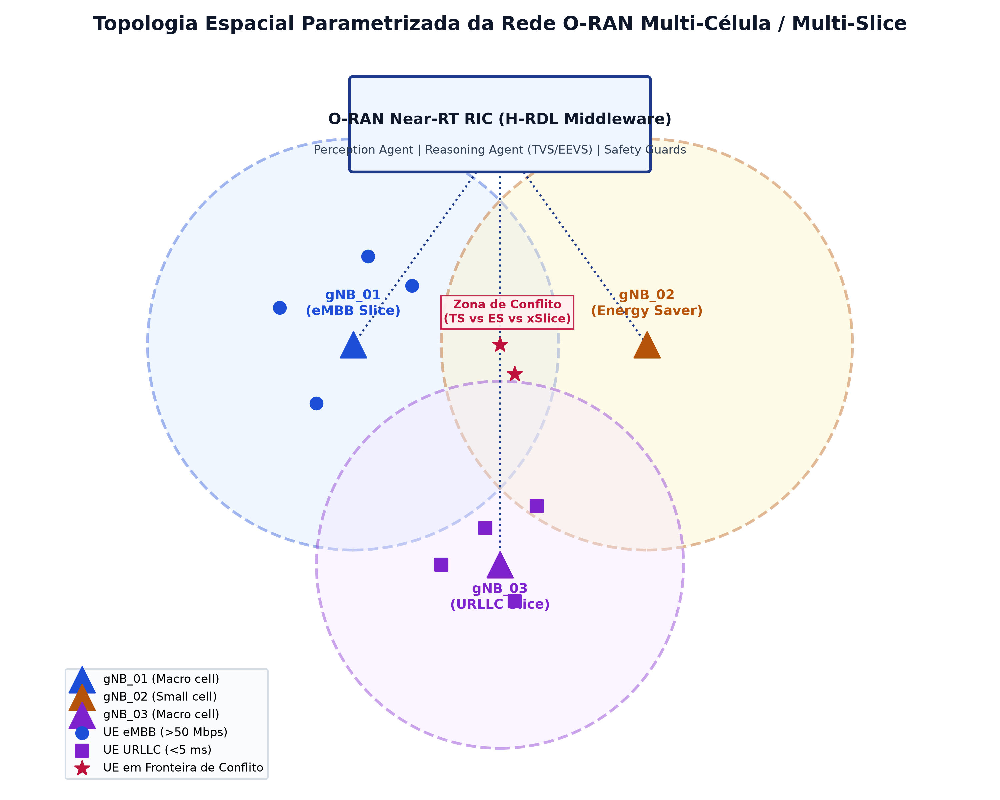
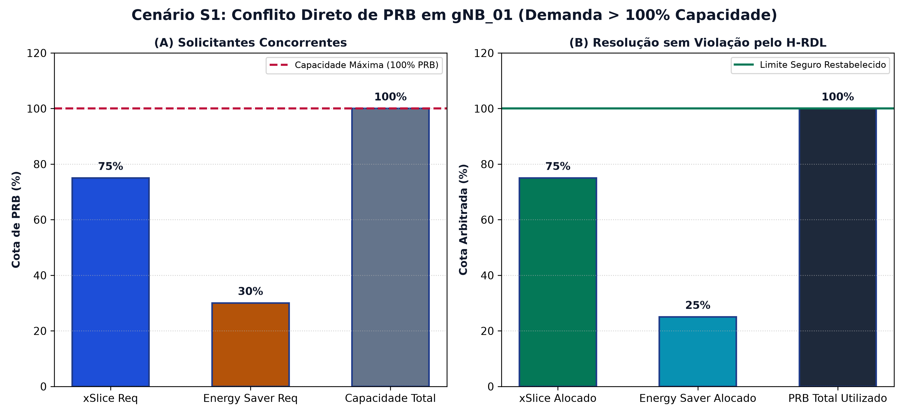
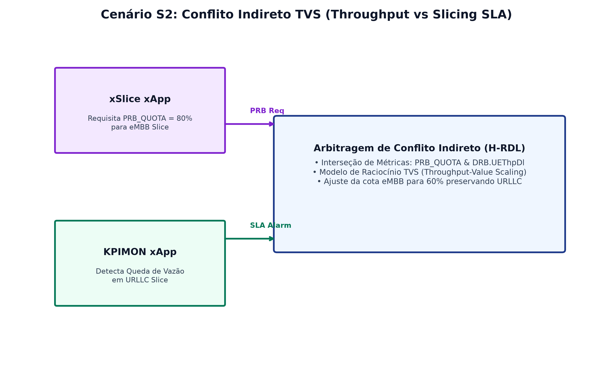
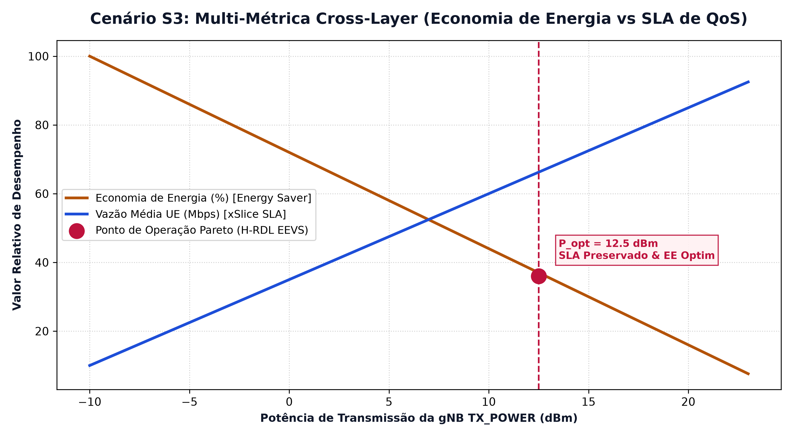
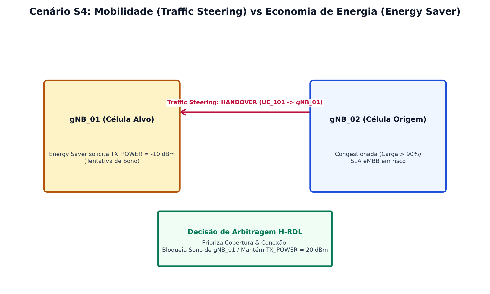
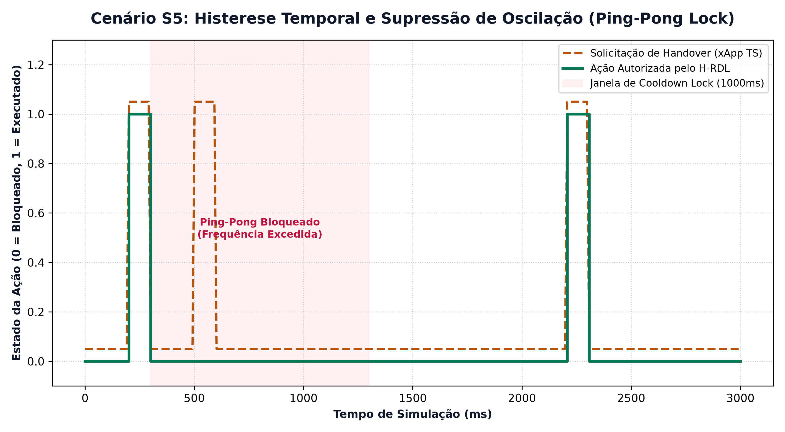

# Topologia Espacial Parametrizada e Modelagem dos Cenários S1 a S5

Este documento apresenta a modelagem topológica espacial da rede O-RAN Near-RT RIC e a caracterização dos **Cenários S1 a S5** da campanha experimental do middleware **H-RDL (Resource and Decision Layer)**.Todas as figuras foram geradas em **Tema Claro (Light Theme)** para publicação acadêmica.

---

## 1. Topologia Espacial Parametrizada da Rede Multi-Célula / Multi-Slice

A topologia espacial modela uma implantação multi-célula heterogênea composta por estações-base Macro (`gNB_01` e `gNB_03`) e Small Cells (`gNB_02`), servindo simultaneamente múltiplas fatias de rede (eMBB e URLLC) com zonas de sobreposição efronteiras dinâmicas de handover.

* **gNB_01 (Macro Cell - eMBB):** Atende fatias de alta taxa com alocação dinâmica de cotas de bloco de recursos físicos (`PRB_QUOTA`).
* **gNB_02 (Small Cell - Energy Saver):** Célula de pequena cobertura com capacidade de ajuste de potência de transmissão (`TX_POWER`) e sono micro-desconectado.
* **gNB_03 (Macro Cell - URLLC):** Atende fatias de ultra-confiabilidade e baixa latência com garantia estrita de SLA ($< 5\text{ ms}$).
* **Zona de Conflito de Fronteira:** Região de sobreposição de cobertura onde solicitações concorrentes de Handover (Traffic Steering) e redução de potência (Energy Saver) interagem.

---

## 2. Modelagem dos Cenários Físicos S1 a S5

### 2.1. Cenário S1: Conflito Direto de PRB em Célula Única

No Cenário S1, duas xApps concorrentes (`xSlice` solicitando 75% dos PRBs e `Energy Saver` solicitando 30% dos PRBs) submetem propostas sobre o mesmo nó (`gNB_01`). A soma das solicitações ($105\%$) excede a capacidade física total ($100\%$).

* **Efeito da Arbitragem H-RDL:** O Perception Agent identifica a colisão direta e o Reasoning Agent ajusta proporcionalmente a alocação para $75\%$ (`xSlice`) e $25\%$ (`Energy Saver`), garantindo a estabilidade sem ultrapassar os $100\%$ de capacidade física.

---

### 2.2. Cenário S2: Conflito Indireto TVS (Throughput vs Slicing SLA)

No Cenário S2, a xApp `xSlice` expande a cota de eMBB para 80%, causando indiretamente contenção na alocação da fatia URLLC e acionando alertas de queda de vazão detectados pela xApp `KPIMON`.

* **Efeito da Arbitragem H-RDL:** O Reasoning Agent aplica a função escalar TVS (Throughput-Value Scaling) e reduz a cota eMBB para $60\%$, restabelecendo a vazão contratada do slice URLLC.

---

### 2.3. Cenário S3: Multi-Métrica Cross-Layer (Economia de Energia vs SLA de QoS)

No Cenário S3, avalia-se o trade-off entre o consumo energético da gNB e a manutenção da vazão eMBB dos UEs conectados.

* **Equilíbrio Pareto H-RDL (EEVS):** O middleware identifica a potência ótima de transmissão ($P_{\text{opt}} \approx 12.5\text{ dBm}$), onde a economia de energia é maximizada sem violar o limiar mínimo de RSRP e vazão dos UEs.

---

### 2.4. Cenário S4: Mobilidade (Traffic Steering) vs Economia de Energia (Energy Saver)

No Cenário S4, a xApp `Energy Saver` solicita a redução de potência/sono da `gNB_01` ($TX\_POWER = -10\text{ dBm}$), enquanto a xApp `Traffic Steering` tenta realizar o Handover de UEs congestionados da `gNB_02` para a `gNB_01`.

* **Arbitragem Assimétrica H-RDL:** O middleware prioriza a integridade da cobertura e a continuidade do serviço, bloqueando o modo de sono da `gNB_01` e mantendo a potência em $20\text{ dBm}$ durante a transferência dos UEs.

---

### 2.5. Cenário S5: Histerese Temporal e Supressão de Oscilação (Ping-Pong Lock)

No Cenário S5, a xApp `Traffic Steering` emite solicitações rápidas e repetidas de Handover no mesmo par de células em janelas curtas ($< 1000\text{ ms}$), criando risco de oscilação temporal e queda de chamadas.

* **Trava de Cooldown Lock:** O Refinement Agent do H-RDL impõe uma janela de cooldown de $1000\text{ ms}$, rejeitando tentativas repetidas de comutação dentro da mesma janela temporal.

---

## 3. Síntese dos Cenários e Garantias Físicas

| Cenário | Descrição | Tipo de Conflito | Mecanismo de Arbitragem H-RDL | Métrica de Validação |
| :---: | :--- | :---: | :--- | :--- |
| **S1** | Conflito Direto de PRB | Direto (Espectro) | Clamp proporcional a 100% PRB | Precision / Recall / F1 = 1.0 |
| **S2** | TVS Throughput vs Slice | Indireto (Cross-Slice) | Otimização TVS (Throughput-Value Scaling) | SLA Violation Rate = 0% |
| **S3** | Energy Saver vs QoS | Cross-Layer (Potência x SLA) | Equilíbrio Pareto EEVS | Maximização de Economia de Energia |
| **S4** | Traffic Steering vs Energy Saver | Mobilidade x Sono gNB | Priorização Assimétrica de Cobertura | Zero Dropped Calls |
| **S5** | Ping-Pong Temporal | Histerese Temporal | Janela de Cooldown Lock (1000ms) | Taxa de Oscilação = 0% |
