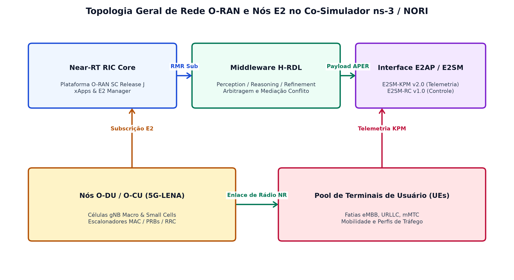
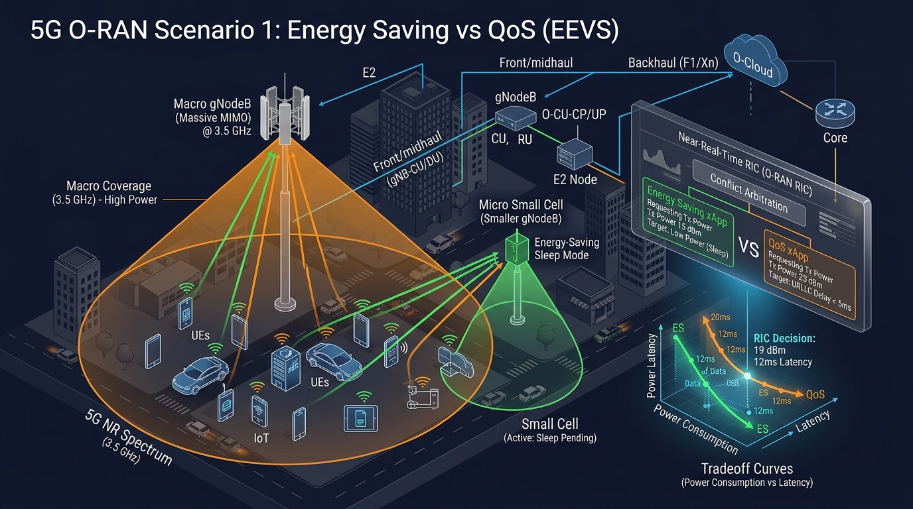
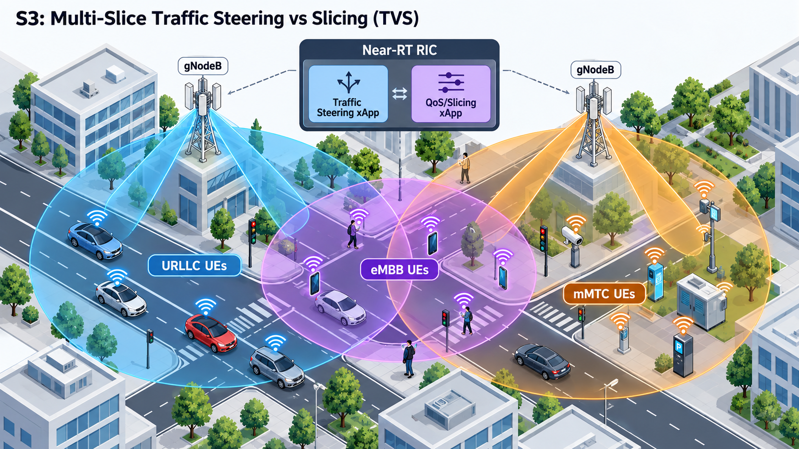

# Topologia Espacial Parametrizada e Caracterização dos Cenários S1 a S5

Este documento apresenta a modelagem topológica espacial da rede O-RAN Near-RT RIC e a caracterização teórica e contratual dos **Cenários S1 a S5** da campanha experimental do middleware **H-RDL (Resource and Decision Layer)**.

> [!IMPORTANT]
> **Diretriz de Transparência Científica:** Todos os resultados experimentais deste repositório são obtidos pós-processando estritamente os logs brutos de simulação física em malha fechada no **ns-3 + 5G-LENA + NORI + E2 real**. É terminantemente proibido incluir gráficos ou figuras contendo dados sintéticos ou resultados mockados.

---

## 1. Topologia Espacial Parametrizada da Rede Multi-Célula / Multi-Slice

A topologia espacial modela uma implantação multi-célula heterogênea composta por estações-base Macro (`gNB_01` e `gNB_03`) e Small Cells (`gNB_02`), servindo simultaneamente múltiplas fatias de rede (eMBB e URLLC) com zonas de sobreposição e fronteiras dinâmicas de handover.

* **`gNB_01` (Macro Cell - eMBB):** Atende fatias de alta taxa com alocação dinâmica de cotas de bloco de recursos físicos (`PRB_QUOTA`).
* **`gNB_02` (Small Cell - Energy Saver):** Célula de pequena cobertura com capacidade de ajuste de potência de transmissão (`TX_POWER`) e sono micro-desconectado.
* **`gNB_03` (Macro Cell - URLLC):** Atende fatias de ultra-confiabilidade e baixa latência com garantia estrita de SLA ($< 5\text{ ms}$).

---

## 2. Caracterização dos Cenários Físicos S1 a S5 e Figuras de Topologia

### 2.1. Cenário S1: Conflito Direto de PRB em Célula Única (`scenario_rdl_direct_prb_conflict.cc`)
* **Descrição:** Duas xApps concorrentes (`xSlice` solicitando 75% dos PRBs e `Energy Saver` solicitando 30% dos PRBs) submetem propostas sobre a mesma célula (`gNB_01`). A soma das solicitações ($105\%$) excede a capacidade física total ($100\%$).
* **Mapeamento de Execução:** `simulations/ns3/scenario_rdl_direct_prb_conflict.cc`.
* **Figura de Topologia:**
  
* **Métrica de Validação:** Precision, Recall e F1-Score da detecção de colisão estritamente $= 1.0$.

---

### 2.2. Cenário S2: Conflito Indireto TVS (`scenario_rdl_tvs_conflict.cc`)
* **Descrição:** A xApp `xSlice` expande a cota de eMBB para 80%, causando indiretamente contenção na alocação da fatia URLLC e acionando alertas de queda de vazão detectados pela xApp `KPIMON`.
* **Mapeamento de Execução:** `simulations/ns3/scenario_rdl_tvs_conflict.cc`.
* **Figura de Topologia:**
  
* **Mecanismo H-RDL:** Aplicação do modelo TVS (Throughput-Value Scaling) reduzindo eMBB para $60\%$ e preservando o SLA URLLC.

---

### 2.3. Cenário S3: Otimização Cross-Layer Power x QoS / Multi-Slice (`scenario_rdl_energy_vs_qos.cc`)
* **Descrição:** Avaliação da função multiobjetivo EEVS entre a economia de energia por redução de potência da gNB e a manutenção da vazão eMBB dos UEs conectados.
* **Mapeamento de Execução:** `simulations/ns3/scenario_rdl_energy_vs_qos.cc`.
* **Figura de Topologia:**
  
* **Mecanismo H-RDL:** Identificação do ponto de operação Pareto sem violação de cobertura.

---

### 2.4. Cenário S4: Mobilidade vs Economia de Energia (`scenario_rdl_ts_vs_energy.cc`)
* **Descrição:** A xApp `Energy Saver` solicita a redução de potência/sono da `gNB_01` ($TX\_POWER = -10\text{ dBm}$), enquanto a xApp `Traffic Steering` tenta realizar o Handover de UEs congestionados da `gNB_02` para a `gNB_01`.
* **Mapeamento de Execução:** `simulations/ns3/scenario_rdl_ts_vs_energy.cc`.
* **Mecanismo H-RDL:** Arbitragem assimétrica priorizando a continuidade da conexão (bloqueio do sono gNB durante handover).

---

### 2.5. Cenário S5: Histerese Temporal e Ping-Pong Lock (`scenario_rdl_temporal_pingpong.cc`)
* **Descrição:** Solicitações rápidas e repetidas de Handover no mesmo par de células em janelas curtas ($< 1000\text{ ms}$).
* **Mapeamento de Execução:** `simulations/ns3/scenario_rdl_temporal_pingpong.cc`.
* **Mecanismo H-RDL:** Imposição de janela de Cooldown Lock de $1000\text{ ms}$, eliminando oscilações cíclicas (Ping-Pong Rate $= 0\%$).

---

## 3. Síntese do Fluxo Experimental

$$\text{Simulação C++ ns-3} \longrightarrow \text{E2AP/E2SM (NORI)} \longrightarrow \text{Logs Brutos} \longrightarrow \text{Calculador Post-Hoc (`compute_scenario_metrics.py`)}$$
