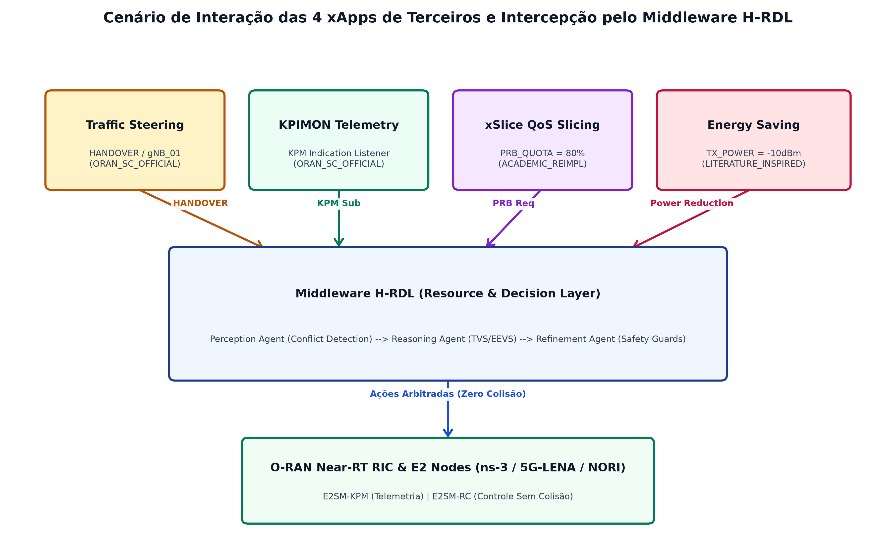

# Taxonomia de Origem e Classificação das xApps (Terceiros vs. Propostas Experimentais)

Este repositório diferencia explicitamente **xApps de Terceiros (Oficiais O-RAN SC ou Reimplementações Acadêmicas da Literatura)** de **xApps Propostas/Experimentais do H-RDL** e **Workloads de Teste**.

---

## 1. Tabela Consolidada de Origem (`origin_type`)

| Nome da xApp | Diretório / Identificador | Tipo de Origem (`origin_type`) | Fonte Upstream / Referência | Papel no H-RDL |
| :--- | :--- | :---: | :--- | :--- |
| **Traffic Steering** | `reference-xapps/traffic-steering` | `ORAN_SC_OFFICIAL` | [O-RAN SC `ric-app-ts`](https://github.com/o-ran-sc/ric-app-ts) | Terceiros / Oficial O-RAN SC (Release J) |
| **KPIMON** | `reference-xapps/kpimon` | `ORAN_SC_OFFICIAL` | [O-RAN SC `ric-app-kpimon`](https://github.com/o-ran-sc/ric-app-kpimon) | Terceiros / Oficial O-RAN SC (Coleta KPM) |
| **xSlice / QoS Slicing** | `reference-xapps/qos-xslice` | `ACADEMIC_REIMPLEMENTATION` | [peihaoY/xslice-oran](https://github.com/peihaoY/xslice-oran) (Yan et al., 2025 / CAMAD) | Terceiros / Reimplementação Acadêmica |
| **Energy Saving** | `reference-xapps/energy-saving` | `LITERATURE_INSPIRED` | [Orange-OpenSource/ns-O-RAN-flexric](https://github.com/Orange-OpenSource/ns-O-RAN-flexric) (Wadud et al., 2024) | Terceiros / Inspirada na Literatura |
| **Load Balancer** | `reference-xapps/load-balancer` | `PROPOSED_EXPERIMENTAL` | Proposta Experimental H-RDL | Proposta / Referência H-RDL |
| **Beamformer** | `reference-xapps/beamformer` | `PROPOSED_EXPERIMENTAL` | Proposta Experimental H-RDL | Proposta / Referência H-RDL |
| **ISAC Radar** | `reference-xapps/isac-radar` | `PROPOSED_EXPERIMENTAL` | Proposta Experimental H-RDL | Proposta / Referência H-RDL (6G ISAC) |
| **Rogue xApp** | `reference-xapps/rogue-xapp` | `TEST_HARNESS` | Workload Adversário H-RDL | Teste / Injeção de Falhas (Zero-Violation) |
| **Bouncer** | `reference-xapps/bouncer` | `TEST_HARNESS` | Workload de Benchmark H-RDL | Teste / Medição de Latência RMR |

---

### 1.1. Detalhamento Arquitetural e Cenários das xApps de Terceiros

Para uma descrição completa contendo componentes internos, especificações de mensagens RMR, Service Models E2SM, parâmetros de controle (`HANDOVER`, `PRB_QUOTA`, `TX_POWER`), prioridades, métricas de simulação ns-3 e **figuras arquiteturais**, consulte a documentação dedicada:

👉 **[`docs/modelagem_cenarios_xapps_terceiros.md`](../docs/modelagem_cenarios_xapps_terceiros.md)**

*Diagrama de Interação das 4 xApps de Terceiros e Middleware H-RDL:*

---

## 2. Taxonomia de xApps Propostas para Cenários Avançados (S9–S15 Roadmap 6G)

| Nome da xApp | Cenário Relacionado | Tipo de Origem (`origin_type`) | Domínio de Pesquisa |
| :--- | :---: | :---: | :--- |
| **NTN-Steering** | S9 (NTN Orbital Handover) | `PROPOSED_EXPERIMENTAL` | Proposta / Satélites LEO (O-RAN 6G NTN) |
| **Satellite-HO** | S9 (NTN Orbital Handover) | `PROPOSED_EXPERIMENTAL` | Proposta / Controle de Handover Orbital |
| **UAV-Mobility** | S10 (UAV Swarm Battery) | `PROPOSED_EXPERIMENTAL` | Proposta / Estações-base Aéreas (UAV Swarm) |
| **Energy-Conserver UAV** | S10 (UAV Swarm Battery) | `PROPOSED_EXPERIMENTAL` | Proposta / Gestão de SoC e Bateria UAV |
| **V2X-Mobility** | S11 (V2X Highway) | `PROPOSED_EXPERIMENTAL` | Proposta / Veículos de Alta Velocidade (110 km/h) |
| **Platoon-QoS** | S11 (V2X Highway) | `PROPOSED_EXPERIMENTAL` | Proposta / Comunicação Crítica de Pelotão |
| **Industrial-QoS** | S12 (IIoT / TSN Factory) | `PROPOSED_EXPERIMENTAL` | Proposta / Latência Determinística Indústria 4.0 |
| **Rescue-QoS** | S13 (Emergency SAGIN) | `PROPOSED_EXPERIMENTAL` | Proposta / Orquestração Multidomínio de Crise |

---

## 3. Diretrizes de Transparência Científica

1. **xApps de Terceiros (`ORAN_SC_OFFICIAL` / `ACADEMIC_REIMPLEMENTATION`):** Representam código open-source ou reimplementações fiéis da literatura. Seus comandos refletem os comportamentos originais descritos por seus autores.
2. **xApps Propostas (`PROPOSED_EXPERIMENTAL`):** São contribuições e protótipos experimentais desenvolvidos especificamente para avaliar a capacidade de arbitragem e generalização do middleware H-RDL.
3. **Workloads de Teste (`TEST_HARNESS`):** Não constituem aplicações operacionais de produção, servindo estritamente como ferramentas de injeção de falhas e estresse.
